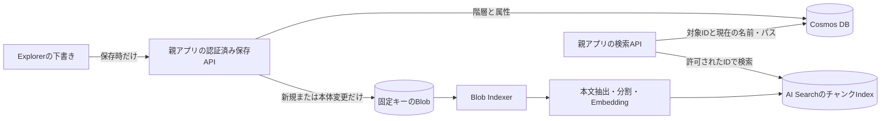
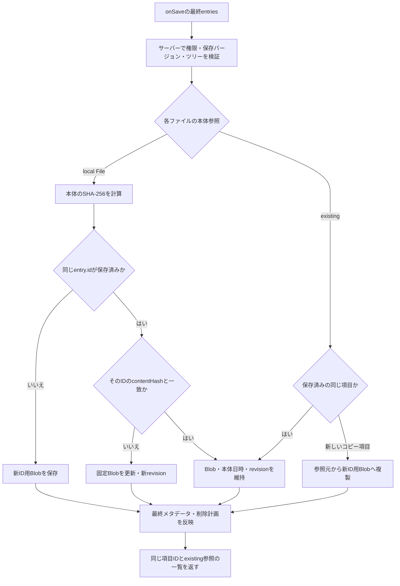
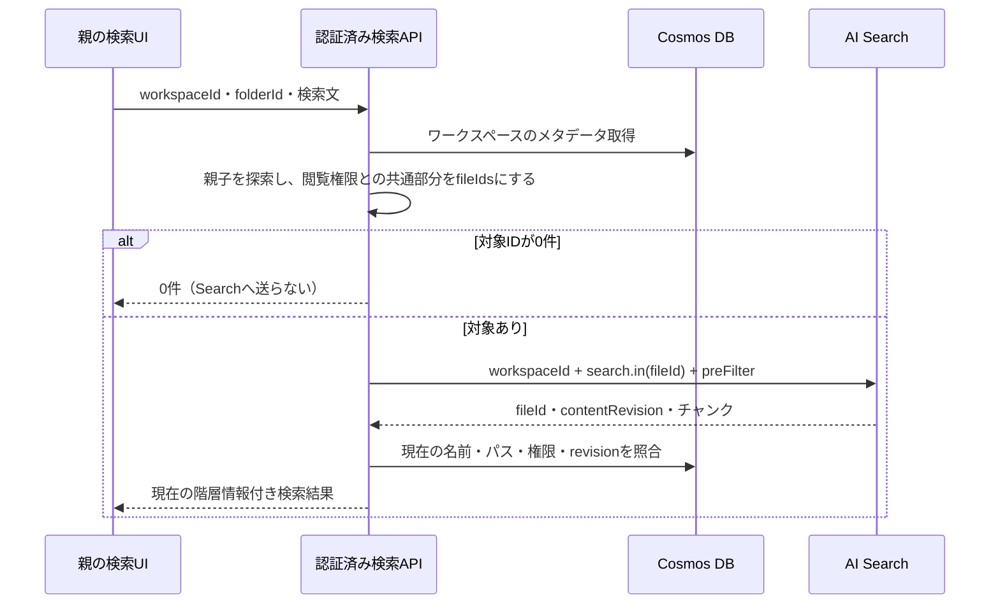

# Explorerの組み込み

このガイドはLikeX Explorerの公開APIと具体例をまとめたものです。コピー元は `packages/explorer/src/`（0.1.0）です。ソースを利用先の `components/explorer/` にコピーする場合、公開入口は `index.ts` です。表示、操作、下書き、テーマはフォルダ内にまとまっています。生成済みの `styles.css` もこのフォルダに含まれます。**React / React DOM 19、必要な実行時依存、CSSのimport、表示枠の高さ**を用意すれば利用でき、Tailwind CSSの導入は不要です。

## 目的別ガイド

最初の導入では、[依存関係とCSS](#依存関係とcss) → [App Routerの最小例](#app-routerで使う最小例) → [データと保存の契約](#データと保存の契約) の順で確認してください。パッケージとして導入した場合は同梱READMEのCSS importを先に行い、このガイドの `@/components/explorer` をインストールしたパッケージ名に読み替えます。

| 目的 | 参照先 |
| --- | --- |
| 閲覧だけにする・機能を隠す | [読み取り専用](#read-only)、[機能・選択・表示](#機能選択表示の設定)、[ショートカット](#keyboard-shortcuts) |
| ファイルを追加する・上書きを扱う | [アップロード制限](#upload-restrictions)、[同名競合](#upload-conflicts)、[OS貼り付け](#osでコピーしたファイルフォルダを貼り付ける) |
| 保存・再取得・同時編集を接続する | [保存の型](#データと保存の契約)、[再取得](#refresh-entries)、[保存前後の処理](#save-lifecycle)、[ロック方式](#楽観ロック悲観ロックを選ぶ) |
| ダウンロード・プレビューを親へ任せる | [外部ダウンロード](#ダウンロードを親へ委譲して進捗を受け取る)、[外部プレビュー](#プレビューを親画面へ渡す) |
| アイコン・配色・表示を調整する | [アイコン](#ファイルとフォルダのアイコンを差し替える)、[配色](#配色とダークモード)、[サイズ](#サイズとスタイルの前提) |
| 別ウィンドウや画面離脱を扱う | [起動用ポップアップ](#最初から別ウィンドウで開く)、[タブ切り離し](#タブを別ウィンドウで開く)、[未保存離脱](#unsaved-changes) |
| 多数のファイルを扱う | [描画とキャッシュ](#performance)、[内蔵ZIPの上限](#フォルダをzipでダウンロードする) |
| 外部ストレージ設計の参考例を見る | [連携パターン](#外側の連携パターンと具体例)、[Azure設計例](#azure-reference-sample)、[未実装の将来方針](#今後の設計方針外側で型と連携を定義する) |

### 最初に把握しておく契約

- `onSave` がなければ読み取り専用です。下書きとローカル `File` はメモリで保持し、DBやストレージへ自動保存しません。
- `initialEntries` は初回のみです。更新は `onRefresh`、別ワークスペースへの切替は未保存を確認してから `key` を変更します。
- `onEvent` は通知専用です。認証・認可・保存前検証・複数人の競合解決は親とサーバーが実装します。
- 専用アイコンがあることと内蔵プレビュー対応は別です。Excel・Word・PowerPointは外部プレビューを使えます。
- 内蔵ZIPは無圧縮で4 GiB未満・65,534項目まで、実用上は端末メモリに収まる規模が前提です。内蔵ダウンロードの成功はブラウザへの引渡しであり、端末保存完了ではありません。
- ポップアップやOS貼り付けはブラウザ・OSに依存します。SPA遷移・アンマウント前の未保存確認は親の責務です。

内部の実装配置を調べる場合は、次の責務表を参照してください。利用先は公開入口からimportし、内部ファイルへ直接依存しない構成にします。

## 公開props一覧

<a id="explorer-props"></a>

以下は両コンポーネントに共通するpropsです。

| prop | 契約 |
| --- | --- |
| `initialEntries` | 初回マウント時の保存済み一覧。`readonly ExplorerEntry[]`。後からのprop変更で編集中の内容を上書きしません。別のワークスペースへ切り替える場合は `key` を変えて再マウントします。 |
| `onSave` | 保存時に `ExplorerSavePayload` を受け取る任意のコールバック。省略すると読み取り専用になります。`void` または保存後の `readonly ExplorerEntry[]` を返します。どちらもPromiseにできます。 |
| `onRefresh` | 任意の `() => readonly ExplorerEntry[] \| Promise<readonly ExplorerEntry[]>`。アドレスバー直前の更新ボタンから最新一覧を取得します。未指定ならボタンを隠します。初回の自動読込は行わず、読み取り専用でも利用できます。 |
| `onEditRequest` | `ExplorerEditHandler`。最初の有効な変更を適用する直前に親へ許可を求めます。入力欄やダイアログを開くだけでは呼びません。許可後は保存・破棄等までセッションを共有し、未指定なら同期で許可します。 |
| `readOnly` | 任意の `boolean`。`true` なら `onSave` があっても読み取り専用です。`false` でも `onSave` がなければ編集できません。 |
| `readFile` | 既存のファイル本体を読み出す任意の `(sourceId: string) => Promise<Blob>`。内蔵プレビュー・内蔵ダウンロード・画像サムネイルに利用します。ローカル追加ファイルには不要です。 |
| `onPreviewRequest` | `ExplorerPreviewHandler`。指定時は内蔵プレビューの代わりにファイル情報を親へ渡します。未指定なら内蔵プレビューを使います。 |
| `onDownloadRequest` | `ExplorerDownloadHandler`。指定時はファイル・フォルダのダウンロードを親へ委譲します。要求情報と進捗通知・取消し用contextを受け取り、結果を明示して返します。未指定なら内蔵処理です。 |
| `previewTrigger` | `ExplorerPreviewTrigger`。`"doubleClick"`（既定）または `"click"`。後者はファイル名の単クリックでプレビューします。 |
| `onEvent` | `ExplorerEventHandler`。ローカル操作・選択・移動・表示状態・保存等を親へ通知します。通知の戻り値や例外は操作の成否を変えません。 |
| `renderIcon` | `ExplorerIconRenderer`。項目情報・描画箇所・選択状態等から独自アイコンを返します。`null` / `undefined` は既定表示、`false` は枠だけを残します。 |
| `title` | 任意の `string`。`title="資料管理"` のようにタブバー右上の表示名を指定します。前後の空白を除去し、省略・空文字・空白のみなら非表示です。 |
| `rootLabel` | ルートの表示名。省略時・空白のみの場合は「ファイル」。タブ、パンくず、サイドバー、保存場所表示へ適用します。 |
| `defaultPath` | 最初のタブと「＋」の新規タブで開く仮想フォルダのパス。省略・空白のみなら `/`。初回に解決したフォルダIDを保持します。 |
| `features` | `ExplorerFeatures`。機能ごとに `false` を指定すると、関連UIとその実行経路を無効にします。 |
| `upload` | `ExplorerUploadOptions`。許可する拡張子・1ファイルの最大サイズ・違反時の扱いを指定します。制限は省略可能で、違反時は既定でその回の追加をすべて中止します。 |
| `selection` | `ExplorerSelectionOptions`。選択方式（`none` / `single` / `multiple`）とチェックボックス表示。 |
| `ui` | `ExplorerUIOptions`。サイドバー、右クリックメニュー、項目メニュー、サムネイルの表示。 |
| `view` | `ExplorerViewOptions`。使える表示形式と初期表示。 |
| `onDirtyChange` | 未保存の変更の有無を通知する任意の `(dirty: boolean) => void`。親画面の保存状態表示や、SPA遷移・ワークスペース切替前の確認に利用できます。 |
| `warnOnUnsavedChanges` | 任意の `boolean`。既定は `true`。未保存の変更がある間、親画面とExplorerの別ウィンドウでブラウザ標準の離脱確認を有効にします。`false` で無効化でき、マウント後の変更にも反映します。 |
| `className` / `style` | 外枠のサイズや配置を調整します。 |
| `colorMode` | `ExplorerColorMode`。`"light"` / `"dark"` / `"system"`。未指定はライト（既存の `theme.colorScheme` 指定は維持）。 |
| `theme` | `ExplorerThemeOptions`。ベースカラー、共通・モード別の配色、フォントを上書きします。従来の `Partial<ExplorerTheme>` も渡せます。 |
| `aria-label` | Explorer領域のアクセシブルな名前。複数配置する場合は識別できる名前を指定します。 |

`title` はマウント後の変更にも追従し、子・孫ウィンドウにも同じ表示名を使います。現在地のタブ名、`rootLabel`、ブラウザの `document.title`、`aria-label` とは独立しています。タブバーを非表示にした場合や表示幅が狭い場合は表示しません。[指定例](#右上のタイトルを指定する) を参照してください。

保存成功時は、返された一覧を次の編集の基準にします。戻り値を省略した場合は、送信した一覧を基準にします。新しく保存したファイルは `source` を既存ファイル参照に正規化した一覧を返すと、次の保存でローカルファイルとして再送する必要がなくなります。保存コールバックが例外を投げる・Promiseをrejectする場合、下書きと選択したローカルファイルを保持して再試行できます。

`onRefresh` は親が認証・取得した最新の一覧を返します。初期表示の取得関数をそのまま共用でき、更新専用のAPIエンドポイントは不要です。成功時に下書きと保存の比較元を最新一覧へ置き換え、未保存状態を解除して子・孫にも共有します。未保存の変更があれば、実行前に「未保存の変更を破棄して、再読み込みしますか？」と確認します。取り消した場合は呼び出さず、取得に失敗した場合も下書きとローカル `File` を保持します。更新中はスピナーを表示し、再更新・保存・変更を無効にします。ページ全体の再読み込みやルーターには依存しません。[型付きの取得関数共用例](#refresh-entries)

未保存の変更がある間は、親画面・子・孫・`ExplorerPopup` の最初の表示で、ウィンドウを閉じる・再読み込み・別の文書への移動をブラウザ標準の確認で保護します。保存成功や変更の破棄で差分がなくなると解除し、保存失敗時は継続します。確認の表示にはユーザー操作が必要で、文言はブラウザが決めます。モバイルでの強制終了など、確認を保証できない操作もあります。[MDN: beforeunload](https://developer.mozilla.org/en-US/docs/Web/API/Window/beforeunload_event)

Next.js等のSPA遷移やReactの `key` 差し替えは、親が `onDirtyChange` を受けて**操作前に**確認します。アンマウント後に引き止めることはできません。Explorer内のフォルダ移動・タブ切替では下書きを保持するため警告しません。`ExplorerPopup` の `close()` は未保存時に確認し、取り消すと表示を維持します。閉じることを許可しても、親にマウントされた下書きは保持します。[確認の範囲とNext.jsの例](#unsaved-changes)

## フォルダの責務

```text
explorer/
├── index.ts                    公開入口
├── explorer.tsx                外枠と各部品の組み込み
├── explorer-popup.tsx          別ウィンドウ起動UIとビューの組み込み
├── props.ts                    公開props・ポップアップ操作・アイコン描画型
├── README.md                   この組み込みガイド
├── model/
│   ├── entries.ts              名前・拡張子・ツリー
│   ├── entry-index.ts          ID・親子関係・名前・パスの共有索引
│   ├── text.ts                 名前の正規化・比較・日時書式
│   ├── draft.ts                下書き操作・保存差分・データ型
│   ├── edit-session.ts         編集許可の要求・状態・イベント型
│   ├── upload.ts               追加ファイルの制約・拒否理由・設定型
│   ├── path.ts                 パスの整形と解決
│   ├── config.ts               機能・選択・UI・表示形式の設定
│   ├── keyboard.ts             ショートカットの判定・表示とIME保護
│   ├── file-content.ts         File/Blob読込とreader型
│   ├── file-icon-style.ts      拡張子別の標準アイコン配色・ラベル
│   ├── archive.ts              フォルダから無圧縮ZIPを生成
│   ├── download.ts             外部ダウンロードの型・対象階層の情報
│   ├── sidebar-size.ts         サイドバー幅の上限・下限
│   ├── window-placement.ts     切り離したウィンドウの表示位置
│   ├── item-info.ts            保存・操作・アイコン等に共通する項目情報
│   ├── preview.ts              外部プレビュー専用の要求型と生成
│   ├── preview-table.ts        上限付きCSV/TSV解析
│   ├── virtual-list.ts         表示範囲・行列・スクロール位置の計算
│   └── events.ts               外側へ渡す操作・状態イベント型
├── state/
│   ├── use-explorer-workspace.ts  ウィンドウ間の下書き・保存・タブ共有
│   ├── use-explorer-popup.ts   起動用ポップアップの作成・開閉通知
│   ├── use-explorer-controller.ts  画面操作
│   ├── use-explorer-listing.ts  一覧の絞り込み・並べ替え・有効な選択
│   ├── use-explorer-download.ts  ダウンロードの実行・進捗・取消し
│   ├── download-manager.ts    ウィンドウ間の多重要求と実行中の管理
│   ├── clipboard-import.ts    OS貼り付けの取得・フォルダ再帰読込
│   ├── use-explorer-draft.ts   下書き・保存状態
│   ├── use-explorer-tabs.ts    タブごとの状態
│   ├── use-explorer-virtual-list.ts  一覧の仮想スクロール・操作対象の保持
│   ├── explorer-context.tsx   表示部品ごとの選択的な状態購読
│   ├── media-cache.ts         本体読込・Blob・Object URLの共有と解放
│   ├── media-context.tsx      ワークスペースの読込キャッシュ共有
│   ├── use-media-visible.ts   可視範囲の共有監視
│   ├── detached-document.ts   子ウィンドウの文書とスタイル
│   └── view-state.ts          画面内の場所・ダイアログ・クリップボード状態
└── ui/
    ├── explorer-header.tsx     タブ・アドレス・検索・操作を含むヘッダー
    ├── explorer-status-bar.tsx  項目数・選択数・保存状態のフッター
    ├── explorer-tabs.tsx       タブ
    ├── explorer-address-bar.tsx  パンくず・パス入力
    ├── explorer-sidebar.tsx    場所ナビ・フォルダツリー・容量表示
    ├── explorer-sidebar-resizer.tsx  サイドバー幅の操作
    ├── explorer-file-list.tsx  一覧・アイコン表示
    ├── explorer-background-menu.tsx  一覧の空白の作成・アップロードメニュー
    ├── explorer-entry-name.tsx  一覧内の名前編集・フォーカス
    ├── explorer-dialogs.tsx    ダイアログ
    ├── explorer-overlays.tsx   別ウィンドウのメニュー・フォーカス制御
    ├── explorer-file-icon.tsx  アイコン・サムネイル
    ├── file-preview.tsx        プレビュー
    ├── explorer-controls.tsx   共通ボタン・入力・メニュースタイル
    ├── explorer-dom-context.tsx  ウィンドウごとのDocument・Portal先
    └── explorer-theme.tsx      配色・ダークモード・テーマの共有
```

`explorer.tsx` が状態と表示を組み合わせます。`explorer-popup.tsx` は同じワークスペースを親画面に保持し、ビューを別ウィンドウへ描画する起動用コンポーネントです。実行時の依存は `ui/ → state/・model/`、`state/ → model/` の方向です。`model/` はReactや表示部品に依存せず、既存ファイルの本体読込にはホストから渡されたreaderを使います。

内部を整理しても公開入口は `@/components/explorer` のままです。利用先は `index.ts` からコンポーネントや公開型をimportし、内部ファイルの配置には依存しない形で使えます。

### 読み込み・保存・更新の公開型名

ホストが渡す関数は `ExplorerFileReader`、`ExplorerSaveHandler`、`ExplorerRefreshHandler` で型付けできます。ブラウザ標準の `FileReader` クラスと紛らわしくならないよう、Explorerの型であることを名前に含めています。

旧公開名の `FileReader`、`SaveHandler`、`RefreshHandler` は同じ型の非推奨エイリアスとして残しています。既存の公開入口からのimportは動きますが、新規コードではExplorer接頭辞付きの名前を使ってください。`initialEntries`、`onSave`、`onRefresh`、`readFile` などのprops名や挙動は変更していません。

## 依存関係とCSS

<a id="依存関係とtailwind"></a>

React / React DOM 19を前提としています。ソースをコピーする場合は、次の実行時依存を追加します。パッケージ導入では自動的に導入されます。

```bash
npm install radix-ui@1.6.7 lucide-react@1.31.0 tailwind-merge@3.6.0
```

このフォルダを `components/explorer/` へコピーし、`styles.css` をアプリの入口で1回読み込みます。Next.js App Routerでは `app/layout.tsx` に書けます。CSSをimportする親と、コールバックを渡すClient Componentは別ファイルでも構いません。

```tsx
// ソースコピーの場合
import "@/components/explorer/styles.css";

// npmパッケージの場合はこちらを使用
// import "@likex/explorer/styles.css";
```

**利用側のTailwind CSS・専用PostCSS設定・`@source`指定は不要です。** 既にTailwindを導入している場合も、既存設定を変更せず同じCSSを読み込めます。CSSは自動挿入せず、アプリ側から明示的に読み込む契約です。

### CSSを二重管理しないための開発手順

TSXの `lxe:` 付きTailwindクラスと、このリポジトリの `packages/explorer/styles/input.css` が原本です。`src/styles.css` は生成物で、手編集しません。コピー利用のためGit管理し、ビルドは同じ内容を `dist/styles.css` へ配置します。

```bash
# LikeXリポジトリで実行
npm run build:styles
npm run check:styles
```

`build:styles` は必要なCSSを再生成し、`check:styles` は原本と生成物の不一致を検出します。配布ビルドでも自動生成し、playgroundではソース編集に追従して再生成します。

`theme`、`colorMode`、`style`による変更はCSSの再生成を必要としません。コピー先で内部のTailwindクラスを編集する場合はCSSも再生成する必要があります。LikeXの原本へ変更を反映し、`build:styles` 後にフォルダをコピーし直すか、同じ生成ツール一式を開発環境へ用意してください。利用だけであれば生成ツールは不要です。

## App Routerで使う最小例

保存関数を渡す親をClient Componentにし、表示する枠の高さを指定します。次の例は親のReact stateに保存するだけのメモリ保存です。再読み込みすると空の一覧に戻ります。

```tsx
"use client";

import { useState } from "react";
import Explorer, { type ExplorerEntry } from "@/components/explorer";

export default function FileManager() {
  const [savedEntries, setSavedEntries] = useState<ExplorerEntry[]>([]);

  return (
    <div style={{ height: 640, minWidth: 0 }}>
      <Explorer
        initialEntries={savedEntries}
        onSave={({ entries }) => {
          setSavedEntries(entries);
          return entries;
        }}
      />
    </div>
  );
}
```

このClient Componentをページから表示します。`@/` を設定していないプロジェクトでは、importを配置先への相対パスに変更してください。

ルートの表示名は標準で「ファイル」です。`<Explorer initialEntries={savedEntries} onSave={save} rootLabel="記事一覧" />` のように `rootLabel` で変更できます（`save` は親の保存関数）。前後の空白は除去し、空白のみなら「ファイル」を使います。タブ、パンくず、サイドバー、移動先、保存場所の表示に反映し、内部のルートID `root` と絶対パス `/` は変わりません。

アドレスバーでは区切り文字を含まないルート名を別名として使えます。標準なら `ファイル/ドキュメント`、上の例なら `記事一覧/ドキュメント` でルート直下へ移動します。同じ名前の実フォルダは `/ファイル` や `./ファイル` のように指定します。

### 右上のタイトルを指定する

`Explorer` と `ExplorerPopup` に共通の `title?: string` で、タブバー右上の表示名を指定できます。`save` は親の保存関数です。

```tsx
<Explorer
  initialEntries={savedEntries}
  onSave={save}
  title="資料管理"
/>
```

前後の空白を除去し、省略・空文字・空白のみの場合は何も表示しません。マウント後に `title` を変更すると、現在の表示と子・孫ウィンドウにも反映します。タブバーが非表示の場合や表示幅が狭い場合は、このタイトルも表示しません。長いタイトルはヘッダー幅の最大30%以内で省略表示し、マウスを重ねると全文を確認できます。

この設定はタブバー右上のラベルだけに使い、現在地のタブ名、ルートの表示名 `rootLabel`、ブラウザの `document.title`、Explorer領域の `aria-label` には影響しません。

### 最初に開くフォルダを指定する

`defaultPath?: string` は、最初のタブと「＋」で追加するタブで開くフォルダを指定します。省略または空白のみなら `/`（ルート）です。例えば、親から渡す `savedEntries` に `/記事/画像` が存在する場合は、次のように設定します。`save` は親の保存関数です。

```tsx
<Explorer
  initialEntries={savedEntries}
  onSave={save}
  defaultPath="/記事/画像"
/>
```

パスはアドレスバーと同じ規則（`resolveExplorerPath`）で、ルートを基準に既存のフォルダへ解決します。`記事/画像` のような相対表記もルート基準で、`rootLabel` はルートの別名として使えます。Blobの保存キー・URL・PCのファイルパスを指定するものではありません。

`defaultPath` は初回マウント時にだけ読み、解決したフォルダIDを保持します。マウント後にpropを変えても現在位置や新規タブの開始位置は変更しません。別の設定で開き直す場合はExplorerのReact `key` を変えてください。指定したフォルダを改名・移動しても同じIDを追い、新規タブもそのフォルダから開きます。削除して存在しなくなった場合はルートから開きます。

不正なパス、存在しない場所、ファイル本体のパスを指定した場合はルートを表示し、初回にエラー通知を出します。`features.pathInput: false` や `features.tabs: false` でも開始位置の指定は有効です。指定したフォルダを新しいルートとして扱う設定ではなく、親や別のフォルダへの通常の移動もできます。

## 最初から別ウィンドウで開く

ページ内に配置する既定の `Explorer` に加え、起動用の `ExplorerPopup` を公開しています。`mode` propによる切り替えではなく、利用先が使うコンポーネントを選びます。`ExplorerPopup` の親画面には `renderTrigger` が返すUIだけを表示し、ユーザー操作で開いたポップアップにExplorerを描画します。専用ページやルート、追加の依存は不要です。

`ExplorerPopupProps` は `ExplorerProps` を引き継ぐため、`initialEntries`・`onSave`・`readFile`・機能設定・テーマ・外部プレビュー・外部ダウンロード等は同じ契約です。追加のpropsと公開型は次のとおりです。

| prop | 契約 |
| --- | --- |
| `renderTrigger` | 必須。`ExplorerPopupControls` を受け取り、起動ボタン等の表示内容を同期的に返します（Promiseを除く `ReactNode`）。エラー表示も利用先がここで組み立てます。 |
| `onOpenChange` | 任意の `(open: boolean) => void`。起動確認後に `true`、開いていた表示を閉じたときに `false` を通知します。初期状態や起動確認前の失敗では通知しません。通知の例外は開閉を妨げません。 |
| `windowOptions` | 任意の `ExplorerPopupOptions`。`width`・`height`・`left`・`top` はすべて省略可能な数値です。既定サイズは1100×760px、既定位置は操作元から右下へ40pxです。次に開くウィンドウへの指定で、開いているウィンドウのサイズや位置はprop変更で更新しません。 |

`ExplorerPopupControls` は次の操作と状態を渡します。

| 項目 | 契約 |
| --- | --- |
| `open(event?: { currentTarget: EventTarget \| null }): boolean` | ユーザー操作から同期的に呼びます。`onClick={open}` ならボタンが属する文書から起動します。既存のウィンドウがあれば前面に出します。`true` は起動要求を受け付けたか既存の表示を使えたことを表し、起動確認の完了ではありません。即時の起動失敗は `false` です。 |
| `close(): void` | 起動中または起動済みのポップアップと、その子ウィンドウを閉じます。起動済みで未保存の変更があり、`warnOnUnsavedChanges` が有効なら、閉じる前に同期的な確認を表示します。取り消すと表示を維持します。閉じている場合は何もしません。 |
| `isOpen: boolean` | ExplorerのDOM・文書の表示状態・表示領域を確認してから `true` になります。 |
| `isOpening: boolean` | ウィンドウの起動要求から確認完了まで `true` になります。 |
| `error: string \| null` | ポップアップのブロックや起動失敗の説明です。次の起動要求で解除し、失敗した場合は更新します。 |

次は、型付きの独自ボタン、エラー表示、開閉状態の表示、親の保存処理を組み合わせた例です。`onSave` と `readFile` は利用先のClient Componentで実装して渡します。

```tsx
"use client";

import { useState } from "react";
import {
  ExplorerPopup,
  type ExplorerPopupProps,
  type ExplorerPopupControls,
  type ExplorerPopupOptions,
} from "@/components/explorer";

type Props = Pick<ExplorerPopupProps, "initialEntries" | "onSave" | "readFile"> & {
  workspaceId: string;
};

const windowOptions = {
  width: 1000,
  height: 720,
  left: 120,
  top: 80,
} satisfies ExplorerPopupOptions;

function Launcher({ open, close, isOpen, isOpening, error }: ExplorerPopupControls) {
  return (
    <div>
      <button type="button" onClick={open} disabled={isOpening}>
        {isOpening ? "起動中…" : isOpen ? "ファイル画面を前面へ" : "ファイルを開く"}
      </button>
      {isOpen && <button type="button" onClick={close}>閉じる</button>}
      {error && <p role="alert">{error}</p>}
    </div>
  );
}

export default function FileManagerPopup({
  workspaceId, initialEntries, onSave, readFile,
}: Props) {
  const [isOpen, setIsOpen] = useState(false);

  return (
    <>
      <ExplorerPopup
        key={workspaceId}
        initialEntries={initialEntries}
        onSave={onSave}
        readFile={readFile}
        windowOptions={windowOptions}
        onOpenChange={setIsOpen}
        renderTrigger={(controls) => <Launcher {...controls} />}
      />
      <p aria-live="polite">{isOpen ? "ファイル画面を表示中" : "ファイル画面は閉じています"}</p>
    </>
  );
}
```

`open` をマウント時のEffectや非同期処理の後から呼ばず、ボタンのクリック等から直接呼んでください。マウントしただけではウィンドウを開きません。起動中または起動済みの間に再度 `open` を呼んでも、ウィンドウは増えません。起動確認には最大5秒待ち、失敗すると表示を閉じて `error` に理由を渡します。ブラウザやWebViewによるウィンドウ形式・位置・前後関係の制約は、[タブを別ウィンドウで開く](#タブを別ウィンドウで開く)場合と共通です。

最初の起動は `features.detachTabs` と独立しています。タブが1つでも、`features={{ tabs: false, detachTabs: false }}` でも開けます。起動後のタブ切り離しは従来どおり、`tabs` と `detachTabs` が有効で操作元にタブが2つ以上ある場合に使えます。この構成で「最初のメインExplorer」は最初に開いたポップアップを指し、切り離した子の「元のウィンドウに戻す」もそこへ戻します。

| 操作 | 表示と保持する状態 |
| --- | --- |
| 最初のポップアップを閉じる、または `close()` | 子ウィンドウも閉じ、子のタブを終了します。親画面に `ExplorerPopup` が残る間は、メインのタブ・下書き・追加した `File`・クリップボード・進行中の保存を保持します。 |
| 同じインスタンスで再び `open()` | 保持したメインのタブと下書きで再開します。閉じた子のタブは復元しません。 |
| 最初のポップアップを再読み込み、別ページへ移動 | 表示を閉じて子ウィンドウも終了します。親画面に保持した下書きは、再度開いて利用できます。 |
| `ExplorerPopup` をアンマウント、または親画面を終了・再読み込み | すべての表示を閉じます。マウント中のメモリ保持は終了するため、次回は利用先の保存先から読み込みます。 |

閉じる・開き直す操作では自動保存や下書きの破棄を行いません。`initialEntries` と `defaultPath` は `ExplorerPopup` の初回マウント時にだけ読み、毎回の `open()` では読み直しません。別のワークスペースへ切り替える場合は、上の例の `key` を変更して再マウントします。

`warnOnUnsavedChanges` は共通の `ExplorerProps` に含まれ、既定は `true` です。起動済みの `close()` では、未保存の変更がある場合に `window.confirm` で「未保存の変更があります。このウィンドウを閉じますか？」と「変更は親画面に保持されます。」を改行して表示します。取り消した場合はウィンドウ・タブ・下書きと `isOpen` を維持し、`onOpenChange(false)` は通知しません。許可された場合に閉じて開閉状態を更新します。`close()` の戻り値は従来どおり `void` です。

OSの閉じるボタンや再読み込みはブラウザ標準の離脱確認を使うため、上記とは文言が異なります。ルート文書の `pagehide`、アンマウント、タブ機能の無効化、子を元のウィンドウへ戻す操作に伴う後片付けでは、確認を重ねません。親のルート遷移や `key` の変更は、親が先に確認してください。[未保存の変更がある状態で画面を離れる](#unsaved-changes)に対応範囲をまとめています。

最初のポップアップの開閉通知は `onOpenChange` です。起動のブロック・失敗は `onEvent` にも `{ type: "window", action: "blocked", windowId, sourceWindowId: "main", tabIds: [], message }` として通知します。この起動ではタブを切り離さないため、成功・終了時に `detach` / `close` イベントは発行しません。後から切り離した子の通知は、既存の `window` イベントの契約に従います。

<a id="read-only"></a>

## 読み取り専用で使う

`onSave` を省略すると自動で読み取り専用になります。保存関数があっても、`readOnly: true` で編集を止められます。`Explorer`・`ExplorerPopup`・`useExplorerDraft` に共通の契約です。

| 指定 | 動作 |
| --- | --- |
| `onSave` なし | 読み取り専用。`readOnly: false` を指定しても編集できません。 |
| `onSave` あり、`readOnly` 省略または `false` | 編集できます。初期状態は閲覧モードで、最初の有効な変更の適用直前に許可を取得します。個別機能は `features` に従います。 |
| `onSave` あり、`readOnly: true` | 読み取り専用。編集機能の `features: true` より優先します。 |

```tsx
import Explorer, { ExplorerPopup, type ExplorerProps } from "@/components/explorer";

// entries、readFile、save、canEditは親が用意します。
const viewer = { initialEntries: entries, readFile } satisfies ExplorerProps;
<Explorer {...viewer} />;

// 親の状態に応じて編集可否を切り替えます。
<Explorer {...viewer} onSave={save} readOnly={!canEdit} />;

// 別ウィンドウで開く閲覧専用ビューも、onSaveなしで使えます。
<ExplorerPopup
  {...viewer}
  renderTrigger={({ open }) => (
    <button type="button" onClick={event => open(event)}>ファイルを見る</button>
  )}
/>;
```

`readOnly?: boolean` は `ExplorerOptions`、`onSave?: ExplorerSaveHandler` はデータ操作の設定で定義しています。有効な状態は `readOnly === true || onSave === undefined` です。

| 操作 | 読み取り専用時 |
| --- | --- |
| 名前変更・コピー・複製・切り取り・貼り付け・移動・削除 | メニューとボタンを非表示にし、操作も禁止します。 |
| 空ファイル作成・フォルダ作成・ファイル／フォルダのアップロード | 非表示・操作禁止。ファイルのドロップやOSからの貼り付けも取り込みません。 |
| お気に入り | 登録済みの印と一覧は表示し、登録・解除だけを禁止します。`features.favorites: false` なら表示もなくなります。 |
| 保存・変更の破棄 | 非表示・操作禁止。 |
| フォルダ閲覧・選択・検索・並べ替え・表示切替・タブ・サイドバー幅変更 | 個別の機能・表示設定に従って利用できます。 |
| プレビュー・詳細・ファイル／フォルダのダウンロード | 個別の `features` に従って利用できます。 |

判定は親・子・孫ウィンドウの共有する下書きで統一しています。マウント後の変更にも対応し、読み取り専用へ切り替えると、編集中の名前を確定せず取り消し、変更用ダイアログを閉じ、読み込み途中のフォルダ貼り付けを中止します。内部のコピー・切り取りとドラッグの情報も消去しますが、OSのクリップボードは変更しません。閲覧位置・選択・既に反映した未保存データ・保存エラーは保持します。編集許可のセッションは終了するため、編集可能に戻した後の変更では改めて許可を取得します。

読み取り専用にする前に開始した `onSave` は取り消しません。その保存が成功すれば返された一覧を次の基準とし、失敗すれば下書きとエラーを保持します。以後の新しい保存は開始しません。読み取り専用への切替自体は `change`・`discard`・`save` イベントを発行しません。閲覧操作やプレビュー等のイベントは引き続き届きます。

`useExplorerDraft` を直接使う場合は、返却される `readOnly: boolean` で有効状態を確認できます。読み取り専用で `apply()`・`add()`・`discard()` を呼ぶと「読み取り専用のため変更できません」という `Error` をthrowし、下書きを変えません。`save()` は `false` を返し、`onSave` を呼びません。保持していた操作関数も最新のモードと保存関数を使います。アンマウント後は従来どおり何もせず、`save()` は `false`、`apply()`・`add()`・`discard()` は `undefined` を返します。

<a id="concurrency-control"></a>

## 楽観ロック・悲観ロックを選ぶ

現在のインターフェースで、どちらの方式も親・サーバー側の実装に接続できます。Explorerにロック方式を指定する専用propはありません。`onEditRequest` は編集開始の許可、`onSave` は保存を委譲する入口です。内部の `"view"` / `"edit"` は画面の編集セッションを表し、サーバーロックの有無を表すものではありません。

| 観点 | 楽観ロック | 悲観ロック |
| --- | --- | --- |
| 編集開始 | ロックを取らず、各ユーザーが下書きを編集します。 | 最初の有効な変更の適用前に `onEditRequest` で親がロックを取得し、許可後に反映します。 |
| 主に使うコールバック | `onSave`。`onEditRequest` は省略できます。 | `onEditRequest` と `onSave`。 |
| 保存時の確認 | 読み込んだ一覧の `version` と現在の値を、サーバーが比較して更新します。 | サーバーがロックの所有者・有効期限と、必要なバージョンを検証して更新します。 |
| 競合した場合 | 保存を拒否し、Explorerの下書きを残して通知します。 | 開始時に `false` を返し、変更を始めません。ロック失効などは保存時にも検出します。 |
| 運用上の特徴 | 他の人の編集を待たずに進められます。編集後に競合が分かるため、競合時の案内が必要です。 | 編集開始時に排他できます。取得・更新・解放・期限切れを管理する必要があります。 |

同時編集の衝突が少なく、最後にまとめて保存する運用なら、まず楽観ロックを使う構成が扱いやすいです。競合後のやり直しが特に高コストな業務では、悲観ロックを選べます。悲観ロックと保存時のバージョン検証の併用も可能です。

**`onEditRequest` の省略だけでは競合検出は有効になりません。** 省略時は編集を無条件で許可するため、楽観ロックにする場合も親の `onSave` とサーバーで条件付き保存を実装します。`onSave` 自体を省略した場合は、従来どおり読み取り専用です。

### 楽観ロック：onSaveでバージョンを検証する例

親は一覧とその `version` を同じ読み込み結果として保持し、保存時にそのバージョンを渡します。次の `saveConditionally` は利用先で実装するホストヘルパーで、このコンポーネントが提供するAPIではありません。サーバーがバージョンの比較と更新を一体で行い、競合時には保存を確定させない契約です。

```tsx
"use client";

import { useRef, useState } from "react";
import Explorer, {
  type ExplorerEntry,
  type ExplorerSavePayload,
  type ExplorerSaveHandler,
} from "@/components/explorer";

type VersionedWorkspace = Readonly<{
  version: string;
  entries: readonly ExplorerEntry[];
}>;
type SaveResult =
  | Readonly<{ status: "saved"; snapshot: VersionedWorkspace }>
  | Readonly<{ status: "conflict" }>;

declare function saveConditionally(request: {
  workspaceId: string;
  expectedVersion: string;
  payload: ExplorerSavePayload;
}): Promise<SaveResult>;

type Props = {
  workspaceId: string;
  initialSnapshot: VersionedWorkspace;
};

export default function OptimisticExplorer({ workspaceId, initialSnapshot }: Props) {
  const [initial] = useState(() => initialSnapshot);
  const version = useRef(initial.version);

  const onSave: ExplorerSaveHandler = async payload => {
    const result = await saveConditionally({
      workspaceId,
      expectedVersion: version.current,
      payload,
    });
    if (result.status === "conflict") {
      throw new Error("他のユーザーが更新しています。変更内容を確認してから読み直してください。");
    }
    // 保存成功時だけ、次の保存に使うバージョンとExplorerの比較元を進める。
    version.current = result.snapshot.version;
    return result.snapshot.entries;
  };

  return <Explorer initialEntries={initial.entries} onSave={onSave} />;
}
```

例えばA・Bがともに `version: "17"` を読み、Aの保存で `"18"` になった場合、Bの `expectedVersion: "17"` による保存は競合です。`onSave` がthrow / rejectするとExplorerは下書き・編集状態を維持し、エラーを表示します。親のバージョンも `"17"` のままにします。**競合時にバージョンだけを最新値へ進めて、古い下書きをそのまま再送してはいけません。** 別ユーザーの変更を上書きするためです。

競合解決のための自動マージや差分比較UIは内蔵していません。まずは親が競合を通知し、必要なら下書きを退避してから再読込する運用にできます。`initialEntries` は初回だけ読むため、親が新しい一覧とバージョンを読み直したら、この例の `OptimisticExplorer` のReact `key` を変更して両方を再初期化します。別の `workspaceId` を表示する場合も同様です。再マウントで未保存の下書きは失われるため、利用者が内容の扱いを決めた後に行います。通常の保存成功では再マウントは不要です。

楽観ロックでも `onEditRequest` を権限確認や編集開始時の最新一覧取得に利用できます。`{ allowed: true, entries }` で比較元を更新する場合、親の保存用バージョンもその一覧と対応する値に合わせます。編集開始時に最新データを読んでも、その後の競合に備えた保存時の検証は必要です。

### Blobと複数ファイルを保存する場合

Azure Blob単体では、読み込み時の `ETag` を保存時の `If-Match` 条件に使えます。不一致の場合はHTTP 412となり、対象Blobへの条件付き更新は行われません。これはファイル内容のハッシュ比較とは別の仕組みです。[Microsoftの同時実行制御の説明](https://learn.microsoft.com/en-us/azure/storage/blobs/concurrency-manage)

Explorerの保存には複数ファイルの追加・変更・削除や階層変更が含まれます。各Blobへの `If-Match` だけでは、一覧全体の保存が一括で成功・失敗することを保証できません。全体の整合性が必要なら、親・サーバー側で一覧の `revision` を条件付きで確定する保存手順を組み立てます。DBで管理する一覧にはトランザクションを使えますが、その保護範囲にBlob本体の書込み・削除は含まれません。

例えば、新しい本体を準備した後に一覧マニフェストを条件付き更新して公開する方式があります。確定前に現在の一覧が参照している本体を上書き・削除せず、失敗した準備データの回収も外側で扱います。保存失敗時にExplorerが下書きを保持しても、すでに行われた外部ストレージへの変更を巻き戻すわけではありません。コンポーネントは保存方式やロックの粒度を固定しません。

同じExplorerから開いた親・子・孫は下書きを共有しますが、別ページ・別のExplorerインスタンス・別ユーザーとの競合はサーバー側で検出します。`onEvent` は観測専用なので、その戻り値で保存を拒否することはできません。

## 編集開始の許可とセッションを親で管理する

`onEditRequest?: ExplorerEditHandler` で、最初の有効な変更を適用する直前に親へ許可を問い合わせられます。Explorerは初期状態を閲覧モード `"view"` とし、その変更を1件保留して許可を待ちます。許可後は `"edit"` となり、同じセッション内の操作では再取得しません。未指定の場合は同期で許可するため、外部ロックを使わない既存の編集も継続できます。

| 操作の段階 | `onEditRequest` のタイミング |
| --- | --- |
| 名前変更欄を開く・入力する・キャンセルする | 要求しません。 |
| 作成・移動・複製・削除のダイアログを開く・キャンセルする | 要求しません。 |
| 内部コピー・切り取りをクリップボードに準備する | 要求しません。実際に項目を増やす・移動する貼り付け時に判定します。 |
| 名前変更を確定する、ダイアログで作成・移動・複製・削除を実行する | 入力と変更内容を検証し、最初の有効な変更を反映する直前に要求します。 |
| 貼り付け・ファイル追加・ドロップ・お気に入りの登録や解除 | 有効な変更を反映する直前に要求します。ファイル選択画面を開く段階では要求しません。 |
| 同じ名前での確定・同じフォルダへの移動等の無変更、不正入力、取り込みの全件拒否・全件除外 | 要求しません。必要な入力エラーや取り込み結果の通知は従来どおり表示します。 |

`readOnly: true` または `onSave` の省略は、編集を禁止する別の設定です。その状態では許可を要求せず、`onEditRequest` があっても編集できません。閲覧モード `"view"` では許可を要求する編集の入口を残し、検索・選択・フォルダ移動・プレビュー・ダウンロード等をそのまま利用できます。

```ts
type ExplorerEditMode = "view" | "requesting" | "edit";
type ExplorerEditRequest = Readonly<{
  action: ExplorerAction["action"] | "upload" | "save";
  ids: readonly string[];
  items: readonly ExplorerItemInfo[];
  windowId: string;
  destinationId?: string;
  destinationPath?: string;
  destination?: ExplorerItemInfo;
}>;
type ExplorerEditContext = Readonly<{
  requestId: string;
  signal: AbortSignal;
}>;
type ExplorerEditResult = boolean | Readonly<{
  allowed: true;
  entries?: readonly ExplorerEntry[];
}>;
type ExplorerEditHandler = (
  request: ExplorerEditRequest,
  context: ExplorerEditContext,
) => ExplorerEditResult | Promise<ExplorerEditResult>;
```

これらの型は公開入口からimportできます。`request` は許可を待っている操作と対象の情報です。移動先がルートの場合は `destinationId: "root"`、`destinationPath: "/"` とし、実項目ではないため `destination` を省略します。編集許可のない状態で残っている未保存データを保存する場合は `action: "save"` で改めて許可を取得します。`requestId` はExplorerの要求識別子で、サーバーが発行するロックトークンとは別です。

| 親の結果 | Explorerの扱い |
| --- | --- |
| `true` / `{ allowed: true }` | 編集モードに入り、保留していた操作を再検証して進めます。 |
| `{ allowed: true, entries }` | 取得時点の最新一覧を検証して下書き・比較元を更新し、その一覧に対して保留操作を再検証します。未保存変更がある場合の一覧差し替えは拒否します。 |
| `false` | 閲覧モードに戻り、他のユーザーが編集中のため変更できない旨を表示します。操作は適用しません。 |
| throw / Promiseのreject | 閲覧モードに戻り、許可の取得失敗を表示します。保留操作は適用しません。 |

許可の要求中は後続の編集をキューへ追加しません。対象や移動先が最新一覧からなくなっていた場合は、その操作を中止します。同じ名前の別IDへ勝手に適用することもありません。許可取得用の最新一覧は `initialEntries` のprop変更で渡すのではなく、上の戻り値で渡します。

### 保存・終了・複数ウィンドウの扱い

| 状況 | 編集セッション |
| --- | --- |
| 許可の要求中 | `"requesting"`。「許可待ちを取り消す」で中止できます。操作元のビューを閉じた場合も保留要求を取り消します。 |
| 許可取得後 | `"edit"`。親・子・孫で1つのセッションを共有します。取得に使った子を閉じただけでは終了しません。 |
| 保存成功・変更の破棄 | `"view"` へ戻り、`signal` をabortします。次の有効な変更で再取得します。 |
| 最新一覧の再取得に成功 | 下書きと比較元を置き換え、`reason: "refreshed"` でセッションを終了します。取得に失敗した場合はセッションを保持します。 |
| 取得済みセッションで差分がないときの保存ボタン | `onSave` を呼ばずセッションを終了します。「編集を終了」ボタンの代わりに、この場合も保存ボタンを使えます。 |
| 公開フックの `endEdit()` | 変更がない場合に、親の独自UIからセッションを終了できます。Explorer内に「編集を終了」ボタンは表示しません。 |
| 保存失敗 | 下書きと編集セッションを保持します。修正・再保存ができます。 |
| 変更を元に戻して差分がなくなっただけ | セッションは維持します。保存・破棄または公開フックの `endEdit()` で終了します。 |
| `readOnly` への変更・`onSave` の省略・アンマウント | 取得中の要求または取得済みセッションを終了し、`signal` をabortします。 |

`context.signal` は許可の取得が終わっても有効で、**編集セッションの終了まで**使います。`onEvent` の `type: "edit-mode"` で遷移を観測できますが、通知の戻り値で許可・不許可を決めることはできません。`ExplorerEditModeEvent` / `ExplorerEditEndReason` も公開型です。

`ExplorerPopup` はlauncherがマウントされている間、最初の表示を閉じても下書きと取得済みセッションを保持します。表示の終了と、共有ワークスペースの終了は別です。表示を閉じたら編集も終了する運用なら、親が `onOpenChange(false)` 等で `readOnly` を切り替えるか、launcherをアンマウントします。アンマウントでは未保存の下書きも失われます。

読み取り専用への切替で残った未保存データを再編集する場合は、親がバージョンを確認して `entries` を省略して許可するか、未保存データをどう扱うか決めてから読み直します。未保存データがある状態で新しい `entries` を返して上書きする方式にはしません。読み取り専用中は破棄操作も使えないため、親で確認してReactの `key` を変更し、新しいワークスペースとして開く方法もあります。

### 悲観ロック：サーバーロックとonSaveをつなぐ例

次の例は、通常の「最初の有効な変更を確定 → ロック取得と最新一覧の読込 → 変更の反映 → 保存」の流れです。名前変更欄やダイアログを開くだけではロックを取得しません。`acquireEditLock`、`saveWithEditLock`、`releaseOwnEditLock` は**利用先で実装するホストヘルパー**で、このコンポーネントが提供するサーバーAPIではありません。ロックの保持先・認証方式には依存しません。

```tsx
"use client";

import { useRef } from "react";
import Explorer, {
  type ExplorerEditHandler,
  type ExplorerEntry,
  type ExplorerProps,
  type ExplorerSavePayload,
  type ExplorerSaveHandler,
} from "@/components/explorer";

type EditLock = Readonly<{
  token: string;
  version: string;
  entries: readonly ExplorerEntry[];
}>;

// サーバー側で対象ワークスペースのロックを取得し、最新一覧を返す。
// 他ユーザーが編集中ならnull。トークンは取得のたびに別の値にする。
declare function acquireEditLock(options: { signal: AbortSignal }): Promise<EditLock | null>;
// 保存時にtokenの所有権・有効期限とversionを原子的に検証して書き込む。
declare function saveWithEditLock(
  payload: ExplorerSavePayload,
  lock: { token: string; version: string },
): Promise<readonly ExplorerEntry[]>;
// 一致するtokenのロックだけを解放する。別の取得済みロックは解放しない。
declare function releaseOwnEditLock(token: string): Promise<void>;

type Props = Omit<ExplorerProps, "onEditRequest" | "onSave">;

export default function LockedExplorer(props: Props) {
  const activeLock = useRef<EditLock | null>(null);

  const onEditRequest: ExplorerEditHandler = async (_request, { signal }) => {
    const acquired = await acquireEditLock({ signal });
    if (!acquired) return false;

    const release = () => {
      if (activeLock.current === acquired) activeLock.current = null;
      void releaseOwnEditLock(acquired.token).catch(() => {
        // 利用先でログ・再試行を扱う。画面終了時の通信はTTLでも補完する。
        console.error("編集ロックの解放を確認できませんでした");
      });
    };
    // 取消しの後で取得応答が届いても、自分が取得したロックを残さない。
    if (signal.aborted) {
      release();
      return false;
    }
    activeLock.current = acquired;
    signal.addEventListener("abort", release, { once: true });
    return { allowed: true, entries: acquired.entries };
  };

  const onSave: ExplorerSaveHandler = async payload => {
    const owned = activeLock.current;
    if (!owned) throw new Error("編集ロックを取得し直してください");
    return saveWithEditLock(payload, { token: owned.token, version: owned.version });
  };

  return <Explorer {...props} onEditRequest={onEditRequest} onSave={onSave} />;
}
```

保存成功でExplorerがセッションを終了し、上のabortリスナーがロックを解放します。保存失敗では解放せず、同じセッションを保持します。解放処理は取得したトークンを閉じ込めておき、古い要求の応答や解放が後から届いても、新しいセッションの参照や別ユーザーのロックを消さないようにします。

ロックの取得・更新・解放、TTLによる期限切れ、保存時のトークンとバージョン検証は親とサーバーの責務です。長い編集に必要な更新処理はセッション中だけ行い、signalのabortで止めます。ロック更新に失敗した場合は、親が `readOnly` 等で編集を止め、保存APIも失効済みトークンを拒否します。

画面の終了や通信中断だけではサーバーロックが必ず解放されるとは限らず、取得応答そのものを失う場合もあります。そのためTTLと、所有トークンを照合した解放を組み合わせます。保存中に読み取り専用へ切り替えて解放が先に届く場合も、保存APIが同じロック・バージョンの検証と書込みを一体で行い、競合を処理します。Explorerの閲覧・編集モードだけをサーバーの排他制御として扱うことはできません。

### useExplorerDraftから直接操作する

コンポーネント内では入力の検証・許可の取得・操作の再検証を自動で行います。`useExplorerDraft` を直接使う場合は、`prepareAction()` / `prepareAdd()` で先に変更を検証し、実変更があるときだけ `requestEdit(intent)` を待って準備した変更を確定できます。名前変更欄を開く段階で `requestEdit()` を呼ぶ必要はありません。これは明示的な許可取得APIなので、独自UIからの呼び出しタイミングは親が決めます。

`onEditRequest` を指定した状態で、有効な変更を許可前に直接 `apply()` / `add()` すると「編集を開始してから変更してください」というエラーになります。変更なし・不正入力・取り込みの全件拒否・全件除外は、先に検証して許可を要求しません。`onEditRequest` 未指定なら、従来どおり同期の `apply()` / `add()` で有効な変更を適用できます。

```ts
type ExplorerEditIntent = Readonly<{
  action: ExplorerAction["action"] | "upload" | "save";
  ids?: readonly string[];
  parent?: string;
  windowId?: string;
}>;
```

| hookの返却値・操作 | 契約 |
| --- | --- |
| `editMode` / `editError` | 現在のモードと取得エラー。`readOnly` はこれとは別の編集禁止設定です。 |
| `prepareAction(action)` | 入力を検証し、変更がなければ `null`、変更があれば確定用の `() => boolean` を返します。不正入力はthrowします。許可の取得や下書きの変更は行いません。 |
| `prepareAdd(files, parent, decisions?, session?)` | 取り込みを検証・分類し、`{ changed, result: ExplorerUploadResult, commit() }` を返します。未回答の同名競合は `ExplorerUploadConflictError`、全件拒否は `upload.rejected` 通知とthrowです。下書きはまだ変えず、アンマウント後は `undefined` を返します。確認の引数は[同名ファイルの上書き確認](#upload-conflicts)を参照してください。 |
| `requestEdit(intent)` | `boolean \| Promise<boolean>`。明示的に許可を要求します。既に許可済みなら `true`、要求中の重複や編集禁止時は `false`。 |
| `cancelEditRequest(windowId?)` | 取得中の要求を取り消します。ウィンドウIDを渡すとその操作元の要求だけが対象です。取得済みセッションの終了には使いません。 |
| `endEdit()` | 変更がなければセッションを終了します。保存中・未保存変更がある場合はthrowします。 |
| `getEditState()` / `getEntries()` | 非同期の許可取得後に、現在のセッションと一覧を取得します。状態は `mode` / `requestId` / `error` / `errorRequestId` を持ち、取得失敗の表示は `errorRequestId` で要求を照合できます。古いrender時の値で操作を再開しないために使います。 |
| `save(windowId?)` / `discard()` | 保存成功・破棄でセッションを終了します。許可を取り直す保存では、任意の `windowId` を操作元として渡せます。変更がない状態の `save()` は `onSave` を呼ばずセッションを終了します。保存失敗は保持します。 |

例えば独自の名前変更UIからは、入力確定時に準備し、同じ要求の許可がまだ有効かと対象IDを確認してから適用します。準備した確定処理も、許可取得後に一覧やアップロード設定が変わっていれば最新状態で再検証します。

```ts
import { useExplorerDraft, type ExplorerAction } from "@/components/explorer";

async function renameFromHost(
  draft: ReturnType<typeof useExplorerDraft>,
  id: string,
  name: string,
) {
  const action: ExplorerAction = { action: "rename", ids: [id], name };
  const commit = draft.prepareAction(action);
  if (!commit) return; // 同じ名前など、実変更のない入力では取得しない。
  const permission = draft.requestEdit(action);
  const requestId = draft.getEditState().requestId;
  if (!(await permission)) return;
  const current = draft.getEditState();
  if (current.mode !== "edit" || current.requestId !== requestId) return;
  if (!draft.getEntries().some(entry => entry.id === id)) {
    throw new Error("名前を変更する項目が見つかりません");
  }
  commit();
}
```

`prepareAdd()` では `changed === true` のときだけ許可を求めます。件数には新規追加と上書きが別々に入るため、`addedCount` だけで変更の有無を判断しません。全件スキップ・除外の場合も `commit()` は呼び、`skipped` 通知と結果を受け取ります。`commit()` の戻り値が最終的な `ExplorerUploadResult` で、準備後に設定や対象項目が変われば再検証し、競合の再確認が必要になることもあります。準備した確定処理の成功後にもう一度呼んでも、同じ変更を重ねて適用しません。

`ExplorerEditIntent` と `ExplorerEditState` も公開入口からimportできます。`getEntries()` で得た現在の下書きへ直接代入せず、変更は `apply()` / `add()` で行います。

## 機能・選択・表示の設定

`features`、`selection`、`ui`、`view` は任意のpropsです。編集可能な状態ですべて省略すると、全機能・複数選択・チェックボックス・全8表示形式を使います。指定していない項目も既定値を維持します。読み取り専用では、上の表にある変更操作をまとめて止めます。

```tsx
import type { ExplorerOptions } from "@/components/explorer";

const explorerOptions = {
  features: { favorites: false, copy: false, move: true, download: false },
  selection: { mode: "multiple", checkboxes: false },
  ui: { thumbnails: false },
  view: { allowedModes: ["details", "large"], defaultMode: "details" },
} satisfies ExplorerOptions;

// 上のFileManager内で、既存のpropsと合わせて指定します。
<Explorer
  {...explorerOptions}
  initialEntries={savedEntries}
  onSave={({ entries }) => { setSavedEntries(entries); return entries; }}
/>
```

| prop / 公開型 | 設定内容 |
| --- | --- |
| `features: ExplorerFeatures` | 下表の機能をbooleanで指定。`false` は関連UIをすべて非表示にし、ショートカットやドラッグなどの実行経路も止めます。 |
| `selection: ExplorerSelectionOptions` | `mode` は `"none"` / `"single"` / `"multiple"`（既定）。`checkboxes` は選択チェックボックスの表示（既定 `true`）。 |
| `ui: ExplorerUIOptions` | `sidebar`、`contextMenu`、`rowActions`、`thumbnails` の表示を指定。既定はすべて `true`。機能自体の可否とは別です。 |
| `view: ExplorerViewOptions` | `allowedModes` で使える表示形式、`defaultMode` で新しいタブの初期表示を指定します。 |

| `features` の項目 | 対象 |
| --- | --- |
| `favorites` / `recent` | お気に入りの操作・表示 / 最近更新した項目 |
| `createFile` | 手動での0バイトの空ファイル作成。既定 `true`。アップロード機能とは独立します。 |
| `createFolder` | 手動での空フォルダ作成 |
| `uploadFiles` / `uploadFolders` | ローカルファイルの追加 / フォルダの階層付き追加。OSからの貼り付けも、それぞれ対象の機能に従います。保存先への送信は引き続き親の `onSave` が担当します。 |
| `copy` / `move` | コピー / 移動。メニュー、クリップボード、ドラッグの各経路に適用します。 |
| `rename` / `delete` | 名前変更 / 削除 |
| `preview` / `download` / `details` | ファイルプレビュー / ファイル・フォルダZIPのダウンロード / 詳細情報 |
| `search` / `sort` | ファイル名検索 / 並べ替え |
| `tabs` / `pathInput` | 複数タブ / パスの文字入力。パス入力を隠してもパンくずによる移動は使えます。 |
| `detachTabs` | タブを別ウィンドウへ切り離す操作。`tabs` も有効で、操作元のウィンドウにタブが2つ以上あるときに使えます。子ウィンドウからも切り離せます。 |
| `resizeSidebar` | ツリーと一覧の間のグリップによるサイドバー幅変更。`ui.sidebar` も有効なときに使えます。 |

`copy: false, move: true` では、コピーとコピー先選択を消し、切り取り・移動先選択・移動を残します。貼り付け専用のflagはありません。内部の貼り付けはクリップボードがコピーか移動かに応じて、対応する機能の可否を判定します。OSからの貼り付けは独立した追加操作で、内容に応じて `uploadFiles` / `uploadFolders` に従います。コピーが無効なときのCtrlドラッグを移動に置き換えることもありません。

`selection.checkboxes: false` はチェックボックスだけを隠し、複数選択は維持します。`mode: "single"` はCtrl・Shift・全選択を含めて選択を最大1件に制限し、`mode: "none"` は選択自体を行いません。選択方式の型 `ExplorerSelectionMode` も公開しています。

名前変更は一覧内で行います。既定では1項目を選択してからもう一度クリックするか、右クリックの「名前を変更」、ツールバー、F2で編集を開始します。`previewTrigger="click"` のファイル名クリックではプレビューを優先するため、名前変更にはF2やメニューを使えます。ファイルは拡張子を除いた本体だけを編集し、元の拡張子は変更できない文字として表示します。1行表示では入力欄の隣、複数行表示では入力欄の下に添えます。例えば `Report.PDF` は `Report` を編集し、確定時に元の `.PDF` をそのまま結合します。拡張子は最後のピリオドから末尾までを扱い、`.env` のように先頭のピリオドしかない名前は拡張子なしです。拡張子のないファイルに `README.pdf` のような拡張子を追加しようとするとエラーになります。フォルダは名前全体を編集できます。

中・大・特大アイコンでは、編集欄も長い名前を折り返し、内容に合わせて高さを調整します。編集欄は元の名前の位置に重ねるため、後続の段は移動しません。折り返しは表示上のもので、名前に改行は追加しません。Enterまたは入力欄の外へフォーカスを移すと確定し、Escで取消します。不正な名前や同名の項目がある場合は編集欄にエラーを表示します。確定後も保存するまではクライアント内の下書きです。`features.rename: false` ですべての開始経路を無効にできます。拡張子の固定は名前変更UIの仕様で、親が `useExplorerDraft().apply({ action: "rename", name: ... })` を使う場合は従来どおりファイル名全体を渡します。

`ui` は表示設定です。右クリックメニューを隠しても、ツールバー等に別の入口がある操作は使えます。空ファイル作成のメニューを利用するには `ui.contextMenu` を有効にします。`thumbnails: false` は画像のサムネイルをアイコンに替える設定で、プレビューダイアログの可否は `features.preview` で指定します。

表示形式の型 `ExplorerViewMode` は `"extra-large"`、`"large"`、`"medium"`、`"small"`、`"list"`、`"details"`、`"tiles"`、`"content"` のいずれかです。`view.allowedModes` は1種類以上の非空tupleで、`defaultMode` はその中から選びます。不正な組み合わせはエラーになります。`defaultMode` を省略すると、許可されていれば `"details"`、なければ配列の先頭を使います。1種類だけなら表示形式の切替UIを隠します。

詳細表示は「名前」「更新日時」「拡張子」「サイズ」の順で並べます。拡張子は小文字・先頭の点なしで、フォルダや拡張子のないファイルは空欄です。列見出しとツールバーから拡張子順でも並べ替えられます。「最近更新した項目」は更新日時の降順を保ち、並べ替え操作を無効にして、名前の下の親フォルダ名を隠します。その一覧内の検索にも適用し、通常の検索やお気に入りでは場所の補足表示を維持します。

これらのpropsはマウント後の変更も反映します。機能を無効にしても、編集中のファイルや既存のメタデータを削除しません。保存・変更の破棄は引き続き利用できます。`ExplorerOptions` は4つの設定propsをまとめた公開型です。各型はすべて公開入口からimportできます。

`preview` と `download` は独立しています。ダウンロードを無効にするとExplorerのダウンロードボタンと案内を隠し、プレビューだけを残せます。これはExplorer内の操作設定で、ストレージのアクセス権限を設定するものではありません。

内蔵プレビューはテキスト（1 MiBまで）、CSV/TSV（200行・50列・合計10,000セルまで、各セル2,000文字まで）、PNG・JPEG・GIF・WebP・AVIF・BMP、PDF、MP4/WebMに対応します。SVGは画像として描画せず、ソースをテキスト表示します。画像のプレビューは `features.preview`、一覧の画像サムネイルは `ui.thumbnails` で独立して制御できます。PDFはブラウザーのiframeで表示します。Excel・Word・PowerPoint（`xlsx` / `xls` / `docx` / `doc` / `pptx` / `ppt`）の内蔵プレビューは未対応です。ダウンロードが有効な場合は、取得して対応アプリで開けます。

<a id="keyboard-shortcuts"></a>

## キーボードショートカット

Explorer内にフォーカスがあるときに使えます。ツールバーのヒント、右クリックメニュー、ヘルプの表示は同じ定義を使います。Windows/LinuxではCtrl、Macでは⌘を使う操作は「Ctrl / ⌘」と併記します。

| 操作 | キー | 条件 |
| --- | --- | --- |
| 保存 | Ctrl / ⌘ + S | 編集可能なとき。保存ボタンと同じ条件で実行します。 |
| 最新の一覧に更新 | F5 | `onRefresh` があるとき。未保存なら確認してから読み込みます。 |
| ファイル名を検索 | Ctrl / ⌘ + F または K | `features.search` |
| すべて選択 | Ctrl / ⌘ + A | `selection.mode: "multiple"` |
| コピー / 切り取り | Ctrl / ⌘ + C / X | 項目を選択し、`features.copy` / `features.move` が有効 |
| 貼り付け | Ctrl / ⌘ + V | 内部操作は `copy` / `move`、OSからの追加は `uploadFiles` / `uploadFolders` に従います。 |
| 名前を変更 | F2 | 1項目を選択し、`features.rename` が有効 |
| 削除の確認を開く | Delete / ⌘ + Backspace | 項目を選択し、`features.delete` が有効 |
| ファイル・フォルダを開く | Enter / Space | 項目にフォーカス、または一覧の1項目を選択。ファイルは `features.preview` が必要 |
| 選択と内部クリップボードを解除 | Esc | 一覧の操作中 |
| 上のフォルダ / 履歴を戻る / 進む | Alt + ↑ / ← / → | Explorer内の移動 |

項目にフォーカスした状態の↑↓で前後の項目へ移動します。タブにフォーカスした状態では←→・Home・Endでタブを切り替えます。幅変更グリップでは←→で10px、Shift + ←→で50pxずつ調整し、Home / Endで最小 / 最大幅にします。

入力欄・名前変更中・IME変換中・メニューやダイアログが開いている間は、一覧のショートカットを実行しません。入力中のCtrl / ⌘ + A・C・X・Vは通常の文字編集に使えます。変換中のEnter / Escで名前やパスを意図せず確定・取消しないようにしています。定義にない追加の修飾キーを押した組み合わせも実行しません。`features`・読み取り専用・保存中・更新中などの操作制限は、マウス操作と同様に適用します。

Ctrl / ⌘ + R・L・T・Wなどブラウザーのショートカットは奪いません。F5も `onRefresh` がない場合や、Explorer外・入力欄・ダイアログにフォーカスがある場合はブラウザー側の動作を維持します。コピー・切り取り・貼り付けはブラウザー標準のクリップボードイベントを使い、OSファイルの貼り付けと二重実行しません。

<a id="create-items"></a>

## 一覧の空白からファイル・フォルダを作成する

ファイル・フォルダの項目がない**一覧の空白部分**を右クリックすると、次の4項目を表示します。追加先は現在開いているフォルダです。ファイル行・フォルダ行の右クリックや各行の操作メニューには、この4項目を追加しません。お気に入り・最近更新した項目の一覧や、検索文字を入力している間は表示しません。

| メニュー | 対応する機能 | 動作 |
| --- | --- | --- |
| 新しいファイル | `features.createFile` | 名前を入力して0バイトの空ファイルを作成します。 |
| 新しいフォルダ | `features.createFolder` | 名前を入力して空フォルダを作成します。 |
| ファイルをアップロード | `features.uploadFiles` | PC上のファイルを選択して下書きへ追加します。 |
| フォルダをアップロード | `features.uploadFolders` | PC上のフォルダを選択し、ファイルと階層を下書きへ追加します。 |

4つの機能は独立しており、既定はすべて `true` です。無効にした項目はメニューから消え、読み取り専用ではすべて表示しません。`ui.contextMenu: false` でもこのメニューを隠します。左ツリーのフォルダ追加ボタンとヘッダーの「新規作成」は表示せず、ヘッダーの「ファイルを追加」は通常のアップロード入口として残します。

ファイル・フォルダの選択画面を開いた時点のフォルダを追加先にします。選択中にExplorerで移動しても追加先は変えず、保存・破棄・公開フックによる編集終了、読み取り専用への変更、対応機能の無効化、選択のキャンセル後に遅れて届いた結果は追加しません。

例えば、PCからのアップロードを使わず、空ファイルだけを作れるようにする設定です。

```tsx
<Explorer
  initialEntries={entries}
  onSave={save}
  features={{
    createFile: true,
    createFolder: false,
    uploadFiles: false,
    uploadFolders: false,
  }}
/>
```

「新しいファイル」の初期名は `新しいファイル.txt` です。作成時は拡張子も含めて名前全体を入力できます。前後の空白を除去しUnicodeをNFCに正規化して、通常の名前規則で検証します。同じフォルダに大小文字を区別しない同名の項目があれば入力エラーになり、自動連番は付けません。作成後の通常の名前変更UIでは、既存ファイルと同じく拡張子を固定します。

本体は0バイトのブラウザー `File` で、`source: { kind: "local", file }` として保持します。作成時の `entry.name` と `File.name` は一致し、`.txt` は大小文字を問わずMIMEが `text/plain`、それ以外は `application/octet-stream` です。拡張子を `.xlsx`・`.docx`・`.pptx`・`.pdf` 等にしても、Office文書やPDFの中身を生成する機能ではありません。

空ファイル作成にも `upload.allowedExtensions` と `upload.maxFileSizeBytes` を適用します。単一ファイルの作成なので、`invalidFileBehavior: "skip"` であっても違反時は入力エラーにし、黙って作成を省略する扱いにはしません。失敗時は下書きを変えず、`change` / `upload` イベントも発行しません。入力が不正な段階では編集許可を要求せず、名前を修正して再試行できます。ほかの変更で既に取得した編集セッションがあれば保持します。

作成は保存までクライアント内の下書きです。ダイアログを開く時点では許可を要求せず、有効な名前で作成を確定した時点に `onEditRequest` の `request.action: "createFile"` で要求します。成功時の変更通知は `change.action: "createFile"` です。`onSave` を自動では呼ばず、保存時に `entries` と `changes.created` にローカルFileを含む項目を渡します。フォルダ作成の操作名は従来どおり `"create"` です。

公開フックでは `apply({ action: "createFile", name, parent })` を使えます。`name` を省略すると `新しいファイル.txt`、`parent` を省略すると `"root"` です。空文字の名前は拒否します。外部編集許可を使う場合は、ほかの操作と同じく `prepareAction()` で入力を検証してから `requestEdit()` を待ち、準備した変更を確定してください。制約違反は `ExplorerUploadValidationError` をthrowするため、独自の操作UIではcatchして入力エラーとして表示できます。

<a id="local-file-paste"></a>

## OSでコピーしたファイル・フォルダを貼り付ける

PC上でコピーしたファイルやフォルダを、Ctrl / Cmd + Vまたはブラウザー標準の「貼り付け」で追加できます。追加先フォルダを開き、Explorerの一覧にフォーカスを合わせて操作します。複数のファイル・フォルダを一度に追加でき、混在も可能です。`Explorer` と `ExplorerPopup` に標準で備わり、追加のpropsは不要です。

Explorer内部のコピーを制御する `features.copy` とは独立して、取り込む内容で許可を判定します。次の各機能は既定で `true` です。

| コピーした内容 | 必要な機能 |
| --- | --- |
| 直接選択したファイルのみ | `features.uploadFiles` |
| フォルダのみ（その配下のファイルを含む） | `features.uploadFolders`。`uploadFiles: false` でも取り込めます。 |
| 直接選択したファイルとフォルダの混在 | `uploadFiles` と `uploadFolders` の両方。一方でも無効ならその回の追加をすべて中止します。 |

例えば、内部コピーと単体ファイル追加を無効にして、フォルダの貼り付けを許可する設定は次のとおりです。

```tsx
<Explorer
  initialEntries={entries}
  onSave={save}
  features={{ copy: false, uploadFiles: false, uploadFolders: true }}
/>
```

貼り付けイベントの `clipboardData.files` / `items` からブラウザーが提供する `File` を受け取り、通常のファイル追加処理へ渡します。元の名前・サイズ・本体はこの `File` の値を使い、表示名の正規化や同名ファイルの上書き確認も通常の追加と同じです。イベントからファイルを受け取る仕組みは [web.devのファイル貼り付けの説明](https://web.dev/articles/clipboard/paste-files) を参照してください。

フォルダはイベント内で `DirectoryEntry` を取得し、その後に配下を再帰的に読み取ります。最上位のフォルダ名から相対パスを付け、すべてのファイルを読み終えてから一括で追加します。例えば `/資料` を開いて `配布資料/画像/logo.png` を含む「配布資料」フォルダを貼り付けると、`/資料/配布資料/画像/logo.png` になります。空フォルダは作成せず、ファイルのある階層だけを取り込みます。

フォルダの列挙では、各 `readEntries()` が空の配列を返すまで読み進めるため、1回の応答に含まれない残りの項目も取り込みます。利用するAPIは [MDNのwebkitGetAsEntry()](https://developer.mozilla.org/en-US/docs/Web/API/DataTransferItem/webkitGetAsEntry) と [readEntries()](https://developer.mozilla.org/en-US/docs/Web/API/FileSystemDirectoryReader/readEntries) を参照してください。

`upload.allowedExtensions` と `maxFileSizeBytes` も同じ条件で検証します。既定では1件でも条件に違反するとその回の追加をすべて中止し、`upload` の `rejected` イベントで通知します。`invalidFileBehavior: "skip"` なら違反ファイルだけを除外し、残りを追加して `skipped` イベントで通知します。読取エラーの場合は設定によらず全体を中止します。追加があれば `change` イベントの `action: "upload"` も通知します。追加した `File` は共有する下書きに保持され、子・孫ウィンドウでも同じ結果が見えます。貼り付けで `onSave` は呼ばず、保存ボタンを押したときに親へ渡します。

読み取り中は画面に案内を表示します。追加先は貼り付けた時点のフォルダで固定し、読み取り中に別のフォルダへ移動しても変更しません。同じウィンドウで次の外部ファイル・フォルダ貼り付けを開始した場合、貼り付け元のビューがアンマウントされた場合、または必要な追加機能を無効にした場合は、そのビューの進行中の取り込みを中止します。別ウィンドウでの同時読み取りは独立しています。

保存開始と変更の破棄は、全ウィンドウの進行中の取り込みを中止します。まだ一覧へ追加されていないファイルは保存対象に含めません。貼り付けた内容を保存するときは、読み取りが終わって一覧へ追加されたことを確認してから保存してください。中止した処理が後から下書きを変更することはありません。

| 貼り付けの経路・内容 | 動作 |
| --- | --- |
| Ctrl / Cmd + V、ブラウザー標準の「貼り付け」でファイル・フォルダ情報が届く | OSの内容を優先して取り込みます。内部のコピー・切り取りが残っていても、同時には実行しません。 |
| 同じ操作でファイルを示す情報がなく、テキストなどが届く | 許可された内部のコピー・切り取りがあれば、その貼り付けを行います。 |
| `Files` 型やファイル項目があるが、本体・階層を取得できない | 取得できない案内を表示し、内部のコピー・切り取りは実行しません。 |
| Explorerのツールバー・右クリックメニューの「貼り付け」 | 内部のコピー・切り取り専用です。OSの任意ファイルを非同期Clipboard APIで取得する操作は行いません。 |
| ブラウザーがフォルダの `DirectoryEntry` を公開しない場合 | 階層を読み取れないため、通常のフォルダ選択による追加を使ってください。 |

ファイル・フォルダ情報がある場合、必要な追加機能が無効でも内部のコピー・切り取りへは切り替えず、その回の追加操作を行いません。

検索欄・アドレスバー・名前変更欄などの入力、`textarea`、`select`、`contenteditable`、ダイアログ・プレビュー・詳細パネル・メニューの操作中や保存処理中は、ファイル追加として扱いません。最近の項目・お気に入りの一覧も追加先にはできません。通常のフォルダに戻り、一覧にフォーカスを合わせてください。

内部のCtrl / Cmd + C・Xでは、ブラウザーの `copy` / `cut` イベントで内部の操作情報を保持すると同時に、選択項目の仮想パスをOSクリップボードへ `text/plain` として書き込みます。これにより、以前コピーしたOSファイルが残って次の貼り付けで再追加されることを防ぎます。この準備操作では `onEditRequest` を呼びません。貼り付けによって実際に項目を複製・移動する直前に編集許可を求め、拒否された場合は下書きに反映しません。

ツールバーやメニューからの内部コピー・切り取りも `navigator.clipboard.writeText()` による書き込みを試みます。利用できない場合や書き込みが拒否された場合は内部の操作情報を保持し、画面の「貼り付け」を使う案内を表示します。`writeText()` は安全なコンテキストとブラウザーの許可条件に従います。[MDNのwriteText()の説明](https://developer.mozilla.org/en-US/docs/Web/API/Clipboard/writeText)

利用には、ブラウザーとOSが貼り付けイベントでファイル本体やフォルダの `DirectoryEntry` を公開する必要があります。macOS Chromeでは、OSのクリップボードから106ファイルを含むフォルダを貼り付け、階層と本体の保持、ファイルとの混在、制限違反時の一括拒否、空フォルダの省略を確認しています。Windowsでの対応はAPIと実装に基づくもので、Windows上の実際のコピー・貼り付けは未検証です。階層が公開されない環境では通常のフォルダ選択を使ってください。このフォルダの再帰読込は貼り付けの経路に実装しており、外部フォルダのドラッグには追加していません。

文字列・HTML・ローカルパスを貼り付けても、それらから新しいファイルを作ったり、PC上のパスを読み取ったりはしません。通常のファイル本体も公開されない環境では、「ファイルを追加」やファイルのドラッグを使ってください。

<a id="upload-restrictions"></a>

## アップロードの拡張子とサイズを制限する

`Explorer`、`ExplorerPopup`、`useExplorerDraft` に共通の `upload?: ExplorerUploadOptions` を渡します。制限はクライアントの下書きへ追加する前に適用し、ストレージとの通信は行いません。次の例は、PDF・Word・Excelの指定拡張子で、1ファイル20 MiB以下を許可します。

```tsx
import Explorer, { type ExplorerUploadOptions } from "@/components/explorer";

const upload = {
  allowedExtensions: [".pdf", ".docx", ".xlsx"],
  maxFileSizeBytes: 20 * 1024 * 1024,
} satisfies ExplorerUploadOptions;

// entriesとsaveは親が用意した一覧と保存関数です。
<Explorer initialEntries={entries} onSave={save} upload={upload} />;
```

公開型は次のとおりです。

```ts
type ExplorerUploadInvalidFileBehavior = "reject-batch" | "skip";

type ExplorerUploadOptions = Readonly<{
  allowedExtensions?: readonly `.${string}`[];
  maxFileSizeBytes?: number;
  invalidFileBehavior?: ExplorerUploadInvalidFileBehavior;
}>;
```

| 設定 | 動作 |
| --- | --- |
| `upload` または拡張子・サイズの項目を省略 | 省略した制限は適用しません。拡張子だけ、サイズだけの指定もできます。 |
| `allowedExtensions` | `.pdf` のように先頭にピリオドを付けます。前後の空白を除去し、UnicodeをNFCに正規化し、大小文字を区別せず判定します。重複指定はまとめます。 |
| `allowedExtensions: []` | すべてのファイルが拡張子の条件に違反します。アップロードは既定で全体を拒否、`"skip"` では全件を除外します。空ファイル作成は入力エラーです。機能自体を隠す場合は `features.createFile` / `uploadFiles` / `uploadFolders` を無効にします。 |
| 複合拡張子 | `.tar.gz` のような指定も可能です。正規化した取り込み元の名前がその末尾と一致するか判定します。 |
| 拡張子なし | 許可リストを指定した場合、`README` や `.env` は拒否します。サイズだけの制限なら追加できます。 |
| `maxFileSizeBytes` | バイト単位の、0以上の安全な整数を指定します。上限と同じサイズは許可し、0なら空ファイルだけを許可します。負数・小数・NaN・Infinityは設定エラーです。 |
| `invalidFileBehavior: "reject-batch"` | 既定値。1件でも拡張子・サイズに違反すれば、その回の追加をすべて中止します。 |
| `invalidFileBehavior: "skip"` | 拡張子・サイズに違反したファイルを除外し、残りを一括で追加します。指定できる型は `ExplorerUploadInvalidFileBehavior` です。 |

MIME指定や `image/*` のようなワイルドカードはこの設定では受け付けません。拡張子はファイル名の条件であり、内容の形式を解析するものではありません。サイズは `File.size` で判定するため、検証のために本体を読み込む必要はありません。

ファイル選択・フォルダ追加・外部ファイルのドロップ・OSからのファイルやフォルダの貼り付けは、すべて同じ追加処理で検証します。フォルダ追加では `webkitRelativePath` の各部分を通常の名前規則で正規化し、その末尾のファイル名で判定します。既定の `"reject-batch"` では、違反があればその回のファイルもフォルダも一切追加せず、既存の下書き・未保存状態を保持します。拒否は保存コールバックや成功の `change` イベントを発生させません。

「新しいファイル」の空ファイルも同じ拡張子・サイズ制限で検証します。ただし単一作成のため、違反時は `"skip"` でも入力エラーとし、以下の一括アップロード用 `upload` 通知は発行しません。

違反ファイルを除外して続ける例です。PDF以外や20 MiBを超えるファイルを除外し、条件を満たすファイルだけを追加します。

```tsx
<Explorer
  initialEntries={entries}
  onSave={save}
  upload={{
    allowedExtensions: [".pdf"],
    maxFileSizeBytes: 20 * 1024 * 1024,
    invalidFileBehavior: "skip",
  }}
/>
```

`"skip"` で作るフォルダは、追加対象のファイルに必要な階層だけです。空フォルダや、配下の全ファイルが除外されたフォルダは作りません。全件除外の場合は一覧・未保存状態を変えず、`change` イベントも発行しません。全件拒否・全件除外では `onEditRequest` も呼ばず、有効な追加対象がある場合だけ適用直前に要求します。

除外できるのは拡張子・サイズの違反だけです。不正なパス、壊れた `File`、フォルダ列挙やファイルの読取エラーは、`"skip"` でもその回の追加をすべて中止します。また、追加対象のファイルに必要な階層で、フォルダと同じ名前のファイルが存在する場合も全体を中止します。除外したファイルだけが使う階層は作成も衝突確認もしません。同名ファイルについては、下記の上書き確認で扱います。

通常のファイル選択には `accept` も反映します。フォルダ選択ではブラウザーに対象を部分的に除外させないよう `accept` を指定せず、受け取った全ファイルを検証します。`accept` は選択の補助であり、検証そのものではありません。[MDNの説明](https://developer.mozilla.org/en-US/docs/Web/HTML/Reference/Attributes/accept)も参照してください。

制約違反は画面にファイル名と理由をまとめて表示します。`"skip"` では追加・上書き・スキップ・条件違反による除外の件数と、各ファイルの除外理由を表示します。長い一覧は通知内でスクロールでき、通知は自動では消えず、閉じるか次の通知で置き換わるまで表示します。親でも次のイベントを受け取れます。

```ts
import type { ExplorerEventHandler } from "@/components/explorer";

const onEvent: ExplorerEventHandler = event => {
  if (event.type !== "upload") return;
  if (event.status === "skipped") {
    console.info({
      parentPath: event.parentPath,
      added: event.addedCount,
      overwritten: event.overwrittenCount,
      skippedConflicts: event.skippedCount,
      rejectedByRules: event.rejections.length,
    });
  } else {
    console.warn(`${event.attemptedCount}件の追加を中止: ${event.parentPath}`);
  }
  for (const rejection of event.rejections) {
    console.warn(rejection.relativePath, rejection.reasons.map(reason => reason.message));
  }
};
```

`onEvent={onEvent}` として渡します。通知の型 `ExplorerUploadRejectedEvent`・`ExplorerUploadSkippedEvent` と、各ファイルの `ExplorerUploadRejection`、理由の `ExplorerUploadRejectionReason` も公開入口からimportできます。

| イベントの項目 | 内容 |
| --- | --- |
| `type` / `status` | `"upload"` / `"rejected"` または `"skipped"`。 |
| `parentId` / `parentPath` | 追加先フォルダのIDと、その操作時点の下書き上の絶対パス。 |
| `attemptedCount` | その回に追加しようとした全ファイル数。 |
| `addedCount` | `status: "skipped"` の場合に存在する、新しく追加したファイル数。上書きや作成フォルダは含めません。 |
| `overwrittenCount` | `status: "skipped"` の場合に存在する、同名確認で上書きを選んだファイル数。 |
| `skippedCount` | `status: "skipped"` の場合に存在する、同名確認でスキップを選んだファイル数。条件違反の除外は含めません。 |
| `rejections` | 拡張子・サイズの条件に違反したファイルだけの一覧。`"rejected"` では正常なファイルも含め全体を中止します。競合のスキップだけなら空配列です。 |
| `message` | 該当ファイルと理由をまとめた説明。 |

一部をスキップ・除外して変更を適用した場合は、通常の `change`（`action: "upload"`）を1回通知し、その後に `upload` の `skipped` を通知します。全件スキップ・除外なら `skipped` だけです。スキップも条件違反もなければ、追加・上書きによる `change` だけを通知します。

各 `rejections` には元の `file: File`、正規化後の `name` / `relativePath`、最後の拡張子を小文字・ピリオドなしにした `extension`、バイト数の `size`、理由一覧の `reasons` を含みます。1ファイルに拡張子とサイズの両方の違反がある場合は、両方の理由を渡します。

- `code: "extension-not-allowed"` の理由は `allowedExtensions` と `message` を持ちます。
- `code: "file-too-large"` の理由は `maxFileSizeBytes` と `message` を持ちます。

`rejections` のファイルは下書きへ追加していないため、ファイルの項目IDや保存済みの `source.id` はありません。`File` 以外の通知オブジェクトは内部の結果と別のコピーです。子・孫ウィンドウからの拒否・除外も共有ワークスペースから1回だけ通知します。

`upload` はマウント後の変更に対応し、追加時点の最新設定を全ウィンドウで使います。貼り付けのフォルダ読込中に設定を変えた場合も、読込完了後の追加時に判定します。取り込み済みの項目を遡って拒否したり、削除したりはしません。コピーや親のプログラムによる名前変更、保存時の検証にもこの設定を自動適用しません。保存先での制限が必要な場合は、親から呼ぶサーバー側の保存処理で実際の内容・サイズ・保存名を検証します。

`useExplorerDraft` を直接使う場合、正常に完了した `add()` は次の `ExplorerUploadResult` を返します。全件スキップ・除外でも結果が返り、新規追加・上書きは0件です。アンマウント後の呼び出しは何もせず `undefined` を返します。`ExplorerUploadInvalidFileBehavior` と `ExplorerUploadResult` は公開入口からimportできます。

```ts
type ExplorerUploadResult = Readonly<{
  attemptedCount: number;
  addedCount: number;
  overwrittenCount: number;
  skippedCount: number;
  rejections: readonly ExplorerUploadRejection[];
}>;
```

`"reject-batch"` で条件に違反した場合は、従来どおり `add()` が `ExplorerUploadValidationError` をthrowします。`onEvent` への通知後もthrowするため、親の操作ハンドラーでcatchしてください。画面への拒否・除外理由の表示は `Explorer` / `ExplorerPopup` に内蔵しています。ファイル数や全ファイルの合計サイズを制限する設定は、現在は設けていません。

<a id="upload-conflicts"></a>

## 同名ファイルの上書き確認

追加先の同じ親フォルダに、正規化後の名前が同じファイルがあると確認ダイアログを表示します。名前の比較はNFC正規化・大小文字を区別しない既存の規則を使います。`Explorer` / `ExplorerPopup` では追加のpropsは不要で、ファイル選択・フォルダ選択・外部ファイルのドロップ・OS貼り付けに共通です。

| 選択 | 下書きへの反映 |
| --- | --- |
| 「上書きする」 | 既存の `id`・名前・親・`createdAt`・`updatedAt`・お気に入りを維持し、`source` を取り込み元のローカル `File`、`size` / `mime` をそのFileの値へ置き換えます。 |
| 「スキップ」 | その既存ファイルを変更せず、今回の対応するFileだけを取り込みません。 |
| 「残りのすべての競合に、この回答を適用する」 | 同じ取り込みバッチ内の残りの同名競合へ、選んだ上書き／スキップを適用します。次のアップロードへは引き継ぎません。 |
| ダイアログを閉じる・取り込みを取り消す | その回の取り込み全体を中止し、既存の下書きを保持します。途中まで回答したファイルも反映しません。 |

確認中は `1 / 5` のように、同名競合の現在位置と総数を表示します。アップロード全件数ではありません。残りの競合が1件だけなら、一括回答用のチェックボックスは表示しません。

フォルダを丸ごと取り込む場合、同名フォルダは既存の階層へまとめ、その中の同名ファイルを確認します。今回の取り込みに含まれない既存ファイルは削除しません。新しいファイルだけに新IDを割り当て、空フォルダは作りません。ファイルとフォルダが同じ名前で衝突する場合は、この確認で置き換えず全体を中止します。内部のコピー・複製や「新しいファイル」の作成は、このアップロード確認とは別の操作です。

条件違反の検証と競合の回答を済ませてから、実変更がある場合だけ編集許可を求め、一括で反映します。確認待ちや全件スキップの段階では `onEditRequest` を呼びません。反映後も保存まではローカルの下書きで、`onSave` を自動で呼びません。

上書きされた保存済み項目は、保存時に同じIDの `changes.updated` へ入ります。前回保存以降に作った未保存の項目を上書きした場合は、同じIDの `changes.created` に最終本体が入ります。ハッシュ照合は行わないため、別の `File` として同じバイト列を再選択しても上書き候補になります。親は既存IDの本体と比較し、同じ内容なら保存先への書込みを省略できます。日時と `existing` 参照は、親が返す保存後の一覧で確定します。[固定Blobを使った保存の分岐](#azure-reference-sample)も参照してください。

### 独自UIからuseExplorerDraftで確認する

`prepareAdd(files, parent, decisions?, session?)` / `add(files, parent, decisions?, session?)` は、未回答の競合があると `ExplorerUploadConflictError` をthrowし、下書きを変更しません。次の型・クラス・作成関数は公開入口からimportできます。

```ts
type ExplorerUploadConflict = Readonly<{
  fileIndex: number;
  relativePath: string;
  file: File;
  existing: ExplorerEntry;
}>;

type ExplorerUploadDecision = Readonly<{
  fileIndex: number;
  existing: ExplorerEntry;
  action: "overwrite" | "skip";
}>;

// ExplorerUploadSessionは不透明なトークンです。自作せず、この関数で生成します。
const session = createExplorerUploadSession();
```

`error.conflict` は確認対象、`error.session` はその取り込みのセッションです。`error.conflicts` は現在未解決の競合をまとめた読み取り専用の配列で、先頭が `error.conflict` です。一括回答にも使えます。`error.conflictIndex` は1から始まる競合の位置、`error.conflictCount` は競合総数です。`conflict.fileIndex` は条件違反を含む元のFile配列の添字で、進捗表示の番号とは異なります。`existing` は確認した既存項目のスナップショットで、IDだけへ置き換えず回答に含めます。

独自UIでは同じFile配列・追加先・セッションを保ち、確認するたびに `{ fileIndex, existing, action }` を回答配列へ追加して `prepareAdd()` をやり直します。以前の回答対象が変更されて再確認になった場合は、その添字の回答を置き換えます。すべて解決したら `prepared.changed` を確認し、変更があれば `requestEdit({ action: "upload", parent })` の許可と同じ編集セッションが有効なことを確認して `prepared.commit()` を呼びます。許可取得後の再検証でも競合が変われば、再び確認へ戻ります。

セッションは同じ取り込みの仮IDを維持するために使い、別バッチへ流用しません。確認をキャンセルしたら確定せず、回答とセッションを破棄します。保存・破棄・ビュー終了・機能の無効化後に古い回答を適用しない制御は、独自UI側にも必要です。標準のExplorerはこれらの確認と中止を内蔵しています。

<a id="performance"></a>

## 大きな一覧の処理と共通化

次の最適化は標準で有効です。利用側のprops変更や追加の実行時依存は不要です。

| 対象 | 仕組み |
| --- | --- |
| 一覧の描画 | 表示するフォルダまたは検索結果の一覧が300件を超えると、全8表示形式で画面内とその周辺だけを描画します。詳細表示は行、アイコン表示は行列、一覧表示は横スクロールの列で範囲を計算します。 |
| 編集・選択 | フォーカス中、名前編集中、メニュー表示中、ドラッグ中の項目は画面外でも描画を保持します。キーボードで画面外へ移動すると、移動先を描画してスクロール・フォーカスを合わせます。全選択やShift範囲選択は、描画されていない項目も対象です。 |
| ID・階層・名前・パス | 不変の下書き配列ごとに索引を共有します。ツリー、移動先、選択、プレビュー要求、イベントの情報作成で同じ索引・階層処理を使い、項目ごとの全件走査を減らしています。並び替えと日時表示も共通の比較器・書式を再利用します。 |
| 下書きと保存差分 | 変更した項目だけを置き換え、変更していない項目は参照を共有します。同じ保存基準と下書きの差分は再利用し、無変更の操作では状態を更新しません。保存時は従来どおり全体の最終状態と差分を返します。 |
| 状態の購読 | 表示部品は必要な状態だけを購読します。検索・選択・タブ切替など、そのウィンドウだけの操作は別ウィンドウのタブ状態を更新しません。ファイル操作・保存・クリップボードはワークスペース全体で共有します。 |
| メディア読込 | サムネイルは可視範囲に入ってから読み込みます。同じファイルの本体は一覧・プレビュー・別ウィンドウで共有し、同時読込を最大4件に制限します。CSV/TSVの解析結果も再利用します。 |
| 別ウィンドウのCSS | 同じ元文書のスタイル監視を共有し、変更したスタイルだけを配布します。最後の利用先を閉じると監視を解除します。 |

300件以下では従来の一覧配置を使います。仮想スクロール中のアイコン表示は名前2行分の高さを確保した同じ高さのセルを使い、画面外の名前に左右されずスクロール位置を計算します。長い名前の編集欄はその上に重ねて展開するため、後続の段を押し下げません。これらのしきい値やキャッシュ設定は内部の実装値で、公開propsではありません。

### 読込キャッシュの寿命

既存ファイルは `readFile` 関数の参照と `source.id`、ローカルファイルは `File` 自体をキーにします。名前変更や移動だけでは本体を再取得しません。未使用のBlobは古いものから解放し、キャッシュ全体の64件・32 MiBを超えた場合に整理します。表示中・読込中のデータは使用を優先するため、この上限を超える場合があります。Object URLは最後の表示利用が終わると破棄します。

画面外へ出て利用がなくなった未開始の読込は取り消します。公開の `ExplorerFileReader` 型には中断用の引数がないため、すでに開始した `readFile` 自体は中断しません。完了時に利用先がなければ、その結果をキャッシュに残しません。ワークスペースを破棄するとキャッシュとURLを解放します。

保存成功時と、編集許可で返された最新の `entries` を反映するときには、既存ファイルのキャッシュを無効にします。同じ `source.id` の内容が更新されている場合も、表示中のサムネイル・プレビューを読み直します。Explorer外で発生したストレージの変更を自動監視する機能はありません。これら以外の外部更新で本体だけを読み直す場合は `readFile` の関数参照を更新してください。メタデータも再取得する場合は、未保存の変更を処理したうえで `key` を変えて再マウントする方法もあります。

### 利用側で扱う範囲

仮想化するのは一覧のDOMです。全メタデータ、追加した `File` への参照、保存差分はクライアントで保持します。フォルダツリー、保存ペイロード、外部の重い `renderIcon` / `onEvent`、ファイルのダウンロードやZIP作成まで定数時間・定数メモリにするものではありません。大量データのページ取得やサーバー側検索が必要な場合は、利用側も含めた別のデータ取得契約が必要です。

`useExplorerDraft` が返す現在の `entries` は不変の下書きとして扱い、直接代入せずフックの操作を使ってください。`initialEntries` は初期化時にコピーし、`onSave` のペイロードや外部イベントの項目情報も内部とは別のオブジェクトで渡します。ローカルファイルの本体である `File` は共有します。

このリポジトリでは `npm run benchmark:explorer` で、100・1,000・5,000件の人工データに対する情報作成、変更判定、名前変更、並び替えを計測できます。Node.js上で索引と差分キャッシュを準備した後の5回の中央値です。初期読込、Reactの描画、ブラウザーのレイアウト、通信、利用側の保存処理は含めないため、画面全体の応答時間を保証する数値ではありません。

## タブを別ウィンドウで開く

`features.detachTabs` は既定で `true` です。操作するウィンドウにタブが2つ以上ある場合、タブを右クリックして「別ウィンドウで開く」を選ぶか、マウスでタブバーから離れた場所へドラッグして離すと、そのタブを新しいウィンドウに移します。子ウィンドウからもさらに切り離せます。タブが1つしかない場合はどのウィンドウでも新規に開かず、メニューの「別ウィンドウで開く」も表示しません。

ドラッグ中はタブの半透明の影がポインターに追従します。タブバー内で離す、操作をキャンセルする、切り離しに失敗する、操作元にタブが1つしかない、といった場合は影が元の位置へ戻ります。復帰アニメーションは非同期で進み、他のクリックや操作を完了まで待たせません。OS・ブラウザの「動きを減らす」設定（`prefers-reduced-motion: reduce`）が有効なら、復帰アニメーションを省略して元の表示へ戻します。

ウィンドウは、操作元の文書の `ownerDocument.defaultView.open()` を操作イベント内で同期的に呼んで作成します。子ウィンドウからの切り離しでは、その子の `open()` を使います。ユーザー操作の有効状態はウィンドウごとに管理されるため、子での操作をメインの `open()` へ迂回させない構成です。`open()` には `popup=yes,resizable=yes,scrollbars=yes` と寸法・位置を指定し、ポップアップ形式で開くよう要求します。取得したウィンドウと文書の参照をメインで保持してReact描画を続けながら、`popup.opener = null` でブラウザのopener参照を切り離します。`focus()` は起動時に1回だけ呼びます。

ドラッグで切り離す場合は、タブを掴んだ位置が画面上のドロップ点に合うよう、OSのタイトルバーやブラウザUIの寸法を見込んで `moveTo` による位置補正を行います。メニューから開く場合は、操作元のウィンドウ位置から右下へ40pxずらした位置を要求します。

これらはブラウザへの要求です。ポップアップ形式で開くか、要求位置・寸法を採用するか、ネイティブウィンドウの前後関係や連動終了をどう管理するかは、ブラウザ・OS・WebViewホストが最終決定します。特にアプリ内WebViewではホストがウィンドウ生成を担当するため、`opener = null` だけで前面固定や連動終了が解除される保証はなく、Explorerからその関係を強制変更することもできません。[HTMLのウィンドウ仕様](https://html.spec.whatwg.org/multipage/nav-history-apis.html#dom-open)、[WebKitのウィンドウ作成delegate](https://developer.apple.com/documentation/webkit/wkuidelegate/webview(_:createwebviewwith:for:windowfeatures:))を参照してください。

ポップアップをブロックされた場合は元のタブを残して通知し、右クリックメニューから再試行できます。メイン経由での自動再試行は行いません。長時間のマウスドラッグでは、押し始めに得たユーザー操作の有効状態がドロップまでに期限切れになることがあるため、右クリックメニューから改めて操作してください。同期的に呼んでも、ブラウザのポップアップ設定やWebViewホストの制限で開けない場合があります。[HTMLのユーザー操作の仕様](https://html.spec.whatwg.org/multipage/interaction.html#tracking-user-activation)、[MDNの `window.open()` の説明](https://developer.mozilla.org/en-US/docs/Web/API/Window/open#description)を参照してください。

`window.open()` が参照を返しても、その時点では起動成功を通知しません。移動先に描画したExplorerのDOMが文書に接続され、文書が読込中ではなく表示状態で、表示領域の幅・高さが正になることを確認してから `window.action: "detach"` を通知します。これは文書の状態を確認するもので、WebViewホストがネイティブウィンドウを表示することまで保証するものではありません。

起動中にウィンドウが閉じる・文書を利用できなくなる・5秒以内に起動を確認できない場合は、移したタブを表示状態ごと切り離し元へ復元します。切り離し元の子が終了済みなら、最初のメインExplorerへ戻します。失敗したウィンドウを閉じて `window.action: "blocked"` を通知し、操作元が残っていればエラーを表示します。この復元では `reattach` / `close` を通知しません。通常ウィンドウへの切り替えやブラウザ別の回避処理は行わず、`popup=yes` と操作元の `open()` を維持します。

`ui.contextMenu: false` の場合はタブのメニューも隠します。タッチではタブバーの横スクロールを維持し、ドラッグでの切り離しは行いません。

タブの右クリックメニューは、次のように表示します（`ui.contextMenu` と関連機能が有効な場合）。

| 操作元 | タブ数 | ウィンドウ操作のメニュー |
| --- | --- | --- |
| 最初のメインExplorer | 1つ | 表示しません。 |
| 最初のメインExplorer | 2つ以上 | 「別ウィンドウで開く」 |
| 子ウィンドウ | 1つ | 「元のウィンドウに戻す」 |
| 子ウィンドウ | 2つ以上 | 「別ウィンドウで開く」と「元のウィンドウに戻す」 |

すべてのウィンドウは最初のメインExplorerが管理し、同じReactツリーで描画します。子から開いたウィンドウも同じ共有状態へ接続し、文書へコピーするスタイルは最初のメインから取得します。例えば子Aから子Bを開いた後にAを閉じても、Explorer自身はBを閉じません。ただしWebViewホストがネイティブウィンドウを連動して閉じる場合は、その制御に従います。ウィンドウごとに保存データを再取得・同期する別アプリを作る仕組みではありません。

| 状態 | ウィンドウ間の扱い |
| --- | --- |
| 下書きの全項目・追加した `File` | 共有します。どこで編集しても他のウィンドウに反映します。 |
| 保存処理・保存中の状態・クリップボード | 共有します。保存はワークスペース全体に対して行います。 |
| 選択・表示場所・戻る/進む・検索・表示設定 | ウィンドウやタブごとに独立して扱います。切り離すタブの表示状態を引き継ぎます。 |
| サイドバー幅 | ウィンドウごとに独立し、新しいウィンドウは既定幅から始めます。 |

**起動を確認した子ウィンドウを閉じると、その中の全タブも終了し、親には戻しません。** 終了するのはタブの表示状態です。共有する下書き・ファイル・クリップボード・保存処理は維持し、子で行った未保存の変更も親に残ります。保存中に子を閉じても、親が動いていれば保存は継続します。

戻す場合は、子のタブを右クリックして「元のウィンドウに戻す」を選びます。この操作は、その子にある全タブを表示状態ごと**最初のメインExplorer**へ戻します。行き先は直前の切り離し元とは限らず、子Aから子Bを開いた場合もBのタブはメインへ戻ります。復帰メニューは子のタブが1つの場合も有効です。

| 起動確認後の操作・終了理由 | 子のタブの扱い |
| --- | --- |
| 子ウィンドウを閉じる | その子の全タブを終了します。メインへは戻さず、Explorer自身はその子から開いた別ウィンドウを閉じません。ホストによる連動終了の制約は上記のとおりです。 |
| 子の「元のウィンドウに戻す」 | その子の全タブを最初のメインExplorerへ戻します。 |
| `features.tabs: false` / `features.detachTabs: false` に変更 | 子ウィンドウを閉じ、その全タブを終了します。 |
| 子のページ移動・再読み込みなどで表示を継続できなくなる | その子の全タブを終了します。 |
| 最初のメインを閉じる・再読み込みする（`pagehide`）、Explorerをアンマウントする | すべての子を閉じ、その全タブを終了します。メインへの復帰は行いません。 |

タブの終了・復帰のために下書きを保存したり破棄したりすることはありません。ただし親ページ自体の終了・再読み込み後にデータを復元できるかは、従来どおり親の保存先と読込処理によります。

## サイドバーの幅を変える

`features.resizeSidebar` は既定で `true` です。ツリーと一覧の間にある縦グリップをマウス・タッチでドラッグします。既定幅は208px、通常の範囲は160〜400pxです。コンポーネントの幅が狭くなる場合は、一覧用に320pxを確保するよう上限を下げます。コンポーネント幅720px未満のモバイル用重ね表示ではグリップを隠し、ナビゲーションは従来の既定幅を使います。

グリップはフォーカス可能な縦の `separator` です。左右キーで10px、Shift＋左右キーで50px、Home/Endで最小/最大の幅に変えられます。ダブルクリックで208pxへ戻します。幅はそのウィンドウ内で保持し、ストレージへの保存対象にはしません。

`features.resizeSidebar: false` にするとグリップと操作を無効にし、幅も既定へ戻します。`ui.sidebar: false` の場合はサイドバーとグリップの両方を表示しません。例えば、切り離しと幅変更だけを無効にする設定は次のとおりです。ほかの機能の既定値は変わりません。

```tsx
<Explorer
  initialEntries={savedEntries}
  onSave={save}
  features={{ detachTabs: false, resizeSidebar: false }}
/>
```

## フォルダをZIPでダウンロードする

`features.download` は既定で `true` です。`onDownloadRequest` を指定しない場合、ファイルを選ぶとその本体、フォルダを選ぶとそのフォルダ全体のZIPをダウンロードします。ZIPには選んだフォルダ自身を最上位に含め、子フォルダ・ファイル・空フォルダの階層を保ちます。例えば `資料` を取得したZIPの中には `資料/議事録.txt` や空の `資料/下書き/` が入ります。

ZIPは圧縮を行わない形式で、現在の下書きからクライアント内で生成します。未保存の追加・改名・移動も反映します。既存本体は `readFile(sourceId)`、ローカル追加分は保持している `File` から読みます。`onSave` は呼び出さず、元のファイルや保存先も変更しません。途中で1つでも読込に失敗した場合はエラーを通知し、不完全なZIPのダウンロードを開始しません。

ZIP64には未対応です。ヘッダーを含む生成ZIP全体は4,294,967,295バイト未満（4 GiB未満）、格納エントリーは最大65,534件です。エントリー数にはフォルダも含み、ZIP内の各パスはUTF-8で65,535バイトまでです。上限を超える場合はエラーにします。生成に必要な本体をブラウザ内で扱うため、これらの形式上の上限より小さい場合でも、利用端末のメモリに収まる規模を前提にしてください。

`features.download: false` はファイル・フォルダ両方の取得経路と案内を隠します。`onEvent` の `download` は開始・成功・失敗を通知します。内蔵処理の成功は `result.status: "handed-off"` で、ブラウザへ取得を引き渡した時点です。公開型 `ExplorerDownloadRequest` は `ExplorerItemInfo` と同じ項目情報で、`kind: "file" | "folder"` を持ちます。フォルダ要求の `name`・`path` は対象フォルダを表し、全項目一覧は次の外部ハンドラーの `context.items` で渡します。

## ダウンロードを親へ委譲して進捗を受け取る

`onDownloadRequest?: ExplorerDownloadHandler` を指定すると、ファイル・フォルダのダウンロード本体を親へ任せます。`Explorer` と `ExplorerPopup` で共通です。指定時はExplorerによる本体の先読み、ZIP作成、リンクのクリックを行わず、外部処理が失敗しても内蔵処理へ切り替えません。未指定なら上記の内蔵処理を使います。

```ts
type ExplorerDownloadRequest = ExplorerItemInfo;
type ExplorerDownloadItem = ExplorerItemInfo & Readonly<{ archivePath: string }>;
type ExplorerDownloadProgress = Readonly<{
  phase: "accepted" | "preparing" | "ready" | "transferring";
  message?: string;
}>;
type ExplorerDownloadResult = Readonly<{
  status: "handed-off" | "completed" | "cancelled";
  message?: string;
}>;
type ExplorerDownloadContext = Readonly<{
  requestId: string;
  windowId: string;
  ownerDocument: Document | null;
  signal: AbortSignal;
  items: readonly ExplorerDownloadItem[];
  reportProgress: (progress: ExplorerDownloadProgress) => void;
}>;
type ExplorerDownloadHandler = (
  request: ExplorerDownloadRequest,
  context: ExplorerDownloadContext,
) => ExplorerDownloadResult | Promise<ExplorerDownloadResult>;
```

以上の型は `@/components/explorer` からimportできます。`request` はクリックした項目のID・名前・パス・拡張子・本体参照等です。`context` はその1回の実行に使います。

| `context` の項目 | 契約 |
| --- | --- |
| `requestId` | Explorerが実行ごとに発行する識別子。外部APIのjob IDとは別です。 |
| `windowId` / `ownerDocument` | 操作元の識別子と文書。メインは `"main"`、子・孫はそのウィンドウIDです。ダウンロード用DOMを作る場合はこの文書を使い、利用できなければエラーまたは取消しにします。 |
| `signal` | 操作元ビューの終了、ダウンロード機能の無効化、アンマウントで中止を伝えます。親のfetch・待機処理へ渡し、リンクを開く直前にも確認します。 |
| `items` | 対象自身と、フォルダの場合はその全配下。呼出時点の下書きのコピーで、以後の改名・移動・保存によって差し替わりません。メタデータは読み取り専用、ローカル `File` 本体は元の参照を維持します。 |
| `reportProgress` | 処理途中の段階と任意の表示文言をExplorerへ伝えます。呼んだだけでは成功・失敗・取消しを確定しません。 |

`items[].path` はExplorer上の絶対パス、`archivePath` はZIP等の中で使う相対パスです。例えば `/部署/資料` の取得では、対象自身が `資料/`、配下が `資料/議事録.txt` や `資料/下書き/` になります。単体ファイルならそのファイル名です。空フォルダも含むため、サーバー側でZIPを作る場合も、現在の階層を再現できます。

| 親から伝える内容 | 意味 |
| --- | --- |
| `reportProgress({ phase: "accepted" })` | リクエストが受理された段階。APIの202応答等で使います。 |
| `phase: "preparing"` / `"ready"` / `"transferring"` | 準備中 / 準備完了 / 転送中。実際に確認できた段階だけ通知します。`message` で「リクエストを送信しました」等の文言を指定できます。 |
| `return { status: "handed-off" }` | ブラウザーへダウンロードを引き渡した段階。端末への保存完了は未確認です。 |
| `return { status: "completed" }` | 親が端末への保存完了を確認できる方式の場合だけ使います。サーバー上のZIP生成完了や `fetch(...).blob()` の完了だけでは、この結果にしません。 |
| `return { status: "cancelled" }` | 親側の操作等で取り消した場合。失敗としては扱いません。 |
| `throw new Error(message)` / Promiseのreject | ダウンロード処理の失敗。Explorerと `onEvent` に通知します。 |

進捗の順序は `accepted → preparing → ready → transferring` です。段階の省略はできますが、一度進んだ段階から前へ戻る通知や、同じ段階・同じ文言の重複通知は無視します。同じ段階でも文言の更新はできます。`AbortError` は失敗ではなく取消しとして扱います。

戻り値は必須です。`void` を返したり、202応答の直後に処理を切り離して終了したりせず、待機と引渡しまでをPromiseに含めます。一般的なダウンロードリンクのクリックから端末保存の完了は確認できないため、その方式では `handed-off` を返します。ブラウザー側が取得を中止する場合もあります。[HTMLのダウンロード仕様](https://html.spec.whatwg.org/multipage/links.html#downloading-resources)

### Next.jsの認証APIで取得先URLを用意する

以下の `requestDownloadUrl` は**利用先で実装するホストヘルパー**です。例えば認証付きのNext.js APIを呼び、アクセス権を確認して、ダウンロード用のURLとファイル名を返します。Explorerやこのリポジトリが提供するAPIではありません。URLは操作元文書で解決できる絶対URLとし、必要な認証は親のAPIで扱います。

```tsx
"use client";

import Explorer, {
  type ExplorerDownloadContext,
  type ExplorerDownloadHandler,
  type ExplorerDownloadItem,
  type ExplorerDownloadResult,
  type ExplorerProps,
} from "@/components/explorer";

type DownloadLink = { url: string; filename: string };

// ホスト側で実装: Next.jsの認証APIへ要求し、応答を検証して返す。
declare function requestDownloadUrl(
  items: readonly ExplorerDownloadItem[],
  options: { signal: AbortSignal },
): Promise<DownloadLink>;

function handOffDownload(
  link: DownloadLink,
  context: ExplorerDownloadContext,
): ExplorerDownloadResult {
  context.signal.throwIfAborted();
  const doc = context.ownerDocument;
  if (!doc?.body || doc.defaultView?.closed) {
    throw new Error("ダウンロードを開始する画面がありません");
  }
  const anchor = doc.createElement("a");
  anchor.href = link.url;
  anchor.download = link.filename;
  doc.body.appendChild(anchor);
  try {
    anchor.click();
  } finally {
    anchor.remove();
  }
  return { status: "handed-off", message: "ブラウザーへダウンロードを引き渡しました" };
}

const download: ExplorerDownloadHandler = async (_request, context) => {
  context.reportProgress({ phase: "preparing", message: "ダウンロードを準備しています" });
  const link = await requestDownloadUrl(context.items, { signal: context.signal });
  context.reportProgress({ phase: "ready", message: "取得先の準備ができました" });
  return handOffDownload(link, context);
};

export default function HostExplorer(props: Omit<ExplorerProps, "onDownloadRequest">) {
  return <Explorer {...props} onDownloadRequest={download} />;
}
```

同一オリジンの認証APIからファイルを返す方法や、期限付きのストレージURLを返す方法を親で選べます。別オリジンのURLでは `download` 属性だけに頼らず、応答に `Content-Disposition: attachment` 等を設定します。URL遷移先での認証失敗や保存取消しは、このクリック処理では検出できません。[HTMLのダウンロード仕様](https://html.spec.whatwg.org/multipage/links.html#downloading-resources)

### Azure Functionの準備ジョブを待つ

Next.js APIが認証し、別のAzure FunctionへZIP生成等を依頼する場合も、同じハンドラーで扱えます。例えば開始APIが202とjob IDを返し、その後に状態を問い合わせます。Durable Functionsにも202応答と状態確認用URLを使う非同期処理の方式があります。すべてのAzure Functionが自動でこの方式になるわけではなく、採用するAPIの契約に合わせます。[Durable FunctionsのHTTP非同期処理](https://learn.microsoft.com/en-us/azure/durable-task/durable-functions/durable-functions-http-features)

次の2つもホストヘルパーの型です。上の `DownloadLink` と `handOffDownload` を使います。`waitForDownloadJob` は準備完了までpollingやSSE等で待ち、失敗時はthrowし、`signal` で待機を終了する実装にします。

```ts
declare function startDownloadJob(
  items: readonly ExplorerDownloadItem[],
  options: { signal: AbortSignal; requestId: string },
): Promise<{ jobId: string }>;

declare function waitForDownloadJob(
  jobId: string,
  options: { signal: AbortSignal },
): Promise<DownloadLink>;

const downloadViaJob: ExplorerDownloadHandler = async (_request, context) => {
  const { signal, reportProgress, requestId, items } = context;
  const job = await startDownloadJob(items, { signal, requestId });
  reportProgress({ phase: "accepted", message: "リクエストを送信しました" });
  reportProgress({ phase: "preparing", message: "サーバーでファイルを準備しています" });
  const link = await waitForDownloadJob(job.jobId, { signal });
  reportProgress({ phase: "ready", message: "準備が完了しました。ダウンロードを開始します" });
  return handOffDownload(link, context);
};
```

認証・Functionsへの接続・jobの状態判定・待機間隔・タイムアウト・再認証は親が実装します。Next.js側でFunctionsの管理URLやキーを管理し、ブラウザーにはアプリ用のjob IDと認証APIを公開する構成にできます。`requestId` は画面からの要求を関連付けるIDで、job IDやサーバーの重複実行防止を自動で提供するものではありません。

`context.items` には未保存のローカル `File` が入る場合があります。`JSON.stringify(items)` でファイル本体を送れるわけではありません。親がFormDataや一時アップロード等で本体を届け、`archivePath` と本体参照の対応を保つか、親側でローカル処理を選びます。既存の `source.id` だけをサーバーへ渡すと、未保存の追加や階層変更を取り落とすため、現在の `items` を処理の基準にします。ダウンロードのためにExplorerが `onSave` を呼ぶことはありません。

### 多重実行・ウィンドウ・取消し

同じワークスペースでは、同一項目の実行中の再要求を抑止し、親・子・孫から同じ処理を重複開始しません。別項目は並行して実行できます。画面内のダウンロード通知はその画面で直近に開始した要求を表示し、古い要求の完了で新しい進捗を上書きしません。親が複数の進捗を一覧表示したい場合は `onEvent` を `requestId` ごとに管理できます。

操作元ビューを閉じる、`features.download: false` にする、Explorerをアンマウントする場合は `signal` を中止し、終了後の進捗や遅れて届いた結果を無視します。別ウィンドウで進行中の独立した要求は、その操作元が残る限り継続します。`readOnly` は閲覧機能を禁止しないため、ダウンロードも継続します。

AbortSignalは親へ中止を伝えるもので、既に作成済みのFunctionsジョブやブラウザーへ引き渡した取得を停止する保証ではありません。バックエンドのジョブ取消し・一時ファイルの後片付けが必要なら、親の契約で実装します。キャンセル後のサーバー処理をExplorerが監視したり、再読み込み後にジョブを復元したりはしません。

## ファイルとフォルダのアイコンを差し替える

標準アイコンは細い輪郭と、紙の内側に置いた小さな大文字の拡張子で表示します。塗りつぶしの帯は使わず、次の色を落ち着いた配色で使います。紙の面はライトで白、ダークで暗色になり、文字色も切り替わります。これは名前から選ぶ表示であり、ファイル本体の形式検証や、Office文書の内蔵プレビュー対応を意味しません。

| 対象 | 標準アイコン |
| --- | --- |
| Excel（`xls`・`xlsx`・`xlsm`・`xlsb`・`xlt`・`xltx`・`xltm`・`xla`・`xlam`） | 緑 |
| PDF（`pdf`） | 赤 |
| Word（`doc`・`docx`・`docm`・`dot`・`dotx`・`dotm`） | 青 |
| PowerPoint（`ppt`・`pptx`・`pptm`・`pot`・`potx`・`potm`・`pps`・`ppsx`・`ppsm`） | 橙 |
| フォント（`ttf`・`otf`・`woff`・`woff2`・`ttc`・`eot`） | 灰青色の拡張子のみ |
| `json`・`csv`・`tsv`・`xml`・`yaml`・`yml` | 紫 |
| テキスト（`txt`・`md`） | 従来の中立色で拡張子を表示 |
| 圧縮ファイル（`zip`・`7z`・`rar`・`tar`・`gz`・`tgz`・`bz2`・`xz`・`zst`・`lzh`） | 茶系 |
| その他のファイル | 中立色の輪郭 |
| フォルダ | 黄色 |

画像のサムネイルや、対応形式に応じた内蔵プレビューは引き続き利用できます。

`renderIcon?: ExplorerIconRenderer` で、ファイルやフォルダのアイコンを外側から指定できます。現在使える描画用APIで、未実装の `Explorer<T>` やアダプターpropsとは別です。Explorerはアプリ固有のアイコンや外部データ型を直接importせず、親から渡された関数を呼びます。

```ts
type ExplorerIconRenderer = (
  context: ExplorerIconContext,
) => Exclude<ReactNode, Promise<unknown>>;
```

`ExplorerIconRenderer`、`ExplorerIconContext`、`ExplorerIconLocation` は公開入口からimportできます。戻り値は同期のReact描画要素で、Promiseは返せません。

| `context` の項目 | 内容 |
| --- | --- |
| `entry` | 読み取り専用の `ExplorerItemInfo`。正規化された `extension` を含むエントリーの全フィールドと、最新の下書き上の `path` を渡します。ファイルとフォルダの両方を含みます。 |
| `location` | 描画箇所。`"list"` / `"tree"` / `"tab"` / `"destination"` / `"details"` / `"preview"`。 |
| `view` | 現在の `ExplorerViewMode`。一覧の8種類の表示形式を区別できます。 |
| `selected` | その描画箇所の選択状態。 |
| `expanded` | フォルダツリーで展開中かどうか。ファイルの場合は `false`。 |
| `defaultIcon` | Explorerの既定のアイコンまたはサムネイルを表す `ReactElement`。そのまま返すことも、バッジ等と組み合わせることもできます。 |

| `location` | 差し替える箇所 |
| --- | --- |
| `list` | 一覧のファイル・フォルダ。全8表示形式に対応します。 |
| `tree` | フォルダツリーの実フォルダ。 |
| `tab` | 実フォルダを表示しているタブ。 |
| `destination` | 移動先・コピー先の実フォルダ。 |
| `details` | 詳細表示のファイル・フォルダ。 |
| `preview` | 内蔵プレビューのファイルアイコン。 |

ルート・お気に入り・最近の一覧といった仮想場所、操作ボタンのアイコン、空状態のイラストは対象外です。

| 戻り値 | 表示 |
| --- | --- |
| 独自のSVG・画像・React要素 | 既定アイコンや画像サムネイルより優先して表示します。 |
| `null` / `undefined` | 既定表示に戻します。サムネイルが有効な箇所ではサムネイルも使います。 |
| `defaultIcon` | 既定表示をそのまま使います。ほかの要素と組み合わせても構いません。 |
| `false` | アイコンの枠を維持し、内容を描画しません。 |

独自アイコンを返し、`defaultIcon` を含めない場合は、その箇所の既定サムネイル用の本体読込を行いません。`null`・`undefined`・`defaultIcon` に戻すと、既定のサムネイル設定も適用します。

### ID・フォルダ・拡張子で使い分ける

次の例は、特定ID、フォルダ、PDFの順に判定し、それ以外は既定表示に戻します。特定IDの `brand-logo` は利用先の項目IDに置き換えてください。SVGの色も親で指定しています。

```tsx
"use client";

import { FileText, Folder, FolderOpen } from "lucide-react";
import Explorer, {
  type ExplorerIconRenderer,
  type ExplorerProps,
} from "@/components/explorer";

const renderFileIcon: ExplorerIconRenderer = ({ entry, selected, expanded }) => {
  if (entry.id === "brand-logo") {
    return (
      <svg width="100%" height="100%" viewBox="0 0 24 24" aria-hidden="true">
        <circle cx="12" cy="12" r="10" fill="#2563eb" />
        <path d="M7 12h10M12 7v10" stroke="white" strokeWidth="2" />
      </svg>
    );
  }

  if (entry.kind === "folder") {
    const Icon = expanded ? FolderOpen : Folder;
    return (
      <Icon
        width="100%"
        height="100%"
        color={selected ? "#b45309" : "#d97706"}
        fill="#fef3c7"
        strokeWidth={1.6}
      />
    );
  }

  if (entry.extension === "pdf") {
    return <FileText width="100%" height="100%" color="#b91c1c" />;
  }

  return null;
};

type Props = Omit<ExplorerProps, "renderIcon">;

export default function ExplorerWithIcons(props: Props) {
  return (
    <div style={{ height: 640, minWidth: 0 }}>
      <Explorer {...props} renderIcon={renderFileIcon} />
    </div>
  );
}
```

### 既定アイコンにバッジを重ねる

以下は一覧のお気に入り項目に印を重ねる例です。`defaultIcon` を含めるため、画像サムネイルも維持します。`renderIcon={renderIconWithBadge}` のように渡します。

```tsx
import type { ExplorerIconRenderer } from "@/components/explorer";

const renderIconWithBadge: ExplorerIconRenderer = ({
  entry,
  location,
  defaultIcon,
}) => {
  if (location !== "list" || !entry.favorite) return defaultIcon;

  return (
    <span style={{ position: "relative", display: "inline-flex", width: "100%", height: "100%" }}>
      {defaultIcon}
      <span
        aria-hidden="true"
        style={{
          position: "absolute", right: 0, bottom: 0,
          width: "35%", height: "35%", borderRadius: "50%",
          background: "#f59e0b", border: "1px solid white",
        }}
      />
    </span>
  );
};
```

アイコンの枠のサイズと配置はExplorerが決めます。返すSVGや画像には `width="100%"`・`height="100%"`、または同等のstyleを指定すると、その枠へ収まります。画像では `objectFit: "contain"` も指定できます。例えば利用先に `public/icons/project.svg` を用意した場合は、`` を返せます。画像URLとアセットは利用先が管理し、Next.jsの画像最適化は必須ではありません。

`renderIcon` はReactの描画中に呼ばれる純粋な関数として実装します。関数内で状態更新・通知・通信を始めず、操作の通知には `onEvent` を使います。hooksや非同期データが必要なら、`return <CustomIcon entry={entry} />` のようにコンポーネントを返し、そのコンポーネント内でhooksを使ってください。描画関数の呼出回数を操作回数として扱わないようにします。

## プレビューを親画面へ渡す

`onPreviewRequest` で、ファイルを開いたときの表示を親画面へ任せられます。コールバックを指定すると内蔵プレビューダイアログの代わりに要求を渡し、指定しなければ従来の内蔵プレビューを使います。これは現在使えるAPIで、後述の未実装のジェネリックなアダプター設計とは別です。

| prop | 動作 |
| --- | --- |
| `onPreviewRequest?: ExplorerPreviewHandler` | 開くファイルの情報を受け取ります。戻り値は `void` または `Promise<void>`。同期例外・PromiseのrejectはExplorerがエラー通知します。 |
| `previewTrigger?: ExplorerPreviewTrigger` | `"doubleClick"`（既定）または `"click"`。`"click"` はファイル名の単クリックでプレビューします。 |

`"click"` ではファイル名クリックのプレビューを名前の再クリックによる改名より優先します。名前変更はF2、右クリックの「名前を変更」、ツールバーから開始できます。Ctrl/Cmd・Shift付きクリックによる選択や、名前以外の部分のダブルクリックは維持します。フォルダを開くときは通常どおりフォルダへ移動します。`features.preview: false` は内蔵プレビューと外部コールバックの両方を無効にします。

次の型を `@/components/explorer` からimportできます。リクエストは `ExplorerEntry` の全フィールドを持ち、ファイルに限定した `kind`、正規化済みの `extension` と現在の `path` を含みます。`ExplorerItemInfo` は、後述のイベントでも使うファイル・フォルダ共通の情報です。

```ts
type ExplorerPreviewTrigger = "doubleClick" | "click";

type ExplorerItemInfo = Readonly<
  Omit<ExplorerEntry, "source"> & {
    source: Readonly<NonNullable<ExplorerEntry["source"]>> | null;
    path: string;
    extension: string;
  }
>;

type ExplorerPreviewRequest = ExplorerItemInfo & Readonly<{ kind: "file" }>;

type ExplorerPreviewHandler = (
  request: ExplorerPreviewRequest,
) => void | Promise<void>;
```

| フィールド | 内容 |
| --- | --- |
| `id` | Explorer内の項目ID。ファイル本体のIDとは別です。 |
| `parent` | 親フォルダのエントリーID。最上位にあるファイルは `"root"`。 |
| `name` | 要求時点の表示名。未保存の名前変更も反映します。 |
| `kind` | プレビュー要求では常に `"file"`。フォルダはプレビュー要求の対象になりません。 |
| `size` | ファイルサイズ。単位はbytes（バイト）です。 |
| `mime` | エントリーに設定されたMIMEタイプ。例: `"application/pdf"`。 |
| `createdAt` / `updatedAt` | エントリーの作成日時・更新日時を表す、時差を含むISO 8601文字列。Blob保存先の日時を改めて取得するものではありません。 |
| `favorite` | お気に入りの状態を表す数値。`0` は未登録、通常 `1` は登録済みです。 |
| `path` | `/記事/test.pdf` のような、最新の下書き上のファイルパス。`rootLabel` は含まず、Blobの保存キーやURLを表すものではありません。 |
| `extension` | 最後の拡張子を小文字・先頭の点なしで表します。`report.PDF` は `"pdf"`、`archive.tar.gz` は `"gz"`、`README` や `.env` は `""` です。 |
| `source` | 既存ファイルは `{ kind: "existing", id }`、未保存の追加ファイルは `{ kind: "local", file }`。`local.file` は選択したブラウザーの `File` です。本体参照がない場合は `null` です。 |

Explorerはコールバックを呼ぶ前に `readFile` で本体を読み込みません。親の表示で本体が必要なら、`existing` の `source.id` を親の読込処理へ渡すか、`local.file` をそのまま使います。要求と `source` は読み取り専用の型で渡すコピーで、ローカルの `File` は元のオブジェクトを参照します。親stateに保持した要求は呼出時点の情報で、その後の移動や保存によって自動更新されません。

### 親stateで受け取り、横にカードを表示する

次の例は、要求を受け取るたびにファイル情報のカードを更新します。保存・読込関数は親から渡すため、既存ファイルと未保存のローカルファイルのどちらにも使えます。

```tsx
"use client";

import { useState } from "react";
import Explorer, {
  type ExplorerProps,
  type ExplorerPreviewHandler,
  type ExplorerPreviewRequest,
} from "@/components/explorer";

type Props = Pick<ExplorerProps, "initialEntries" | "onSave" | "readFile">;

export default function ExplorerWithPreviewCard({
  initialEntries,
  onSave,
  readFile,
}: Props) {
  const [preview, setPreview] = useState<ExplorerPreviewRequest | null>(null);
  const showPreview: ExplorerPreviewHandler = (request) => {
    setPreview(request);
  };
  const source = preview?.source;
  const sourceLabel = source?.kind === "existing"
    ? `保存済みの本体参照: ${source.id}`
    : source?.kind === "local"
      ? `未保存のFile: ${source.file.name} (${source.file.size} bytes)`
      : "本体参照なし";

  return (
    <div style={{ display: "flex", flexWrap: "wrap", gap: 16 }}>
      <div style={{ height: 640, minWidth: 0 }}>
        <Explorer
          initialEntries={initialEntries}
          onSave={onSave}
          readFile={readFile}
          previewTrigger="click"
          onPreviewRequest={showPreview}
        />
      </div>
      <aside
        aria-label="ファイルのプレビュー"
        style={{ minWidth: 0, flex: "1 1 320px", border: "1px solid #ccc", borderRadius: 8, padding: 16 }}
      >
        {preview ? (
          <>
            <div style={{ display: "flex", alignItems: "start", justifyContent: "space-between", gap: 8 }}>
              <h2 style={{ minWidth: 0, fontWeight: 600, overflowWrap: "anywhere" }}>
                {preview.name}
              </h2>
              <button type="button" onClick={() => setPreview(null)}>
                閉じる
              </button>
            </div>
            <dl style={{ marginTop: 16, fontSize: 14, overflowWrap: "anywhere" }}>
              <dt>ID</dt>
              <dd>{preview.id}</dd>
              <dt>表示パス</dt>
              <dd>{preview.path}</dd>
              <dt>拡張子</dt>
              <dd>{preview.extension || "なし"}</dd>
              <dt>本体</dt>
              <dd>{sourceLabel}</dd>
            </dl>
          </>
        ) : (
          <p>ファイル名をクリックすると、ここに情報を表示します。</p>
        )}
      </aside>
    </div>
  );
}
```

このカードはメタデータだけを表示します。同じ `preview` stateを使って、親のダイアログや独自のPDFビューアー等を表示することもできます。外部プレビューへ切り替えても、既存ファイルの内蔵ダウンロードや画像サムネイルを使う場合は、Explorerへ引き続き `readFile` を渡します。親側の表示・読込・閉じる操作は親が管理し、`features.preview` を後から無効にしたときに既存のカードを閉じる処理も親側で行います。

## 操作や状態変化を親画面で受け取る

`onEvent?: ExplorerEventHandler` は、ローカル操作や表示状態の変化を親へ通知します。親のステータス表示や、別のUIとの連携に利用できます。現在使える公開APIです。

```ts
type ExplorerEventHandler = (event: ExplorerEvent) => void | Promise<void>;
```

`ExplorerEvent` は `type` で判別するunionです。`save`・`refresh`・`download`・`upload` はさらに `status`、`window` は `action` で判別できます。`ExplorerEvent`、`ExplorerEventHandler`、`ExplorerDraftEvent`、`ExplorerChangeInfo`、`ExplorerLocationInfo`、`ExplorerDownloadRequest`、`ExplorerUploadRejectedEvent`、`ExplorerUploadSkippedEvent` を公開入口からimportできます。

| `event.type` | 通知のタイミングと主なデータ |
| --- | --- |
| `change` | 成功したローカル操作に実変更があったとき。`action` は `create` / `createFile` / `rename` / `move` / `copy` / `delete` / `favorite` / `upload`。操作後の全 `entries` と、直前との差分 `changes: { created, updated, deleted }`。 |
| `upload` | 制約違反時の `status: "rejected"` はその回の全体中止、`"skipped"` は条件違反の除外または同名競合のスキップ。`parentId` / `parentPath`、`attemptedCount`、違反ファイルの `rejections` と `message` を持ち、`"skipped"` は `addedCount` / `overwrittenCount` / `skippedCount` も持ちます。 |
| `discard` | 下書きを破棄したとき。戻した一覧 `entries`。 |
| `save` | `status: "start"` は保存に渡す `payload`、`"success"` は保存後の `entries`、`"error"` は `message`。 |
| `refresh` | `status: "start"` は再取得開始、`"success"` は反映した最新の `entries`、`"error"` は失敗の `message`。未保存確認の取り消しでは発行しません。 |
| `edit-mode` | 編集許可の `mode`・`reason`・`requestId`・最初の操作 `request` と任意の `message`。要求・許可・拒否・取得失敗・セッション終了を通知します。 |
| `navigate` | 表示場所が変わった後。`location` に `kind`、`id`、`name`、`path`。お気に入り・最近の一覧は `id` と `path` が `null`。 |
| `selection` | 選択状態が変わった後。選択項目の `ids` と `entries`。 |
| `tabs` | タブの状態が変わった後。`activeTabId` と、各タブの `id`・`title` を持つ `tabs`。 |
| `view` | 表示設定が変わった後。`mode`、`compact`、`query`、`sort: { key, asc }`。`key` は `"name"` / `"updatedAt"` / `"extension"` / `"size"` で、検索・並べ替えも含みます。 |
| `details` | 詳細表示が変わった後。開いた項目の `entry`、閉じたときは `null`。 |
| `clipboard` | コピー・切り取りをクリップボードへ設定したとき。`action: "copy" \| "move"` と対象の `ids`。 |
| `preview` | プレビューを要求したとき。`request` と、親のプレビューを使うかを表す `external`。表示完了の通知ではありません。 |
| `download` | 従来どおり `status: "start"` / `"success"` / `"error"` と `request: ExplorerDownloadRequest`。成功時は `result`、失敗時は `message`。`result.status: "handed-off"` はブラウザーへの引渡し、`"completed"` は親が保存完了を確認した場合です。内蔵処理の成功は `handed-off`。 |
| `download-progress` | ダウンロード処理途中の `progress: ExplorerDownloadProgress` と対象の `request`。この通知では処理は終了しません。 |
| `download-cancelled` | ダウンロードを取り消したときの `reason`・`message` と対象の `request`。失敗通知とは分けます。 |
| `window` | `action: "detach"` / `"reattach"` / `"close"` / `"blocked"` と `windowId`・`tabIds`。起動確認後の切り離し・明示的な復帰・子のタブ終了・ポップアップのブロックや起動失敗を通知します。`detach` / `blocked` には `sourceWindowId` も含み、説明用の `message` を含む場合があります。 |

`navigate`・`selection`・`tabs`・`view`・`details` は初回マウント時には通知せず、その後の状態変化を通知します。操作に伴って複数のイベントが届く場合があります。イベント内の項目情報は `ExplorerItemInfo` で、要求時点の表示パスと本体参照を含みます。フォルダの `extension` は空文字です。`save` の `start.payload` は通常の `ExplorerSavePayload` です。

子ウィンドウで発生した `navigate`・`selection`・`tabs`・`view`・`details`・`clipboard`・`preview`・`download`・`download-progress`・`download-cancelled` には、その子の `windowId` を追加します。親のこれらの通知では省略します。`window` イベントには常に対象の `windowId` があります。`change`・`discard`・`save`・`refresh`・`upload`・`edit-mode` はワークスペース全体の通知で、ウィンドウごとに二重発行しません。

`edit-mode.reason` は、`request` / `granted` / `denied` / `error` / `saved` / `refreshed` / `discarded` / `ended` / `cancelled` / `read-only` / `unmounted` です。初期の閲覧モードでは通知せず、要求・許可・終了等で発行します。操作元は `request.windowId` で識別します。外部ハンドラー未指定なら同期で許可するため、`requesting` を経ず `granted` を通知します。保存の成功通知後に、セッション終了の `saved` を通知します。再取得が成功した場合は `refreshed` で終了します。

ダウンロード関連の通知は、同じ実行を示す `requestId` と、外部ハンドラー利用の有無 `external` を持ちます。既存の `download` 型では後方互換のため追加フィールドを任意にしていますが、新しい実装が発行する通知には含めます。進捗と取消しは別の `type` なので、既存の `download.status` の開始・成功・失敗という3分岐を変更する必要はありません。各要求の状態を親で並行管理する場合は `requestId` をキーにします。

`window.action: "reattach"` は「元のウィンドウに戻す」を選んだときだけ通知します。子を閉じるなどしてタブを終了した場合は `"close"` です。`close` の `tabIds` は終了したタブのIDであり、ファイルの削除や下書きの破棄を表すイベントではありません。

`window.action: "detach"` は `open()` が参照を返した時点ではなく、描画・文書の表示状態・表示領域を確認した後に通知します。起動失敗や5秒の起動確認タイムアウトでタブを復元した場合は `"blocked"` を通知し、`"reattach"` / `"close"` は通知しません。

`window` の `sourceWindowId?: string` は切り離し元を識別する項目です。型では任意ですが、`action: "detach"` / `"blocked"` の通知では必ず設定し、メインからの操作は `"main"`、子からの操作はその子のウィンドウIDを渡します。この2つの通知で `windowId` は開く先の新しいウィンドウID、`tabIds` は切り離す対象タブです。`reattach` / `close` の `windowId` は従来どおり、戻す・終了する対象の子を表します。

`ExplorerPopup` の最初の起動に失敗した場合も `blocked` を通知します。この場合は切り離す対象がないため `tabIds: []`、`sourceWindowId: "main"` です。最初のポップアップの正常な開閉は `onOpenChange` で受け取り、`detach` / `close` は通知しません。最初のポップアップ内での操作はメイン扱いになり、`navigate` 等の `windowId` は省略します。

`change.changes` は**その操作の直前と直後**の差分です。`onSave` に渡す差分は**現在の比較元から**の差分です。比較元は初期一覧、前回の保存成功時の一覧、再取得に成功した一覧、または編集許可で反映した最新一覧です。例えば名前を変更して元に戻すと `change` はそれぞれ通知しますが、保存対象の差分は残りません。操作イベントをストレージへ逐次反映する方式にはしません。

### 型付きswitchで親の状態を更新する

この例は、変更・保存・選択・プレビュー要求・ダウンロード・ウィンドウ操作を受け取って最新の通知を表示します。複数のダウンロードを個別表示する場合は、親のstateを `requestId` ごとのMap等にします。ほかのイベントも `case` を追加して扱えます。

```tsx
"use client";

import { useState } from "react";
import Explorer, {
  type ExplorerEventHandler,
  type ExplorerProps,
} from "@/components/explorer";

type Props = Omit<ExplorerProps, "onEvent">;

export default function ExplorerWithEvents(props: Props) {
  const [status, setStatus] = useState("操作待ち");
  const observe: ExplorerEventHandler = (event) => {
    switch (event.type) {
      case "change":
        setStatus(
          `${event.action}: 追加 ${event.changes.created.length}件、` +
          `更新 ${event.changes.updated.length}件、削除 ${event.changes.deleted.length}件`,
        );
        break;
      case "save":
        if (event.status === "start") {
          setStatus(`${event.payload.entries.length}項目を保存中`);
        } else if (event.status === "success") {
          setStatus(`${event.entries.length}項目を保存しました`);
        } else {
          setStatus(`保存エラー: ${event.message}`);
        }
        break;
      case "edit-mode":
        setStatus(event.message ?? `編集状態: ${event.mode} (${event.reason})`);
        break;
      case "selection":
        setStatus(`${event.windowId ?? "親"}: ${event.ids.length}項目を選択中`);
        break;
      case "preview":
        setStatus(`${event.request.path} のプレビューを要求しました`);
        break;
      case "download":
        if (event.status === "start") {
          setStatus(`${event.request.name} のダウンロードを要求しました`);
        } else if (event.status === "error") {
          setStatus(`ダウンロードエラー: ${event.message}`);
        } else {
          setStatus(event.result?.message ?? (
            event.result?.status === "completed"
              ? "保存完了を確認しました"
              : "ダウンロードをブラウザーへ引き渡しました"
          ));
        }
        break;
      case "download-progress":
        setStatus(`${event.request.name}: ${event.progress.message ?? event.progress.phase}`);
        break;
      case "download-cancelled":
        setStatus(event.message);
        break;
      case "window":
        setStatus(
          event.action === "blocked"
            ? (event.message ?? "別ウィンドウを開けませんでした")
            : `${event.windowId}: ${event.action} (${event.tabIds.length}タブ)`,
        );
        break;
      default:
        break;
    }
  };

  return (
    <div style={{ display: "grid", gap: 8 }}>
      <p role="status">{status}</p>
      <div style={{ height: 640, minWidth: 0 }}>
        <Explorer {...props} onEvent={observe} />
      </div>
    </div>
  );
}
```

| コールバック | 責務 |
| --- | --- |
| `onSave` | 永続化の本処理。保存成功・失敗を決めます。 |
| `onRefresh` | 認証等を含む親の取得処理から最新の `readonly ExplorerEntry[]` を返します。取得失敗はthrow/rejectします。 |
| `onEditRequest` | 最初の有効な変更を適用する直前に許可を取得します。ロックの取得・解放は親の実装に接続します。 |
| `onPreviewRequest` | 内蔵プレビューの代わりに親の表示を開きます。 |
| `onDownloadRequest` | ダウンロードの実処理。進捗を報告し、引渡し・保存完了・取消しを返します。失敗はthrow/rejectします。 |
| `onEvent` | 操作や状態を観測する通知。編集・保存・プレビュー・ダウンロードの実装を置き換えません。 |

`onEvent` の完了は待たず、戻り値・同期例外・Promiseのrejectを無視します。例外を投げても操作を取り消せず、保存成功を失敗に変えることもありません。観測処理の失敗を親画面に表示したい場合は、コールバック内で処理します。編集開始の許可は `onEditRequest`、永続化は `onSave`、外部プレビューへの差し替えは `onPreviewRequest`、ダウンロードの委譲は `onDownloadRequest` を使います。

<a id="save-lifecycle"></a>

### 保存前の検証と保存後の通知

保存前に完了を待つ必要のある検証は、親の `onSave` の先頭で行います。例えば親が用意した検証・保存関数を `onSave={async payload => { await validateBeforeSave(payload); return persist(payload); }}` と組み合わせます。検証または保存でthrow/rejectすると保存失敗となり、未保存の下書きとローカル `File` を保持します。サーバー側でも権限や保存条件を検証してください。

完了後の親画面更新などは `onEvent={event => { if (event.type === "save" && event.status === "success") afterSave(event.entries); }}` で受け取れます。`validateBeforeSave`・`persist`・`afterSave` は利用先が実装する関数の例です。`save` の `status: "start"` は観測通知であり、非同期処理を待たせたり、戻り値・throwで保存を拒否したりできません。成功通知側の例外も完了済みの保存を取り消しません。

## データと保存の契約

- `initialEntries` は必須で、初回マウント時だけ読みます。別のワークスペースを開く場合はReactの `key` を変更します。`onSave` は任意で、省略すると読み取り専用になります。`readOnly: true` でも編集を禁止できます。
- `defaultPath` も初回マウント時に読み、最初のタブと新規タブの開始フォルダを決めます。省略時はルートです。表示場所の指定であり、保存対象の一覧や操作範囲を絞るものではありません。
- 追加・移動・コピー・名前変更・削除はクライアント内の下書きを変更します。「保存」で `onSave` に最終一覧 `entries` と比較元からの差分 `changes: { created, updated, deleted }` を渡します。
- `onSave` は `void` または保存後の `readonly ExplorerEntry[]` を返せます。Promiseも使えます。返した一覧を次の編集基準にし、戻り値が `undefined` の場合は保存に渡した一覧を基準にします。例外やPromiseのrejectでは下書きを保持します。
- `onRefresh?: () => readonly ExplorerEntry[] | Promise<readonly ExplorerEntry[]>` は最新一覧の取得処理です。成功時に下書きと比較元へ反映します。`initialEntries` のprop変更を反映する機能ではなく、初回マウント時に自動実行もしません。
- `onDirtyChange?: (dirty: boolean) => void` は未保存の差分の有無を親へ通知します。`warnOnUnsavedChanges?: boolean` は標準の離脱警告を切り替え、既定は `true` です。どちらも `Explorer`・`ExplorerPopup` で使えます。
- `readFile` は任意の `(sourceId: string) => Promise<Blob>` です。既存ファイルの内蔵プレビュー・内蔵ダウンロード・画像サムネイルに使います。ローカル追加ファイルだけなら省略できます。外部 `onDownloadRequest` はこのreaderを自動では呼びません。

`ExplorerEntry` の `source` は、既存本体への参照 `{ kind: "existing", id: string }`、追加したファイル `{ kind: "local", file: File }`、フォルダの `null` のいずれかです。`parent: "root"` が最上位、それ以外は親フォルダのエントリーIDです。詳細な型は公開入口からimportできます。

`ExplorerEntry` の `readonly extension?: string` は後方互換のため省略できます。初期一覧・親が返す保存結果・名前変更等の操作では `name` と `kind` から再計算し、呼び出し元の古い値は採用しません。コンポーネントと `useExplorerDraft` は正規化した文字列を下書きに保持し、`onSave` の最終一覧・差分にも含めます。公開型では省略可能なままですが、実際の保存ペイロードには値を設定します。最後の拡張子を小文字・先頭の点なしで表し、`Report.PDF` は `"pdf"`、`archive.tar.gz` は `"gz"`、フォルダ・`README`・`.env` は `""` です。表示名そのものやローカル `File.name` の大文字・小文字は、この正規化では変更しません。

`createdAt` / `updatedAt` は、`2026-09-06T00:00:00.000Z` のように `Z` または `+09:00` などの時差を含むISO 8601文字列で渡してください。日付はサーバー・ブラウザーとも日本時間（`Asia/Tokyo`）で表示します。

ファイル・フォルダの移動は `parent` だけを変更し、`id`・`source`・`createdAt`・`updatedAt` を維持します。更新日時が変わらなくても、保存時に `parent` の差分が残る項目は `changes.updated` に含まれます。この配列はメタデータを含む項目の変更を表し、ファイル本体の変更だけを表すものではありません。

ストレージへの書き込み・アップロード・削除・競合処理はホスト側の責任です。`File` はJSON文字列化では送れないため、ホストのアップロード手段で本体を送ります。保存がすべて成功してから `onSave` をresolveしてください。新規ファイルを保存後の既存参照に変換した一覧を返すと、次の保存でもローカルファイル扱いになることを防げます。

<a id="refresh-entries"></a>

### 最新一覧を親から再取得する

`Explorer` と `ExplorerPopup` に `onRefresh` を渡すと、アドレスバー直前に更新ボタンを表示します。省略時はボタンを隠し、指定時も初回に自動実行はしません。読み取り専用でも利用でき、ページ全体の再読み込みやルーターには依存しません。認証・取得・外部データから `ExplorerEntry` への変換は親の責務です。

未保存の変更がある場合は、更新前に「未保存の変更を破棄して再読み込みしますか？」と画面内のダイアログで確認します。「キャンセル」、Esc、暗い背景のクリックで取り消した場合は `onRefresh` を呼ばず、下書きを保持します。確認後も取得に成功するまでは既存の下書き・ローカル `File`・編集セッションを保持し、失敗時はエラーを表示して再試行できます。更新中はボタンにスピナーを表示し、再更新・保存・ファイル変更を無効にします。

取得に成功すると、最新一覧を下書きと保存の比較元に設定し、未保存状態を解除します。取得済みの編集セッションは `reason: "refreshed"` で終了します。同じワークスペースの子・孫にも反映し、各タブが表示しているフォルダのIDが残っていれば現在地を維持し、消えていればルートへ戻します。

初期ロードと再取得には同じ取得関数を使えます。次の `loadEntries` は、親が用意する安定した関数参照です。既存の取得処理をそのまま渡せるため、更新専用のAPIエンドポイントは不要です。

```tsx
"use client";

import { useEffect, useState } from "react";
import Explorer, { type ExplorerEntry, type ExplorerProps } from "@/components/explorer";

type Props = Pick<ExplorerProps, "onSave"> & {
  loadEntries: NonNullable<ExplorerProps["onRefresh"]>;
};

export default function FileWorkspace({ loadEntries, onSave }: Props) {
  const [entries, setEntries] = useState<readonly ExplorerEntry[] | null>(null);
  const [error, setError] = useState("");

  useEffect(() => {
    let active = true;
    Promise.resolve().then(loadEntries).then(
      result => { if (active) setEntries(result); },
      () => { if (active) setError("一覧を取得できませんでした。"); },
    );
    return () => { active = false; };
  }, [loadEntries]);

  if (error) return <p role="alert">{error}</p>;
  if (!entries) return <p>読み込み中…</p>;
  return <Explorer initialEntries={entries} onRefresh={loadEntries} onSave={onSave}
    style={{ height: "70vh" }} />;
}
```

この例で初回取得を行うのは親のEffectです。その後はExplorerの更新ボタンから同じ `loadEntries` を呼び、返された一覧をExplorerが反映します。`initialEntries` の値を後から差し替えるだけでは内部の一覧は更新されません。

`onEvent` には `type: "refresh"` と `status: "start" | "success" | "error"` を通知します。成功時は反映後の `entries`、失敗時は `message` を含み、親・子・孫で重複しないワークスペース単位の通知です。

`useExplorerDraft` を直接使う場合は `onRefresh` をオプションに渡し、`refresh(): Promise<boolean>`・`refreshing: boolean`・`refreshError: string | null`・`canRefresh: boolean` を利用できます。`refresh()` は成功時に `true` を返します。低レベルのフック自体は確認UIを表示しないため、未保存変更を置き換えてよいかは呼び出し元で確認してから実行してください。

<a id="unsaved-changes"></a>

### 未保存の変更がある状態で画面を離れる

`warnOnUnsavedChanges` は既定で有効です。共有する下書きに未保存の差分がある間だけ、親画面、切り離した子・孫、`ExplorerPopup` の最初の表示へ `beforeunload` を登録します。保存・再取得の成功、変更の破棄、変更を元に戻す操作で差分がなくなると解除します。保存中も差分がある間は有効で、保存に失敗した場合は警告を維持します。編集許可を得ただけで差分がない場合は警告しません。`warnOnUnsavedChanges={false}` で無効化でき、動的な変更にも追従します。

| 操作 | 確認の扱い |
| --- | --- |
| Explorerの「変更を破棄」・未保存状態での「更新」 | Explorerの表示領域の中央に確認を出し、領域内の背景を薄く黒くします。「キャンセル」、Esc、背景クリックで中止できます。初期フォーカスはキャンセルに置き、閉じた後は元の操作位置に戻します。 |
| OS・ブラウザの閉じるボタン、再読み込み、別文書への移動 | ブラウザ標準の確認を要求します。子を閉じても共有の下書きは親に残ります。親文書の終了ではメモリ上の下書きも失われます。 |
| 起動済みの `ExplorerPopupControls.close()` | 未保存の差分があり、警告が有効な場合に同期的な `window.confirm` を表示します。取り消すと表示と状態を維持し、許可して閉じても親が保持する下書きは破棄しません。 |
| Explorer内のフォルダ移動・タブ切替 | 下書きが失われないため、警告しません。 |
| SPAのルート遷移、Reactの `key` 差し替え・条件付き描画によるアンマウント | 親が `onDirtyChange` を受け取り、操作を実行する前に確認します。アンマウント処理から遷移や破棄を取り消すことはできません。 |

画面内のダイアログは埋め込みサイズ・ウィンドウのリサイズに追従し、内容が収まらない場合はダイアログ内をスクロールできます。表示中は他の操作へフォーカスが移らないようにします。保存・再取得・編集許可の待機中は、未保存確認からの破棄・キャンセルを受け付けません。日本語入力の変換中にEscを押してもダイアログは閉じません。`warnOnUnsavedChanges` は離脱警告の設定なので、明示的に下書きを捨てる画面内の確認はこの設定にかかわらず表示します。

ブラウザ標準の確認はユーザー操作があった文書でのみ表示され、文言はブラウザが決めます。任意の文言や非同期のダイアログ・保存待機へ置き換えることはできません。モバイルでアプリを強制終了する場合など、`beforeunload` が届かない操作もあるため、離脱警告は永続保存の代わりにはなりません。[MDN: beforeunload](https://developer.mozilla.org/en-US/docs/Web/API/Window/beforeunload_event)

親の `pagehide` やアンマウント後のウィンドウ終了、`tabs` / `detachTabs` の無効化、子を元のウィンドウへ戻す処理では、後片付けの途中に追加の確認を挟みません。SPAで親画面を切り替える場合は、次のように入口で確認します。

```tsx
"use client";

import { useState } from "react";
import Link from "next/link";
import Explorer, { type ExplorerProps } from "@/components/explorer";

type Props = Pick<ExplorerProps, "initialEntries" | "onSave" | "readFile">;

export default function FileWorkspace({ initialEntries, onSave, readFile }: Props) {
  const [dirty, setDirty] = useState(false);

  return (
    <>
      <Link
        href="/dashboard"
        onNavigate={(event) => {
          if (dirty && !window.confirm("未保存の変更があります。この画面を離れますか？")) {
            event.preventDefault();
          }
        }}
      >
        ダッシュボードへ
      </Link>
      <Explorer
        initialEntries={initialEntries}
        onSave={onSave}
        readFile={readFile}
        onDirtyChange={setDirty}
        warnOnUnsavedChanges={true}
        style={{ height: "70vh" }}
      />
    </>
  );
}
```

この例は親が描画する `Link` のSPA遷移を確認し、取り消した場合に `event.preventDefault()` で止めます。複数のリンクがある場合は、利用先の共通リンク等にまとめてください。[Next.js: Blocking navigation](https://nextjs.org/docs/app/api-reference/components/link#blocking-navigation)

`router.push()` / `router.replace()`、ワークスペースIDや `key` の変更、Explorerを閉じる親UIも、呼び出し・変更前に同じ `dirty` を確認します。ブラウザの戻る・進むによるSPA遷移は、`Link.onNavigate` と `beforeunload` だけでは網羅できないため、利用先のルーティング方式で別途扱います。警告を無効にしても `onDirtyChange` の通知と下書きは維持されます。

## 今後の設計方針：外側で型と連携を定義する

アプリ固有のデータ型と、読み込み・保存のインターフェースは呼び出し元で定義します。Explorerは、外側で用意したアダプターを通してそのデータを扱い、表示・クライアント内の操作・下書き管理に責任を持つ構成を目指します。

**この節は今後の設計方針です。ジェネリックな `Explorer<T>` やアダプターを渡すpropsは未実装です。** 現在のデータ・保存APIは、上記の `ExplorerEntry`・`ExplorerSavePayload` に固定された `initialEntries`・`onSave`・`readFile` です。現時点でも親側で外部データとの変換を実装して接続できます。以下の方針によって、現在のpropsや動作が変わるわけではありません。

### 型と責務の境界

| 担当 | 定義・実装するもの |
| --- | --- |
| 呼び出し元 | アプリ固有の型 `T`、保存・読み込みの契約、BlobやDBへの接続、保存キー・URL・メタデータのルール。 |
| 呼び出し元のアダプター | 外部データとExplorerの表示・操作用データとの対応づけ、変更の外部形式への変換、新規項目の生成、保存後の参照の更新。 |
| Explorer | 名前・親子関係・項目の識別・ファイル内容の参照などの最小限の契約、UI、選択・移動・編集、保存するまでの下書き、保存要求と結果の表示。 |

型引数 `T` と型付きのアダプターで接続する方針とし、アプリ固有の型を `any` に落とさず、変換の入出力を検証できるようにします。Explorerが外側の型定義ファイルや保存サービスを直接importする依存は作りません。利用先がExplorerの公開入口をimportして接続することで、Explorerフォルダをコピーして別のプロジェクトへ組み込める構成を維持します。

外部レコードと表示項目は一対一とは限りません。ファイルのパスから作る仮想フォルダや、未保存の新規項目も表現できる契約が必要です。また、Explorerに表示しないアプリ固有の情報は、外側でIDとの対応を保持するなどして保存時に失わないようにします。具体的なアダプターの型名・メソッド・propsは、実装時に定義します。

```text
外側のデータ型・読み込み処理
  → アダプター → Explorer内の表示・下書き
  → 保存要求 → アダプター → 外側の保存処理
  → 保存結果をExplorerへ返す
```

アップロード・移動・コピー・名前変更・追加・削除による永続化は、保存ボタンで要求された時点にまとめます。プレビュー等の読み込みは必要に応じて外側へ依頼します。保存先への反映方法はExplorerに持たせません。

### Blobの階層と空フォルダの扱い

Blobへの保存構成も外側の契約で決めます。次の両方式を扱えることを前提とします。

| 保存方式 | 外側での階層の復元・反映 |
| --- | --- |
| 本体をフラットに保存し、プロパティに仮想パスを持つ | ファイルごとの仮想パスから表示階層を組み立て、保存時にプロパティを更新する。本体の保存キーは表示名と別の一意の値にする。 |
| Blobの保存キーに階層を反映する | `記事/2026/画像/サンプル.png` のようなキーから表示階層を組み立て、保存時に最終パスへ反映する。移動・改名では保存先に応じた移動処理やコピー・削除を行う。 |

ここでは、**空フォルダは永続化しない**方針とします。操作中の下書きには空フォルダを作れますが、保存データから再構成するときはファイルが存在する階層だけを復元します。空フォルダ用の管理レコードやダミーファイルは作りません。これは外側の保存方針であり、Explorer内のフォルダ作成機能を無効にするものではありません。

現行APIで接続する場合も、外側の実装で次を扱います。

- 初期一覧と保存後に返す一覧には、各ファイルの祖先となる仮想フォルダも含めます。空フォルダを保存しない場合でも、`parent` が参照するフォルダのエントリーは画面内に必要です。
- 保存時の最終パスは `entries` 全体の親子関係から計算します。フォルダの移動・名前変更では子孫のファイルが `changes.updated` に含まれない場合があるため、直接の差分だけで更新対象を決めません。
- 未保存の移動・名前変更では、既存の `source.id` を元の本体への参照として保持します。保存完了後、新しい参照に更新した一覧を返します。安定したIDを使う場合は、外側でIDから現在の保存キーを解決します。
- コピーによる本体参照の共有、保存キーの入れ替え、不要になった本体の削除は外側で処理します。コピー元がまだ必要な間に本体を上書き・削除しないよう、反映順序を管理します。
- Blobのキーを公開URLに使う場合、移動・改名に伴う参照URLの更新や固定ID経由の配信も外側で設計します。

## 外側の連携パターンと具体例

以下の外部型と `HostAdapter<T>` は、**呼び出し元で定義する例**です。Explorerが公開する型やpropsではありません。保存先固有のAPI呼び出しは利用先で実装します。最後のラッパー例は、現在の `initialEntries`・`onSave`・`readFile` で接続する形です。

外部型の例では一部の編集項目を省略しています。お気に入りなども保存する場合は、対応する項目を外部型と保存処理に追加します。扱わない機能はExplorerの `features` で無効にし、保存後に操作結果が失われる構成を避けます。

| パターン | 階層の情報源 | 向いている用途 |
| --- | --- | --- |
| フラットなBlob＋プロパティ | 各ファイルの `directoryPath` | 本体の保存先を動かさず、画面上の分類を変更したい場合。 |
| Blobのキーに階層を反映 | `記事/画像/logo.png` のような保存キー | ストレージ上のパスと画面上の階層を揃えたい場合。 |
| DBのレコード＋Blob | DBのファイル・フォルダの親子関係 | 記事との関連、説明文、所有者などの独自情報も管理する場合。 |
| メモリ保存 | 親が保持する一覧 | デモ、試作、永続ストレージを接続する前の動作確認。 |

### 1. フラットなBlobに保存し、プロパティで分類する

外側の型を、例えば次のように定義します。`AssetInfo` は以降の例でも使う共通のファイル情報です。

```ts
type AssetInfo = {
  id: string;
  size: number;
  mimeType: string;
  createdAt: string;
  updatedAt: string;
};

type FlatAsset = AssetInfo & {
  blobKey: string;
  properties: {
    displayName: string;
    directoryPath: string;
  };
};
```

保存レコードの例（ファイル情報の一部は省略）です。

```json
{
  "id": "asset-001",
  "blobKey": "8c5f23.png",
  "properties": {
    "displayName": "logo.png",
    "directoryPath": "記事/2026/画像"
  }
}
```

アダプターは `directoryPath` の各階層を仮想フォルダに変換し、ファイルをその配下に置きます。ルート直下のファイルは `directoryPath: ""` とします。

| 操作例 | 保存時に反映するもの |
| --- | --- |
| `記事/2026/画像/logo.png` を `素材/logo.png` へ移動 | `directoryPath` を `素材` に変更。本体の `blobKey` は維持。 |
| `logo.png` を `ロゴ.png` に改名 | `displayName` を変更。 |
| `記事` フォルダを `アーカイブ` に改名 | 配下の全ファイルの `directoryPath` を再計算。 |

`素材/logo.png` と `記事/logo.png` は別の一意キーで保存するため、表示名が同じでも衝突しません。Blob自体のプロパティに所属パスを一つだけ持たせる場合、別の場所へのコピーは保存時に本体も複製し、別のキーとプロパティを割り当てます。

Azure Blobのユーザー定義メタデータにこの `properties` を保存すると、移動・改名でもBlobの更新日時が変わります。Azure AI Searchの増分Indexerで再処理を避けたい場合は、[固定BlobキーとDB／Blob Index Tagsを使う構成](#azure-ai-search-moves) を選びます。

### 2. Blobの保存キーを表示階層に合わせる

```ts
type PathAsset = AssetInfo & {
  key: string;
};
```

例えば `{ id: "asset-001", key: "記事/2026/画像/logo.png", ... }` を読み込んだとき、`key` の最後の部分をファイル名、それより前をフォルダ階層として使います。Explorerの表示名 `rootLabel`（標準の「ファイル」）は保存キーに自動では含めません。

| 操作例 | 保存キーの変化 |
| --- | --- |
| `logo.png` を `ロゴ.png` に改名 | `記事/2026/画像/logo.png` → `記事/2026/画像/ロゴ.png` |
| ファイルを `素材` へ移動 | `記事/2026/画像/logo.png` → `素材/logo.png` |
| `記事` フォルダを `アーカイブ` に改名 | 配下の全ファイルのキーの先頭を `記事/` から `アーカイブ/` に変更。 |

`id` は表示項目の安定した識別子として外側で管理し、パス変更だけでは変更しません。BlobのプロパティにIDを記録するか、外側にIDと現在のキーの対応を持たせるなどして実現します。階層自体はキーから復元するため、別の `directoryPath` は不要です。

例えば保存前に `A.txt` と `B.txt` の名前を入れ替えた場合、単純に片方を上書きすると元の内容を失います。外側で保存計画を作り、必要な本体を退避するなどしてから最終キーへ反映し、不要な旧キーを削除します。Explorerはこの反映手順を決めません。

この方式はBlobの保存キーそのものを変更します。移動によるAzure AI Searchの再処理を避ける用途では、[表示階層と固定Blobキーを分ける方式](#azure-ai-search-moves) を検討してください。

### 3. DBで親子関係とアプリ固有の情報を管理する

```ts
type DbFolder = {
  kind: "folder";
  id: string;
  parentId: string | null;
  title: string;
  createdAt: string;
  updatedAt: string;
};

type DbFile = AssetInfo & {
  kind: "file";
  folderId: string | null;
  filename: string;
  blobKey: string;
  articleId: string;
  altText: string;
  starred: boolean;
};

type DbRecord = DbFolder | DbFile;
```

この例は、外部型とExplorerの型でフィールド名や型が違う場合も示しています。

| 外側のデータ | Explorerへの変換 |
| --- | --- |
| `filename` / フォルダの `title` | `name` |
| `folderId` / フォルダの `parentId` | `parent`。外側の `null` は `"root"` に変換。 |
| `mimeType` | `mime` |
| `starred: boolean` | `favorite: 0 \| 1` |
| `articleId` / `altText` | 外側に保持し、Explorerの編集結果を元レコードへ反映するときに維持。 |

ファイルの移動は `folderId`、フォルダの移動は `parentId`、改名は `filename` / `title` の更新になります。Blobのキーは維持できるため、フォルダを移動しても配下の本体を移す必要はありません。

このパターンでも空フォルダを永続化しない場合は、保存対象のファイルから祖先をたどり、必要なフォルダだけをDBへ保存します。子フォルダの先にファイルがあれば、その祖先フォルダも必要です。

新規ファイルの `articleId` などは親が現在の記事情報から補います。既存ファイルの編集ではIDで元レコードを特定して変更項目を反映し、表示していない `altText` などを削除しません。コピーでどの独自情報を引き継ぐかも外側の契約で決めます。

### 4. 親のメモリだけに保存する

```ts
type MemoryWorkspace = {
  entries: readonly ExplorerEntry[];
  bodies: Map<string, Blob>;
};
```

親の `onSave` は、新規の `File` を `bodies` に入れ、`source` を保存済み参照に置き換えた一覧を保持して返します。`readFile` はそのMapからBlobを取得します。ネットワークやDBなしで、保存前後の状態遷移とプレビューを確認できます。

現在のデモはこの方式です。ただし、現在のデモは空フォルダもメモリ内の一覧に保持します。上記の空フォルダ非永続化を試す場合は、親側でファイルとその祖先フォルダだけに絞る処理を追加します。ページを再読み込みするとメモリ上の保存結果は失われます。

### 現在のAPIへ型付きアダプターを接続する例

次は利用先のClient Componentに置くラッパーの例です。`HostExplorer<T>` と `HostAdapter<T>` を外側で定義し、内部で現在のExplorerを使います。Explorer本体に型引数や `adapter` propsを渡す例ではありません。

```tsx
"use client";

import { useRef, useState } from "react";
import Explorer, {
  type ExplorerEntry,
  type ExplorerSavePayload,
} from "@/components/explorer";

type HostAdapter<T> = {
  toEntries: (records: readonly T[]) => readonly ExplorerEntry[];
  save: (
    payload: ExplorerSavePayload,
    previous: readonly T[],
  ) => Promise<readonly T[]>;
  readFile: (sourceId: string) => Promise<Blob>;
};

function HostExplorer<T>({
  initialRecords,
  adapter,
}: {
  initialRecords: readonly T[];
  adapter: HostAdapter<T>;
}) {
  const savedRecords = useRef(initialRecords);
  const [initialEntries] = useState(() => adapter.toEntries(initialRecords));

  return (
    <div style={{ height: 640, minWidth: 0 }}>
      <Explorer
        initialEntries={initialEntries}
        readFile={adapter.readFile}
        onSave={async (payload) => {
          const records = await adapter.save(payload, savedRecords.current);
          const entries = adapter.toEntries(records);
          savedRecords.current = records;
          return entries;
        }}
      />
    </div>
  );
}
```

フラット保存なら `HostAdapter<FlatAsset>`、キー階層なら `HostAdapter<PathAsset>`、DB管理なら `HostAdapter<DbRecord>` を外側で実装します。型 `T` を揃えることで、異なる保存方式のレコードを取り違えた呼び出しを型チェックできます。メモリ保存は、上記の「App Routerで使う最小例」のように直接コールバックを渡す方法でも接続できます。

このラッパーの対象ワークスペースとアダプターはマウント中に固定します。切り替える場合は、ラッパーのReact `key` を変更して再マウントします。`save` は本体と管理情報の反映をすべて終えてから返し、`readFile` が参照するIDと保存キーの対応も更新します。`toEntries` は初回・保存後とも、有効な親子関係と本体参照を持つ一覧を生成する必要があります。

### アダプター共通の変換ルール

- **表示項目IDと本体参照を区別する。** `entry.id` は編集する項目の識別子です。`source.id` に保存キーを入れる場合は、保存後に新キーへ置き換えます。外部レコードのIDを入れる場合は、`readFile` がそのIDから現在の保存キーを解決します。
- **コピー元の独自情報を識別できるようにする。** 外部レコードIDを `source.id` に使えば、コピーによって新しい `entry.id` が作られても、保存前の `source.id` からコピー元を引けます。保存後は新しいレコードのIDに正規化します。異なる外部レコードが共有するBlobキーだけを参照にすると、コピー元レコードを一意に識別できない場合があります。
- **新規ファイルは `source.kind === "local"` で扱う。** まだ元の外部レコードがないため、親の文脈と下書きから新しいレコードを作り、`source.file` をアップロードします。保存後は `existing` 参照に変換します。
- **パスは最終ツリーから計算する。** 例1・2ではフォルダの改名だけでも子孫のパスが変わります。`changes.updated` のファイルだけを処理せず、`entries` の全ファイルから最終パスを求め、保存済みのパスと比較します。
- **仮想フォルダのIDを保存前後で対応づける。** パスから生成するフォルダにも画面内のIDが必要です。外側で下書きのIDと最終パスの対応を保持し、保存後の一覧でも残る項目のIDを維持します。フォルダID自体の永続化は必須ではありません。
- **空フォルダを取り除くタイミングを決める。** 上のラッパーで保存済みファイルから一覧を再構成する場合は、保存成功直後に空フォルダが消えます。保存後も画面内に残したい場合は、親が正規化済みの下書き一覧を返す方式にし、次回読み込み時にだけ除外します。いずれも空フォルダをストレージには保存しません。

<a id="azure-ai-search-moves"></a>

## Azure AI Searchと連携し移動時の再処理を避ける

Azure Blob Storageに本体を保存し、Azure AI SearchのBlob Indexerで検索インデックスを作る場合の、**呼び出し元で実装する保存方式**です。現行の `initialEntries`・`onSave`・`readFile` で接続でき、Explorer本体へAzure SDKやDB、Indexerの制御を追加する必要はありません。以下は2026年9月7日に確認した公式仕様に基づく設計案で、このリポジトリからAzure実環境への接続・再処理件数の実測は行っていません。

### 前提：画面上の移動とBlobの保存先を分ける

既に取り込み済みのBlobに対する、通常の増分Indexer実行を対象にします。**表示上の移動・改名では、Blobの保存キー・本体・ユーザー定義メタデータを変更しない**構成にします。

Blob Indexerは `LastModified` で変更を検知し、ユーザー定義メタデータの更新もこの日時を変えます。本文やハッシュが同じでも、メタデータに保存したパスを変更すれば再処理対象になります。パスを検索フィールドへマッピングしないだけでは、この変更検知を止められません。[Blob Indexerの変更検知](https://learn.microsoft.com/en-us/azure/search/search-how-to-index-azure-blob-storage#standard-blob-metadata-properties)、[Set Blob Metadataの更新日時](https://learn.microsoft.com/en-us/rest/api/storageservices/set-blob-metadata#response-headers)

「移動が再処理の原因にならない」と「Indexer自体が起動しない」は別です。定期実行はそのまま続きます。起動も制御したい場合は、外側でオンデマンド実行を管理し、移動・改名のみの保存では起動依頼を出さず、新規本体・本文更新・検索からの削除などが必要なときに依頼します。リセット、Indexerの再作成などによる取り込み直しは別途発生します。[Indexerの実行とリセット](https://learn.microsoft.com/en-us/azure/search/search-howto-run-reset-indexers)

### 方法A：固定Blobキー＋DBの階層情報（推奨）

本体は表示名に依存しない固定キーへ保存します。DBに項目ID、表示名、`parentId`、Blobキーの対応を持たせ、フォルダの親子関係もDBで扱います。これは前述の「DBで親子関係とアプリ固有の情報を管理する」パターンです。

```text
Blob container: file-content
Blob key: workspace-42/file-123/content.pdf
DB移動前: id=file-123, parentId=folder-a, name=仕様書.pdf
DB移動後: id=file-123, parentId=folder-b, name=仕様書.pdf
Explorer: source={ kind: "existing", id: "file-123" }
```

`readFile("file-123")` はホスト側で固定Blobキーを解決します。移動しても同じ本体を読み出せます。

| 保存する操作 | 外側で更新するもの | 通常のBlob Indexerへの影響 |
| --- | --- | --- |
| ファイル移動 | DBの `parentId` | Blobは変わらず、この移動による再処理なし。 |
| フォルダ移動・改名 | DBの `parentId` / `name` | 配下のDB項目やBlobを更新する必要なし。 |
| ファイル改名・お気に入り変更 | DBの `name` / `favorite` | Blobは変わらず、この変更による再処理なし。 |
| 新規本体の保存・本文更新 | Blob本体とDBの対応情報 | 新規・更新Blobを取り込む。 |
| コピー | 新しい表示項目をDBへ追加。本体を共有するか複製するかはホストが決定。下のSAMPLEは新ID用のBlobを作る。 | 新しいBlobを作る場合は取り込み対象。 |
| 削除 | DBの項目を削除。共有参照を確認して不要な本体を処理。 | 索引からの削除は別途必要。 |

空フォルダは永続化しません。保存するファイルから祖先をたどって必要なフォルダだけをDBへ保存し、読み込み時にもその階層を組み立てます。

DBを使わない代案として、検索対象とは別のBlobコンテナに、表示名・仮想パス・固定Blobキーの対応をJSONで保存する構成も考えられます。Indexerのデータソースに含めないことを条件に、移動時はそのJSONだけを更新します。複数ユーザーによる同時編集や部分更新は、ホスト側で管理します。

<a id="azure-reference-sample"></a>

### SAMPLE：Cosmos DB＋固定Blob＋チャンク検索

**ここからは未実装の参考構成です。** Cosmos DB API for NoSQLを使い、1ワークスペース100〜500ファイル程度を扱う例です。JSONは設計用の定義例、TypeScriptは親アプリとサーバーの疑似コードであり、そのままデプロイできるAzure実装ではありません。認証、SDK接続、保存API、Indexer・Embeddingのリソース作成は、このリポジトリに含まれません。



#### Cosmos DBの項目定義

コンテナ名を `explorer-items`、パーティションキーを `/workspaceId` とする例です。これは親の保存設計で選ぶ値で、Explorerが要求する設定ではありません。ファイル・フォルダの `id` は作成時に決めたUUIDを維持します。ルートは仮想の `root` とし、対応するフォルダ文書は作りません。

```json
{
  "id": "d35364e5-188b-4c3c-812f-3f8d2c3ac625",
  "workspaceId": "workspace-42",
  "kind": "folder",
  "parentId": "root",
  "name": "設計資料",
  "favorite": 0,
  "createdAt": "2026-09-01T09:00:00.000Z",
  "metadataUpdatedAt": "2026-09-07T09:00:00.000Z"
}
```

```json
{
  "id": "4483667e-63e3-4ef8-a7a8-b802ca32489e",
  "workspaceId": "workspace-42",
  "kind": "file",
  "parentId": "d35364e5-188b-4c3c-812f-3f8d2c3ac625",
  "name": "仕様書.pdf",
  "favorite": 0,
  "blobKey": "workspace-42/4483667e-63e3-4ef8-a7a8-b802ca32489e/content.pdf",
  "contentHash": "sha256:aaaaaaaaaaaaaaaaaaaaaaaaaaaaaaaaaaaaaaaaaaaaaaaaaaaaaaaaaaaaaaaa",
  "contentRevision": "rev-3",
  "size": 148230,
  "mime": "application/pdf",
  "createdAt": "2026-09-01T09:00:00.000Z",
  "contentUpdatedAt": "2026-09-05T09:00:00.000Z",
  "metadataUpdatedAt": "2026-09-07T09:00:00.000Z",
  "indexingStatus": "pending",
  "indexedContentRevision": "rev-2"
}
```

ハッシュ値は説明用です。実際は保存APIが受け取ったバイト列から同じアルゴリズムで計算します。`contentRevision` も説明用の文字列で、本体更新ごとに生成するUUID等を使えます。`indexingStatus` と `indexedContentRevision` は任意のホスト管理情報です。Indexerが自動でCosmosへ書き戻す値ではなく、親が対象revisionの索引反映を確認して更新します。古い処理の完了で新revisionを「反映済み」にしないよう照合します。

| 情報 | 更新する場面 |
| --- | --- |
| `id` / `workspaceId` / `createdAt` / `blobKey` | 新規保存時に決定し、同じ項目の移動・改名・上書きでは維持する。 |
| `parentId` / `name` / `favorite` | 最終下書きのメタデータを保存するとき。 |
| `contentHash` / `contentRevision` / `size` / `mime` / `contentUpdatedAt` | 新規本体を保存するとき、または既存本体が変わったとき。 |
| `metadataUpdatedAt` | 名前・所属などの管理情報が変わったとき。 |

親子関係の正は **`parentId` だけ**にします。絶対パスや `ancestorIds` を各ファイルへ重複保存しないため、フォルダを移動しても、そのフォルダ1文書の更新で済みます。保存時は全ファイルから祖先をたどり、必要なフォルダだけを残します。ファイルを持たない空フォルダは永続化しません。

この規模ならAPIで同一ワークスペースのメタデータを読み、`id → 項目` と `parentId → 子` のMapを作ります。フォルダ配下のファイルIDはサーバーで木を探索して求めます。CosmosのJOINは任意の文書間を再帰探索する機能ではありません。全ファイルを取得しない構成にする場合も、先にフォルダ一覧から子孫IDを求め、`parentId IN (...)` のパラメーター化クエリーでファイルを取得します。[Cosmos DBのデータモデリング](https://learn.microsoft.com/en-us/azure/cosmos-db/modeling-data)

`ancestorIds` は、規模や読取負荷を計測して必要になった段階の選択肢です。追加すると配下検索は簡単になりますが、フォルダ移動時には子孫文書の更新が必要になります。

保存APIは権限、親の存在、循環、同じ親での名前重複を再検証します。Cosmosの `_etag` と `If-Match` は文書の競合検知に使えますが、別々の文書を更新する同時移動や同名作成の競合は、それだけで防げません。ワークスペースの保存バージョンや編集ロックを含めて検証します。標準のTransactional Batchは同一パーティション内で最大100操作・2 MBのため、500項目の保存を無条件に1トランザクションと扱わず、複数バッチ時の途中失敗と再試行をサーバー側で設計します。[楽観的同時実行制御](https://learn.microsoft.com/en-us/azure/cosmos-db/database-transactions-optimistic-concurrency)、[Transactional Batch](https://learn.microsoft.com/en-us/azure/cosmos-db/transactional-batch)

#### Blobの本体とメタデータ

コンテナは `file-content`、Blobキーは `{workspaceId}/{fileId}/content.ext` とします。`ext` は初回保存時の形式から決め、その後は表示名と独立して固定します。上のファイルなら次のメタデータを、本体の保存時に付けます。

```json
{
  "fileid": "4483667e-63e3-4ef8-a7a8-b802ca32489e",
  "workspaceid": "workspace-42",
  "contentrevision": "rev-3"
}
```

`fileid` と `workspaceid` は固定し、`contentrevision` は本体が変わるときだけ更新します。表示名・フォルダ名・パス・お気に入りはBlob metadataへ入れません。同じ内容の上書きで `Set Blob Metadata` を呼び直すことも避けます。これにより、移動や同一内容の再アップロードはBlobの変更検知に影響しません。

このSAMPLEは、保存済みの1ファイルIDにつき1つのBlobを持つ方式です。Explorerの `entry.id` は項目ID、`source.id` は本体の参照IDなので、常に等しいというコンポーネントの保証はありません。初期読込と保存成功後は `source: { kind: "existing", id: fileId }` に正規化し、`readFile(fileId)` は認証済みAPIで対応する `blobKey` を解決します。保存前のコピーは、新しい `entry.id` から元ファイルの `source.id` を参照していることがあります。その場合は元本体を新ID用のBlobへ複製します。

#### 上書きと保存の分岐

| 保存対象 | 項目IDと下書き | 親の保存処理 |
| --- | --- | --- |
| 同じ親・同じ名前で「上書きする」、ハッシュも同じ | 既存IDを維持し、`source` はローカル `File`。保存済みなら `changes.updated` に含まれる。 | 既存IDの保存済みハッシュと比較し、Blob書込みを省略。本体の日時・revision・既存参照を維持して返す。通常の再処理対象にならない。 |
| 同じ場所への上書き、ハッシュが異なる | 同じく既存IDを維持。 | 同じ固定キーへ本体を保存し、ハッシュ・revision・本体更新日時を更新。Indexerの取り込み対象になる。 |
| 新しいパスに追加。同じバイト列が別の場所に存在 | 新IDとローカル `File` が `changes.created` に入る。 | 別ファイルとして新ID用のBlobと検索データを作る。ハッシュが同じでも既存IDへ統合しない。 |
| 新しいフォルダBへ追加し、元のフォルダAのファイルを削除 | 新IDは `created`、元IDは `deleted`。 | 新規保存と元ファイル削除。移動へ推測変換しない。 |
| 画面内で移動 | 既存ID・本体参照・日時を維持し、`parent` だけ変更。 | Cosmosの所属情報だけ更新する。 |
| コピー・複製 | 新ID。保存前は既存の本体参照を共有できる。 | このSAMPLEでは新ID用のBlobを作る。 |

上書き確認は「その既存項目を置き換える」というID対応を決めます。**内容が同じかどうかは確認しません。** Explorerはハッシュを計算せず、ローカル `File` が入った時点では既存の `createdAt` / `updatedAt` を保持します。親は保存後、ファイルの `updatedAt` を `contentUpdatedAt` から、フォルダの `updatedAt` を `metadataUpdatedAt` から作る、といった一貫した規則で正規化一覧を返します。名前変更などで下書きの日時が変わっていても、親の保存結果が最終値です。



次は保存計画の概念例です。`host.*` はすべて親側で実装する補助処理で、このコンポーネントのAPIではありません。`File` はJSONに埋め込まず、親がmultipartやアップロードセッションでサーバーへ渡します。

```ts
// SAMPLE: サーバーで受理した本体と、検証済みの最終ツリーから保存計画を作る。
async function planFile(entry, savedById, uploadedBodies) {
  const saved = savedById.get(entry.id);
  if (entry.source.kind === "local") {
    const body = uploadedBodies.get(entry.id);
    const hash = await host.sha256(body);
    if (saved && saved.contentHash === hash) {
      return host.keepContent(saved, entry); // Blob APIを呼ばず、メタデータのみ比較。
    }
    return host.writeContentPlan({
      entry,
      body,
      blobKey: saved?.blobKey ?? host.newFixedBlobKey(entry),
      contentHash: hash,
      contentRevision: host.newRevision(),
      createdAt: saved?.createdAt ?? host.now(),
      contentUpdatedAt: host.now(),
    });
  }
  if (saved) return host.keepContent(saved, entry);
  // 新しいentry.idが参照するコピー元。参照元へのアクセス権も検証する。
  return host.copyToNewFilePlan(entry, entry.source.id);
}

// SAMPLE: 親のonSave。以下の通信・整合性管理は利用先で実装する。
async function onSave(payload) {
  const response = await host.saveMultipart({
    payload,
    expectedWorkspaceVersion: host.savedVersion,
    editToken: host.currentEditToken,
  });
  host.savedVersion = response.version;
  return response.entries; // 同じentry.id、本体参照はexistingへ正規化済み。
}
```

BlobとCosmosの更新は単一トランザクションにはなりません。この疑似コードは更新順や復旧処理を省略しています。実装時は同じ保存要求の重複適用を防ぎ、途中失敗を再試行・復旧できる保存計画を持たせます。固定キーへの上書きとDB更新の間には一時的な不一致があり得るため、保存APIが成功した状態と、検索に反映済みのrevisionを区別します。Indexer待ちの処理や削除の再試行が必要なら、ホスト側のジョブやoutboxを追加します。

#### AI SearchのIndexとSkillset定義例

Searchには本文チャンクと固定IDを置き、表示パス・表示名は置きません。`chunkId` はIndex Projectionが生成する検索文書キー、`parent_id` はProjectionが管理する親参照です。アプリのファイルIDは別の `fileId` に保持します。`parent_id` を手動で `fileId` へマッピングすると変更追跡を壊すため、生成キーと親参照の両方をProjectionへ任せます。[Index Projectionsの定義](https://learn.microsoft.com/en-us/azure/search/search-how-to-define-index-projections)

```json
{
  "name": "explorer-chunks",
  "fields": [
    { "name": "chunkId", "type": "Edm.String", "key": true, "searchable": true, "filterable": true, "analyzer": "keyword" },
    { "name": "parent_id", "type": "Edm.String", "filterable": true },
    { "name": "fileId", "type": "Edm.String", "filterable": true, "retrievable": true },
    { "name": "workspaceId", "type": "Edm.String", "filterable": true, "retrievable": true },
    { "name": "contentRevision", "type": "Edm.String", "filterable": true, "retrievable": true },
    { "name": "content", "type": "Edm.String", "searchable": true, "retrievable": true },
    { "name": "contentVector", "type": "Collection(Edm.Single)", "searchable": true, "retrievable": false, "stored": true, "dimensions": 1536, "vectorSearchProfile": "content-profile" }
  ],
  "vectorSearch": {
    "algorithms": [{ "name": "content-hnsw", "kind": "hnsw", "hnswParameters": { "metric": "cosine" } }],
    "profiles": [{ "name": "content-profile", "algorithm": "content-hnsw" }]
  },
  "semantic": {
    "configurations": [{
      "name": "content-semantic",
      "prioritizedFields": { "prioritizedContentFields": [{ "fieldName": "content" }] }
    }]
  }
}
```

1536次元は `text-embedding-3-small` を使う例です。モデル・索引側・問い合わせ側の次元を揃えます。ベクトルは `stored: true` で保持し、通常の検索応答では `retrievable: false` で返しません。セマンティック設定の対象は本文です。[ベクトルIndexの定義](https://learn.microsoft.com/en-us/azure/search/vector-search-how-to-create-index)、[セマンティック設定](https://learn.microsoft.com/en-us/azure/search/semantic-how-to-configure)

Skillsetの例です。リソースURL・デプロイ名は置換し、SearchからEmbeddingへアクセスできる認証を構成します。この例はキーを埋め込まず、SearchのマネージドIDを使う前提です。

```json
{
  "name": "explorer-content-skills",
  "skills": [
    {
      "@odata.type": "#Microsoft.Skills.Text.SplitSkill",
      "context": "/document",
      "textSplitMode": "pages",
      "maximumPageLength": 2000,
      "pageOverlapLength": 300,
      "inputs": [{ "name": "text", "source": "/document/content" }],
      "outputs": [{ "name": "textItems", "targetName": "pages" }]
    },
    {
      "@odata.type": "#Microsoft.Skills.Text.AzureOpenAIEmbeddingSkill",
      "context": "/document/pages/*",
      "resourceUri": "https://YOUR-RESOURCE.openai.azure.com",
      "deploymentId": "YOUR-EMBEDDING-DEPLOYMENT",
      "modelName": "text-embedding-3-small",
      "dimensions": 1536,
      "inputs": [{ "name": "text", "source": "/document/pages/*" }],
      "outputs": [{ "name": "embedding", "targetName": "vector" }]
    }
  ],
  "indexProjections": {
    "selectors": [{
      "targetIndexName": "explorer-chunks",
      "parentKeyFieldName": "parent_id",
      "sourceContext": "/document/pages/*",
      "mappings": [
        { "name": "content", "source": "/document/pages/*" },
        { "name": "contentVector", "source": "/document/pages/*/vector" },
        { "name": "fileId", "source": "/document/fileid" },
        { "name": "workspaceId", "source": "/document/workspaceid" },
        { "name": "contentRevision", "source": "/document/contentrevision" }
      ]
    }],
    "parameters": { "projectionMode": "skipIndexingParentDocuments" }
  }
}
```

分割長は文字数の例で、文書・言語・モデルの制限に合わせて調整します。Blob metadataの `fileid` 等を全チャンクへ写し、元ファイルの識別とrevisionの照合に使います。元のmetadataキーをこの例と同じ小文字で保存し、Skillsetでも `/document/fileid` 等へ一致させます。[Text Split Skill](https://learn.microsoft.com/en-us/azure/search/cognitive-search-skill-textsplit)、[Embedding Skillと認証・次元](https://learn.microsoft.com/en-us/azure/search/cognitive-search-skill-azure-openai-embedding)、[カスタムmetadata名の対応](https://learn.microsoft.com/en-us/azure/search/search-how-to-index-azure-blob-storage#custom-and-content-specific-metadata)

Blobデータソースは `file-content` コンテナを対象にし、Indexerは `targetIndexName: "explorer-chunks"`、`skillsetName: "explorer-content-skills"` に接続します。本文とメタデータの抽出を有効にし、`chunkId` / `parent_id` の手動マッピングや、チャンク用の重複したoutput mappingは追加しません。検索の入力をCosmosの階層管理文書へ切り替えると、管理情報の更新もCosmos Indexerの `_ts` による変更検知へ入るため、このSAMPLEでは本体のBlobだけをIndexerの入力にします。[Cosmos Indexerの増分取り込み](https://learn.microsoft.com/en-us/azure/search/search-how-to-index-cosmosdb-sql)

#### フォルダを指定した検索と現在の表示名



検索APIが認証済みのワークスペースとフォルダから子孫ファイルIDを求め、閲覧可能なIDだけでフィルターを作ります。クライアントが渡したID一覧を、そのまま権限として使いません。例えばUUIDの一覧なら、検索条件は次の形です。

```text
workspaceId eq 'workspace-42' and search.in(fileId, 'file-uuid-1,file-uuid-2', ',')
```

実装では値をエスケープし、IDの形式・件数を検証します。ベクトル検索は `vectorFilterMode: "preFilter"` を指定します。許可IDが0件なら全体検索へ切り替えず、そのまま0件を返します。クエリーベクトルは本文と同じモデル・次元で親のサーバーが生成します。このIndex例には問い合わせ時のvectorizer設定を含めていません。[ベクトル検索のフィルター](https://learn.microsoft.com/en-us/azure/search/vector-search-filters)、[search.inの構文](https://learn.microsoft.com/en-us/azure/search/search-query-odata-search-in-function)

結果表示では最新のCosmos情報から名前とパスを組み立て、削除済み・権限外の項目を除外します。検索中の移動や権限変更も扱うなら、応答時に対象フォルダ内かを再確認します。本体の新revisionが未反映なら、古いチャンクを除外するか「検索への反映待ち」と表示するかを親で決めます。名前・パスをIndexへ置かない構成なので、表示名による検索が必要な場合は、親がCosmosのメタデータ検索と組み合わせます。

#### 削除と再試行

Cosmosのファイル文書を消しただけでは、検索チャンクは消えません。このSAMPLEで明示削除する場合は、`workspaceId` と `fileId` で該当する**すべての `chunkId`**をページング取得し、そのキーをDocuments APIの削除へ渡します。フォルダ削除なら、削除前に確定した配下の全ファイルIDを対象にします。現在の画面に見えている数件の検索結果だけを削除して完了にはしません。

再試行中も対象IDを失わないよう、親の削除ジョブ等へ保持します。Blobが残ったままIndexerが再取り込みするとチャンクが復活し得るため、本体削除とIndexerの実行中処理を考慮し、必要なら終了後に削除を再確認します。削除検知ポリシーを採用する場合は初回取り込み前から設定し、利用するBlobの削除方式とIndex Projectionsの子チャンク削除を実環境で検証します。このSAMPLEは「Blobを消せば常に全チャンクが自動で消える」とは扱いません。[Blobの変更・削除検知](https://learn.microsoft.com/en-us/azure/search/search-how-to-index-azure-blob-changed-deleted)、[Projectionの削除追跡](https://learn.microsoft.com/en-us/azure/search/search-how-to-define-index-projections#deleted-content)

### 方法B：固定Blobキー＋Blob Index Tags

Blob Index Tagsは、`x-ms-meta-*` のユーザー定義メタデータとは別機能です。`Set Blob Tags` はBlobの `ETag` と最終更新日時を変えません。この仕様から、固定Blobのタグだけで仮想パスを変更すれば、その変更は通常のBlob Indexerの増分取り込みの契機にならないと判断できます。[Set Blob Tagsの仕様](https://learn.microsoft.com/en-us/rest/api/storageservices/set-blob-tags#remarks)

例えば `file-123.pdf` に次のタグを持たせ、移動時は `directoryPath` だけを変えます。ホストは各ファイルのタグを読み、パスからExplorer用の祖先フォルダを復元します。タグだけで完結させる場合は、表示名もタグから読みます。

```json
{
  "displayName": "proposal.pdf",
  "directoryPath": "docs/2026"
}
```

| 制約 | 外側での扱い |
| --- | --- |
| 1 Blobにつき最大10タグ。キーは1〜128文字、値は0〜256文字。 | パスと表示名を含む保存情報が収まるか検証する。 |
| 使用できるのは英数字・空白と一部記号。日本語は直接保存できない。 | UTF-8をBase64等へ変換する場合も、変換後の長さで判定する。長い日本語パスにはDB方式が適する。 |
| タグ更新はタグ集合全体を置き換え、BlobのETagも変えない。 | アプリが必要とする他のタグを保持し、BlobのETagだけに頼らない同時更新制御を行う。 |
| タグ検索の反映は結果整合。 | 保存直後の再表示は保存結果や `Get Blob Tags` を利用する。 |
| AI SearchのBlob IndexerはBlob Index Tagsを取り込まない。 | 名前・パスの表示や検索フィルターへの反映は外側で扱う。 |

文字・件数制限は [Set Blob Tagsのリクエスト仕様](https://learn.microsoft.com/en-us/rest/api/storageservices/set-blob-tags#request-body)、整合性は [タグ更新の仕様](https://learn.microsoft.com/en-us/rest/api/storageservices/set-blob-tags#remarks)、AI Search側の対応は [Blobメタデータの取り込み](https://learn.microsoft.com/en-us/azure/search/search-how-to-index-azure-blob-storage#indexing-blob-metadata) を参照してください。階層型名前空間（HNS）を有効にしたアカウントではタグ機能の対応API・プレビュー条件も確認します。

空フォルダ用のBlobやタグ用ダミーBlobは作りません。フォルダ改名・移動では配下ファイルのパスタグを更新します。本体も一緒に再アップロードしたり、同じパスをユーザー定義メタデータにも書き戻したりすると、再処理回避の条件を満たさなくなります。

### 検索結果の名前・場所を最新に保つ

検索結果に固定のファイルIDまたは固定Blobキーを持たせ、表示時にDB／タグから最新の名前・パスを解決する方式なら、移動のために検索インデックスを書き換える必要はありません。Blobをチャンクへ分割している場合は、各チャンクから元ファイルを識別できる対応も保持します。複数の表示項目で本体を共有する場合は、同じ検索結果に対応する表示先が複数になることも外側で扱います。

Search内でフォルダをフィルター条件に使う場合は、そのフィールドを別途同期する必要があります。既存検索ドキュメントの名前・パス等だけをDocuments APIの `merge` で更新する方式なら、Indexerを起動せずに更新できます。チャンク構成では該当する全チャンクが対象です。後のIndexer実行で古い値に戻らないよう、フィールドごとの更新元と、本文取り込み後の再適用を決めます。ベクトルフィールドが `stored: false` の場合は部分更新でもベクトルの再送が必要になるため、単純なパスだけの更新では保持できない点に注意してください。[検索ドキュメントの部分更新](https://learn.microsoft.com/en-us/azure/search/search-howto-reindex#update-content)、[ベクトルを含む増分更新](https://learn.microsoft.com/en-us/azure/search/search-howto-reindex#tips-for-incremental-indexing)

### 現行のonSaveへ接続する手順

1. 親は保存済みの外部レコードを保持し、`onSave` の `entries` と照合して最終的な保存計画を作ります。クライアントの `onEvent` は操作通知に使い、Blobへの即時同期には使いません。AzureやDBへの永続化・Indexerの制御は、親から呼ぶサーバー側の処理に置きます。
2. 移動・改名・お気に入りだけなら、DBまたはタグだけを更新します。移動ではExplorerの `updatedAt` を維持しますが、`parent` の差分は `changes.updated` に含まれます。改名等で更新日時が変わった場合も、日時や `updated` 配列だけを本文更新の判定に使わず、既存Blobを一律アップロードし直さないようにします。
3. `source.kind === "local"` の本体は、同じ `entry.id` の保存済みデータと照合します。同じ親・同じ名前の上書きではExplorerが既存IDを維持するため、親がそのIDのハッシュと比較し、同じ内容なら本体の再アップロードを省略できます。Explorer自身はハッシュ比較や差分同期を行いません。コピーで作成された項目は既存の `source.id` を共有することもあるため、`changes.created` をすべてローカルの新規本体と扱いません。
4. パスを各ファイルのDBレコード・タグ・検索ドキュメントへ保存する方式では、`entries` 全体から最終パスを計算します。フォルダ移動・改名でパスが変わる子孫が、`changes.updated` に載るとは限りません。
5. 保存が成功したら、元からある項目の `id` と固定本体参照を維持し、新規本体を `existing` 参照へ正規化した一覧を返します。空フォルダを除いた一覧でも、ファイルが参照する祖先フォルダは含めます。Indexerの完了を保存完了条件に含めるか、永続化済みの非同期ジョブとして追跡するかは外側で定義します。

例えば、既存ファイルと同じ内容を新しいフォルダBへ再アップロードしてから元ファイルを削除すると、新しいIDとローカル `File` が `changes.created` に、元のIDが `changes.deleted` に入ります。別パスへの新規追加と元項目の削除として扱い、ハッシュの一致から移動やIDの再利用へ推測変換しません。

削除は移動とは別に扱います。DBの項目削除だけでは検索結果は消えません。共有中の本体を残す条件を決め、削除検知ポリシーまたは検索ドキュメントの明示削除を外側で用意します。[変更・削除の検知](https://learn.microsoft.com/en-us/azure/search/search-how-to-index-azure-blob-changed-deleted)

採用前の確認では、取り込み済みの少数ファイルに対して移動・改名だけを保存し、対象Blobの保存キー・`LastModified` が変わらないことと、通常のIndexer実行で対象ファイルが再処理されないことを確認します。続けて本体更新と削除が意図どおり反映されることも確認します。確認中に別の更新やリセットを混ぜず、移動の影響を区別します。

## サイズとスタイルの前提

外枠は `className` / `style`、配色とフォントは `colorMode` / `theme` で調整できます。複数配置する場合は `aria-label` で領域名を付けられます。

Explorer専用の `lxe:` クラスと生成済みCSSを使い、`--explorer-*` のテーマ変数をインスタンスとそのPortalに適用します。基礎スタイルもExplorerの範囲に限定します。通常のDOMに描画するため、ホストの高い詳細度や `!important` を持つCSSから完全に隔離する構成ではありません。外枠の確実なサイズ・余白・角丸の指定には `style` を使ってください。`className` には利用先で定義したクラスも指定できますが、Tailwindクラスを生成する機能は含みません。

## 配色とダークモード

`Explorer` と `ExplorerPopup` は共通の配色APIを使います。公開入口 `@/components/explorer` から、次の型と既定配色をimportできます。

```ts
type ExplorerColorMode = "light" | "dark" | "system";
type ExplorerThemeOverrides = Partial<Omit<ExplorerTheme, "colorScheme">> & {
  baseColor?: string;
};
type ExplorerThemeOptions = Partial<ExplorerTheme> & {
  baseColor?: string;
  light?: ExplorerThemeOverrides;
  dark?: ExplorerThemeOverrides;
};
```

| 指定 | 動作 |
| --- | --- |
| `colorMode="light"` | ライト配色を使います。 |
| `colorMode="dark"` | ダーク配色を使います。暗い背景に対応した文字色等も切り替えます。 |
| `colorMode="system"` | 表示先文書の `defaultView.matchMedia("(prefers-color-scheme: dark)")` を使い、設定変更にも追従します。SSRではライトで描画し、ハイドレーション後に設定を反映します。API非対応時もライトです。 |
| `colorMode` を省略 | 既存の `theme.colorScheme` があればその指定を使い、それもなければライトです。 |
| `colorMode` と `theme.colorScheme` の両方を指定 | `colorMode` を優先します。新しい切替には `colorMode` を使ってください。 |

`lightExplorerTheme` と `darkExplorerTheme` は各モードの既定トークンです。`defaultExplorerTheme` は従来どおりライト配色を表します。既存の `theme={{ accent: "#2563eb", selection: "#eff6ff" }}` や、`Partial<ExplorerTheme>` 型のオブジェクトも引き続き渡せます。

### ベースカラーと個別の上書き

`theme.baseColor` にCSSの色を指定すると、その色を `background` とし、`panel`・`border`・`hover` をベースカラーと文字色の `color-mix()`、`selection` をベースカラーとアクセント色の `color-mix()` で生成します。`foreground` 等の文字色は選択したモードの既定値を使い、ベースカラーだけからライト・ダークを自動判定することはありません。

共通の `theme.baseColor` は両モードに適用されます。明暗を切り替える場合は、`theme.light.baseColor` / `theme.dark.baseColor` を分けて指定すると、各モードに合わせた背景色を使えます。

```tsx
<Explorer
  initialEntries={savedEntries}
  onSave={save}
  colorMode="system"
  theme={{
    accent: "#2563eb",
    light: { baseColor: "#f7f9fc" },
    dark: { baseColor: "#182130", accent: "#7fb6ff" },
  }}
/>
```

個別トークンは `background`、`panel`、`foreground`、`muted`、`border`、`accent`、`accentForeground`、`selection`、`hover`、`danger`、`dangerForeground`、`folder`、`fontFamily` です。共通の `theme` に置けば両モードに適用し、`theme.light` / `theme.dark` に置けば選択中のモードだけを上書きします。`dangerForeground` は削除等の危険な操作ボタンの文字色で、既存のテーマ型との互換性のため省略可能です。既定配色には各モードの値を用意しています。

個別トークンの優先順位は、選択中のモード別指定、共通指定、ベースカラーからの自動生成、モードの既定値の順です。例えば、共通に `panel: "#334155"` がある場合、`dark.baseColor` を指定してもパネルは `#334155` のままです。変更するには `dark.panel` を指定するか、共通の `panel` を外します。外枠の `style` が優先する既存の契約も変わらず、`--explorer-*` 変数での上書きも可能です。

`baseColor` にはCSSの色を指定できますが、`var(--host-color)` のような参照は、その変数が表示先のDOMでも定義されている必要があります。親アプリの入れ子の要素だけに定義した変数は、Portalや別ウィンドウから参照できません。上の例のような色の値を直接渡すと、表示先をまたいで同じ指定を使えます。

### 親に切替ボタンを置く

モード切替UIと設定の保存は親が実装します。次の例では型付きのモード値をstateに保持し、クリックで切り替えます。`ExplorerPopup` にも同じ `colorMode` / `theme` を渡せます。

```tsx
"use client";

import { useState } from "react";
import Explorer, {
  type ExplorerProps,
  type ExplorerColorMode,
  type ExplorerThemeOptions,
} from "@/components/explorer";

const theme = {
  light: { baseColor: "#f7f9fc", accent: "#2563eb" },
  dark: { baseColor: "#182130", accent: "#7fb6ff" },
} satisfies ExplorerThemeOptions;

type Props = Pick<ExplorerProps, "initialEntries" | "onSave" | "readFile">;

export default function ThemedFiles(props: Props) {
  const [colorMode, setColorMode] = useState<ExplorerColorMode>("system");

  return (
    <>
      <div role="group" aria-label="ファイル画面の配色">
        <button type="button" aria-pressed={colorMode === "light"} onClick={() => setColorMode("light")}>
          ライト
        </button>
        <button type="button" aria-pressed={colorMode === "dark"} onClick={() => setColorMode("dark")}>
          ダーク
        </button>
        <button type="button" aria-pressed={colorMode === "system"} onClick={() => setColorMode("system")}>
          システム
        </button>
      </div>
      <div style={{ height: 640, minWidth: 0 }}>
        <Explorer {...props} colorMode={colorMode} theme={theme} />
      </div>
    </>
  );
}
```

`colorMode` / `theme` はマウント後の変更にも反映し、タブ・選択・下書き等を保持します。テーマのためにReactの `key` を変える必要はありません。メニュー・ダイアログ・ツールチップ等のPortal、切り離した子ウィンドウ、`ExplorerPopup` の表示にも反映します。配色はExplorerのインスタンス内に限定し、親アプリのテーマ切替や設定の永続化は行いません。親が描画する外部プレビューやPDFの文書本体は、Explorerのテーマ管理対象外です。
