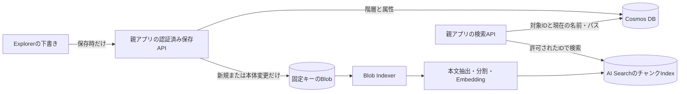
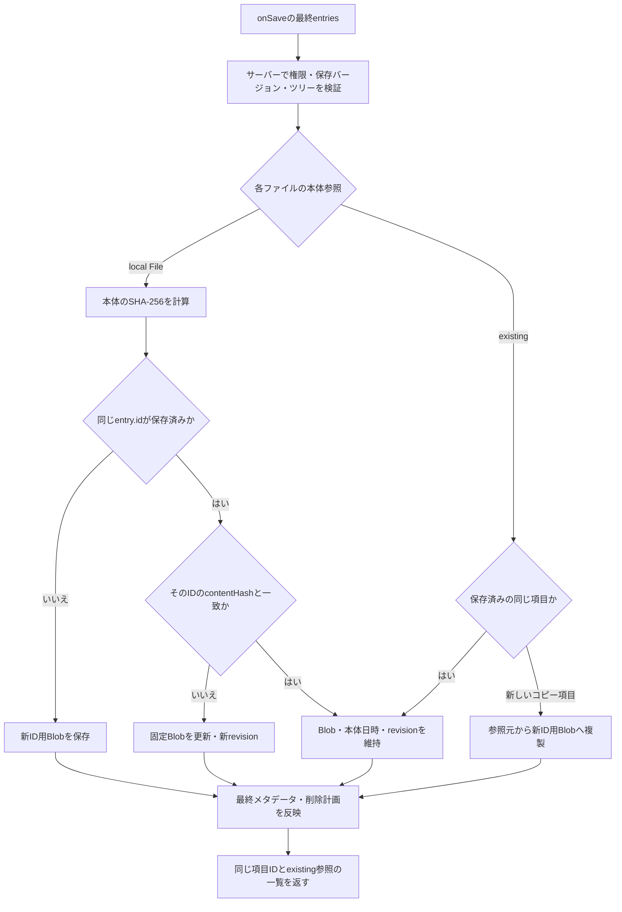
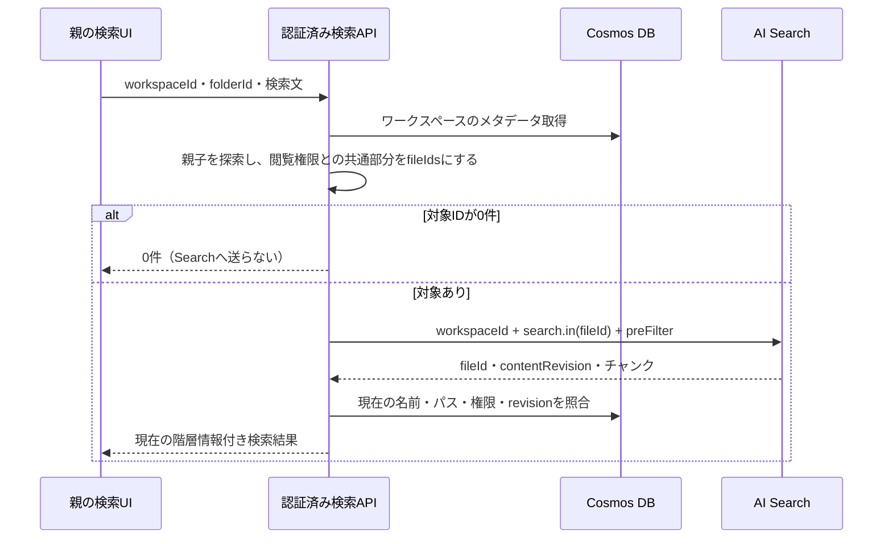

# SAMPLE：Cosmos DB・固定Blob・Azure AI Search

[ドキュメント一覧](./README.md)

**未実装の参考サンプルです。** [移動と再処理の前提](./azure-ai-search.md)を踏まえ、固定ID、DBの階層情報、Blob保存、ハッシュによる更新判定、検索Indexを組み合わせる例を示します。Azure実環境での接続・再処理件数の実測は行っていません。

<a id="azure-reference-sample"></a>

## SAMPLE：Cosmos DB＋固定Blob＋チャンク検索

**ここからは未実装の参考構成です。** Cosmos DB API for NoSQLを使い、1ワークスペース100〜500ファイル程度を扱う例です。JSONは設計用の定義例、TypeScriptは親アプリとサーバーの疑似コードであり、そのままデプロイできるAzure実装ではありません。認証、SDK接続、保存API、Indexer・Embeddingのリソース作成は、このリポジトリに含まれません。



### Cosmos DBの項目定義

コンテナ名を `explorer-items`、パーティションキーを `/workspaceId` とする例です。これは親の保存設計で選ぶ値で、Explorerが要求する設定ではありません。ファイル・フォルダの `id` は作成時に決めたUUIDを維持します。ルートは仮想の `root` とし、対応するフォルダ文書は作りません。

```json
{
  "id": "d35364e5-188b-4c3c-812f-3f8d2c3ac625",
  "workspaceId": "workspace-42",
  "kind": "folder",
  "parentId": "root",
  "name": "設計資料",
  "favorite": 0,
  "createdAt": "2026-09-01T09:00:00.000Z",
  "metadataUpdatedAt": "2026-09-07T09:00:00.000Z"
}
```

```json
{
  "id": "4483667e-63e3-4ef8-a7a8-b802ca32489e",
  "workspaceId": "workspace-42",
  "kind": "file",
  "parentId": "d35364e5-188b-4c3c-812f-3f8d2c3ac625",
  "name": "仕様書.pdf",
  "favorite": 0,
  "blobKey": "workspace-42/4483667e-63e3-4ef8-a7a8-b802ca32489e/content.pdf",
  "contentHash": "sha256:aaaaaaaaaaaaaaaaaaaaaaaaaaaaaaaaaaaaaaaaaaaaaaaaaaaaaaaaaaaaaaaa",
  "contentRevision": "rev-3",
  "size": 148230,
  "mime": "application/pdf",
  "createdAt": "2026-09-01T09:00:00.000Z",
  "contentUpdatedAt": "2026-09-05T09:00:00.000Z",
  "metadataUpdatedAt": "2026-09-07T09:00:00.000Z",
  "indexingStatus": "pending",
  "indexedContentRevision": "rev-2"
}
```

ハッシュ値は説明用です。実際は保存APIが受け取ったバイト列から同じアルゴリズムで計算します。`contentRevision` も説明用の文字列で、本体更新ごとに生成するUUID等を使えます。`indexingStatus` と `indexedContentRevision` は任意のホスト管理情報です。Indexerが自動でCosmosへ書き戻す値ではなく、親が対象revisionの索引反映を確認して更新します。古い処理の完了で新revisionを「反映済み」にしないよう照合します。

| 情報 | 更新する場面 |
| --- | --- |
| `id` / `workspaceId` / `createdAt` / `blobKey` | 新規保存時に決定し、同じ項目の移動・改名・上書きでは維持する。 |
| `parentId` / `name` / `favorite` | 最終下書きのメタデータを保存するとき。 |
| `contentHash` / `contentRevision` / `size` / `mime` / `contentUpdatedAt` | 新規本体を保存するとき、または既存本体が変わったとき。 |
| `metadataUpdatedAt` | 名前・所属などの管理情報が変わったとき。 |

親子関係の正は **`parentId` だけ**にします。絶対パスや `ancestorIds` を各ファイルへ重複保存しないため、フォルダを移動しても、そのフォルダ1文書の更新で済みます。保存時は全ファイルから祖先をたどり、必要なフォルダだけを残します。ファイルを持たない空フォルダは永続化しません。

この規模ならAPIで同一ワークスペースのメタデータを読み、`id → 項目` と `parentId → 子` のMapを作ります。フォルダ配下のファイルIDはサーバーで木を探索して求めます。CosmosのJOINは任意の文書間を再帰探索する機能ではありません。全ファイルを取得しない構成にする場合も、先にフォルダ一覧から子孫IDを求め、`parentId IN (...)` のパラメーター化クエリーでファイルを取得します。[Cosmos DBのデータモデリング](https://learn.microsoft.com/en-us/azure/cosmos-db/modeling-data)

`ancestorIds` は、規模や読取負荷を計測して必要になった段階の選択肢です。追加すると配下検索は簡単になりますが、フォルダ移動時には子孫文書の更新が必要になります。

保存APIは権限、親の存在、循環、同じ親での名前重複を再検証します。Cosmosの `_etag` と `If-Match` は文書の競合検知に使えますが、別々の文書を更新する同時移動や同名作成の競合は、それだけで防げません。ワークスペースの保存バージョンや編集ロックを含めて検証します。標準のTransactional Batchは同一パーティション内で最大100操作・2 MBのため、500項目の保存を無条件に1トランザクションと扱わず、複数バッチ時の途中失敗と再試行をサーバー側で設計します。[楽観的同時実行制御](https://learn.microsoft.com/en-us/azure/cosmos-db/database-transactions-optimistic-concurrency)、[Transactional Batch](https://learn.microsoft.com/en-us/azure/cosmos-db/transactional-batch)

### Blobの本体とメタデータ

コンテナは `file-content`、Blobキーは `{workspaceId}/{fileId}/content.ext` とします。`ext` は初回保存時の形式から決め、その後は表示名と独立して固定します。上のファイルなら次のメタデータを、本体の保存時に付けます。

```json
{
  "fileid": "4483667e-63e3-4ef8-a7a8-b802ca32489e",
  "workspaceid": "workspace-42",
  "contentrevision": "rev-3"
}
```

`fileid` と `workspaceid` は固定し、`contentrevision` は本体が変わるときだけ更新します。表示名・フォルダ名・パス・お気に入りはBlob metadataへ入れません。同じ内容の上書きで `Set Blob Metadata` を呼び直すことも避けます。これにより、移動や同一内容の再アップロードはBlobの変更検知に影響しません。

このSAMPLEは、保存済みの1ファイルIDにつき1つのBlobを持つ方式です。Explorerの `entry.id` は項目ID、`source.id` は本体の参照IDなので、常に等しいというコンポーネントの保証はありません。初期読込と保存成功後は `source: { kind: "existing", id: fileId }` に正規化し、`readFile(fileId)` は認証済みAPIで対応する `blobKey` を解決します。保存前のコピーは、新しい `entry.id` から元ファイルの `source.id` を参照していることがあります。その場合は元本体を新ID用のBlobへ複製します。

### 上書きと保存の分岐

| 保存対象 | 項目IDと下書き | 親の保存処理 |
| --- | --- | --- |
| 同じ親・同じ名前で「上書きする」、ハッシュも同じ | 既存IDを維持し、`source` はローカル `File`。保存済みなら `changes.updated` に含まれる。 | 既存IDの保存済みハッシュと比較し、Blob書込みを省略。本体の日時・revision・既存参照を維持して返す。通常の再処理対象にならない。 |
| 同じ場所への上書き、ハッシュが異なる | 同じく既存IDを維持。 | 同じ固定キーへ本体を保存し、ハッシュ・revision・本体更新日時を更新。Indexerの取り込み対象になる。 |
| 新しいパスに追加。同じバイト列が別の場所に存在 | 新IDとローカル `File` が `changes.created` に入る。 | 別ファイルとして新ID用のBlobと検索データを作る。ハッシュが同じでも既存IDへ統合しない。 |
| 新しいフォルダBへ追加し、元のフォルダAのファイルを削除 | 新IDは `created`、元IDは `deleted`。 | 新規保存と元ファイル削除。移動へ推測変換しない。 |
| 画面内で移動 | 既存ID・本体参照・日時を維持し、`parent` だけ変更。 | Cosmosの所属情報だけ更新する。 |
| コピー・複製 | 新ID。保存前は既存の本体参照を共有できる。 | このSAMPLEでは新ID用のBlobを作る。 |

上書き確認は「その既存項目を置き換える」というID対応を決めます。**内容が同じかどうかは確認しません。** Explorerはハッシュを計算せず、ローカル `File` が入った時点では既存の `createdAt` / `updatedAt` を保持します。親は保存後、ファイルの `updatedAt` を `contentUpdatedAt` から、フォルダの `updatedAt` を `metadataUpdatedAt` から作る、といった一貫した規則で正規化一覧を返します。名前変更などで下書きの日時が変わっていても、親の保存結果が最終値です。



次は保存計画の概念例です。`host.*` はすべて親側で実装する補助処理で、このコンポーネントのAPIではありません。`File` はJSONに埋め込まず、親がmultipartやアップロードセッションでサーバーへ渡します。

```ts
// SAMPLE: サーバーで受理した本体と、検証済みの最終ツリーから保存計画を作る。
async function planFile(entry, savedById, uploadedBodies) {
  const saved = savedById.get(entry.id);
  if (entry.source.kind === "local") {
    const body = uploadedBodies.get(entry.id);
    const hash = await host.sha256(body);
    if (saved && saved.contentHash === hash) {
      return host.keepContent(saved, entry); // Blob APIを呼ばず、メタデータのみ比較。
    }
    return host.writeContentPlan({
      entry,
      body,
      blobKey: saved?.blobKey ?? host.newFixedBlobKey(entry),
      contentHash: hash,
      contentRevision: host.newRevision(),
      createdAt: saved?.createdAt ?? host.now(),
      contentUpdatedAt: host.now(),
    });
  }
  if (saved) return host.keepContent(saved, entry);
  // 新しいentry.idが参照するコピー元。参照元へのアクセス権も検証する。
  return host.copyToNewFilePlan(entry, entry.source.id);
}

// SAMPLE: 親のonSave。以下の通信・整合性管理は利用先で実装する。
async function onSave(payload) {
  const response = await host.saveMultipart({
    payload,
    expectedWorkspaceVersion: host.savedVersion,
    editToken: host.currentEditToken,
  });
  host.savedVersion = response.version;
  return response.entries; // 同じentry.id、本体参照はexistingへ正規化済み。
}
```

BlobとCosmosの更新は単一トランザクションにはなりません。この疑似コードは更新順や復旧処理を省略しています。実装時は同じ保存要求の重複適用を防ぎ、途中失敗を再試行・復旧できる保存計画を持たせます。固定キーへの上書きとDB更新の間には一時的な不一致があり得るため、保存APIが成功した状態と、検索に反映済みのrevisionを区別します。Indexer待ちの処理や削除の再試行が必要なら、ホスト側のジョブやoutboxを追加します。

### AI SearchのIndexとSkillset定義例

Searchには本文チャンクと固定IDを置き、表示パス・表示名は置きません。`chunkId` はIndex Projectionが生成する検索文書キー、`parent_id` はProjectionが管理する親参照です。アプリのファイルIDは別の `fileId` に保持します。`parent_id` を手動で `fileId` へマッピングすると変更追跡を壊すため、生成キーと親参照の両方をProjectionへ任せます。[Index Projectionsの定義](https://learn.microsoft.com/en-us/azure/search/search-how-to-define-index-projections)

```json
{
  "name": "explorer-chunks",
  "fields": [
    { "name": "chunkId", "type": "Edm.String", "key": true, "searchable": true, "filterable": true, "analyzer": "keyword" },
    { "name": "parent_id", "type": "Edm.String", "filterable": true },
    { "name": "fileId", "type": "Edm.String", "filterable": true, "retrievable": true },
    { "name": "workspaceId", "type": "Edm.String", "filterable": true, "retrievable": true },
    { "name": "contentRevision", "type": "Edm.String", "filterable": true, "retrievable": true },
    { "name": "content", "type": "Edm.String", "searchable": true, "retrievable": true },
    { "name": "contentVector", "type": "Collection(Edm.Single)", "searchable": true, "retrievable": false, "stored": true, "dimensions": 1536, "vectorSearchProfile": "content-profile" }
  ],
  "vectorSearch": {
    "algorithms": [{ "name": "content-hnsw", "kind": "hnsw", "hnswParameters": { "metric": "cosine" } }],
    "profiles": [{ "name": "content-profile", "algorithm": "content-hnsw" }]
  },
  "semantic": {
    "configurations": [{
      "name": "content-semantic",
      "prioritizedFields": { "prioritizedContentFields": [{ "fieldName": "content" }] }
    }]
  }
}
```

1536次元は `text-embedding-3-small` を使う例です。モデル・索引側・問い合わせ側の次元を揃えます。ベクトルは `stored: true` で保持し、通常の検索応答では `retrievable: false` で返しません。セマンティック設定の対象は本文です。[ベクトルIndexの定義](https://learn.microsoft.com/en-us/azure/search/vector-search-how-to-create-index)、[セマンティック設定](https://learn.microsoft.com/en-us/azure/search/semantic-how-to-configure)

Skillsetの例です。リソースURL・デプロイ名は置換し、SearchからEmbeddingへアクセスできる認証を構成します。この例はキーを埋め込まず、SearchのマネージドIDを使う前提です。

```json
{
  "name": "explorer-content-skills",
  "skills": [
    {
      "@odata.type": "#Microsoft.Skills.Text.SplitSkill",
      "context": "/document",
      "textSplitMode": "pages",
      "maximumPageLength": 2000,
      "pageOverlapLength": 300,
      "inputs": [{ "name": "text", "source": "/document/content" }],
      "outputs": [{ "name": "textItems", "targetName": "pages" }]
    },
    {
      "@odata.type": "#Microsoft.Skills.Text.AzureOpenAIEmbeddingSkill",
      "context": "/document/pages/*",
      "resourceUri": "https://YOUR-RESOURCE.openai.azure.com",
      "deploymentId": "YOUR-EMBEDDING-DEPLOYMENT",
      "modelName": "text-embedding-3-small",
      "dimensions": 1536,
      "inputs": [{ "name": "text", "source": "/document/pages/*" }],
      "outputs": [{ "name": "embedding", "targetName": "vector" }]
    }
  ],
  "indexProjections": {
    "selectors": [{
      "targetIndexName": "explorer-chunks",
      "parentKeyFieldName": "parent_id",
      "sourceContext": "/document/pages/*",
      "mappings": [
        { "name": "content", "source": "/document/pages/*" },
        { "name": "contentVector", "source": "/document/pages/*/vector" },
        { "name": "fileId", "source": "/document/fileid" },
        { "name": "workspaceId", "source": "/document/workspaceid" },
        { "name": "contentRevision", "source": "/document/contentrevision" }
      ]
    }],
    "parameters": { "projectionMode": "skipIndexingParentDocuments" }
  }
}
```

分割長は文字数の例で、文書・言語・モデルの制限に合わせて調整します。Blob metadataの `fileid` 等を全チャンクへ写し、元ファイルの識別とrevisionの照合に使います。元のmetadataキーをこの例と同じ小文字で保存し、Skillsetでも `/document/fileid` 等へ一致させます。[Text Split Skill](https://learn.microsoft.com/en-us/azure/search/cognitive-search-skill-textsplit)、[Embedding Skillと認証・次元](https://learn.microsoft.com/en-us/azure/search/cognitive-search-skill-azure-openai-embedding)、[カスタムmetadata名の対応](https://learn.microsoft.com/en-us/azure/search/search-how-to-index-azure-blob-storage#custom-and-content-specific-metadata)

Blobデータソースは `file-content` コンテナを対象にし、Indexerは `targetIndexName: "explorer-chunks"`、`skillsetName: "explorer-content-skills"` に接続します。本文とメタデータの抽出を有効にし、`chunkId` / `parent_id` の手動マッピングや、チャンク用の重複したoutput mappingは追加しません。検索の入力をCosmosの階層管理文書へ切り替えると、管理情報の更新もCosmos Indexerの `_ts` による変更検知へ入るため、このSAMPLEでは本体のBlobだけをIndexerの入力にします。[Cosmos Indexerの増分取り込み](https://learn.microsoft.com/en-us/azure/search/search-how-to-index-cosmosdb-sql)

### フォルダを指定した検索と現在の表示名



検索APIが認証済みのワークスペースとフォルダから子孫ファイルIDを求め、閲覧可能なIDだけでフィルターを作ります。クライアントが渡したID一覧を、そのまま権限として使いません。例えばUUIDの一覧なら、検索条件は次の形です。

```text
workspaceId eq 'workspace-42' and search.in(fileId, 'file-uuid-1,file-uuid-2', ',')
```

実装では値をエスケープし、IDの形式・件数を検証します。ベクトル検索は `vectorFilterMode: "preFilter"` を指定します。許可IDが0件なら全体検索へ切り替えず、そのまま0件を返します。クエリーベクトルは本文と同じモデル・次元で親のサーバーが生成します。このIndex例には問い合わせ時のvectorizer設定を含めていません。[ベクトル検索のフィルター](https://learn.microsoft.com/en-us/azure/search/vector-search-filters)、[search.inの構文](https://learn.microsoft.com/en-us/azure/search/search-query-odata-search-in-function)

結果表示では最新のCosmos情報から名前とパスを組み立て、削除済み・権限外の項目を除外します。検索中の移動や権限変更も扱うなら、応答時に対象フォルダ内かを再確認します。本体の新revisionが未反映なら、古いチャンクを除外するか「検索への反映待ち」と表示するかを親で決めます。名前・パスをIndexへ置かない構成なので、表示名による検索が必要な場合は、親がCosmosのメタデータ検索と組み合わせます。

### 削除と再試行

Cosmosのファイル文書を消しただけでは、検索チャンクは消えません。このSAMPLEで明示削除する場合は、`workspaceId` と `fileId` で該当する**すべての `chunkId`**をページング取得し、そのキーをDocuments APIの削除へ渡します。フォルダ削除なら、削除前に確定した配下の全ファイルIDを対象にします。現在の画面に見えている数件の検索結果だけを削除して完了にはしません。

再試行中も対象IDを失わないよう、親の削除ジョブ等へ保持します。Blobが残ったままIndexerが再取り込みするとチャンクが復活し得るため、本体削除とIndexerの実行中処理を考慮し、必要なら終了後に削除を再確認します。削除検知ポリシーを採用する場合は初回取り込み前から設定し、利用するBlobの削除方式とIndex Projectionsの子チャンク削除を実環境で検証します。このSAMPLEは「Blobを消せば常に全チャンクが自動で消える」とは扱いません。[Blobの変更・削除検知](https://learn.microsoft.com/en-us/azure/search/search-how-to-index-azure-blob-changed-deleted)、[Projectionの削除追跡](https://learn.microsoft.com/en-us/azure/search/search-how-to-define-index-projections#deleted-content)
