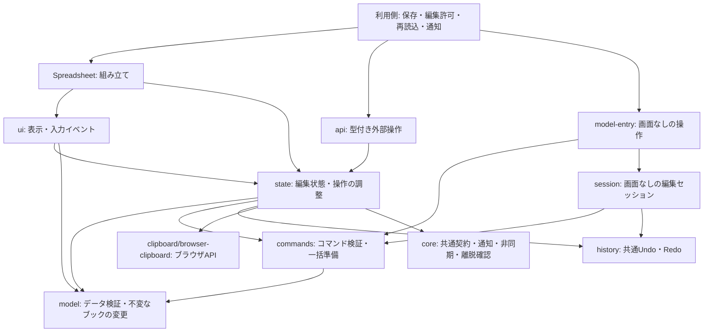

# 内部構成と拡張の方針

Spreadsheetは、ブックを変更する純粋な処理、React上の編集状態、画面とブラウザ操作を分けています。機能を追加するときも、UIからブックを直接書き換えず、この境界に沿って実装します。

公開入口はUI用の `index.ts` と、画面なしでJSONを加工する `model-entry.ts` です。パッケージではそれぞれ `@likex/spreadsheet` と `@likex/spreadsheet/model` からimportします。利用側への契約は `props.ts`・`api/`・`model/types.ts`・`commands/` の公開型に定義します。内部ファイルの配置は公開APIではなく、将来変更できます。コピー導入ではSpreadsheetの `src/` 全体とcoreの `src/` を隣接フォルダに配置し、`core.ts` のimport先1か所を変更します。

## 依存の方向



矢印は利用・依存の方向です。`model/`・`commands/`・`history/`・`session/` はReact・DOM・`state/`・`ui/` に依存しません。`state/` から `ui/` も参照しません。coreにもReactやSpreadsheet固有のブック型・状態は持たせません。表示上の寸法の既定値を含め、モデルと画面で共通の値は `model/sheet-dimensions.ts` に置きます。

## ファイルの役割

以下は `src/` 内の主な構成です。

| 場所 | 責務 |
| --- | --- |
| `model-entry.ts` | ReactやDOMを読み込まない公開入口。取得・変更APIと履歴付きセッションを公開 |
| `session/create-spreadsheet-session.ts` | 画面なしのコマンド実行・履歴・最新データ取得を組み合わせる |
| `history/workbook-history.ts` | GUIとセッションで共用する上限付きのUndo／Redo履歴 |
| `model/query.ts`・`query-reader.ts` | 番地やIDによる読み取りと、最新ブックを参照するメソッドの接続 |
| `api/types.ts`・`api/use-spreadsheet-handle.ts` | 公開コマンド型・結果型・読み取り専用snapshotと、安定したrefの接続 |
| `api/lifecycle.ts`・`api/features.ts` | 注入する処理・イベント・編集許可・機能設定の公開型 |
| `core.ts` | `@likex/core` への入口。コピー導入時の参照先変更もここだけで行う |
| `model/types.ts` | 保存できるJSONの型と上限 |
| `model/workbook.ts` | ブック操作の公開用export。実装は下記に分離 |
| `model/workbook/normalize.ts`・`validation.ts`・`snapshot.ts` | 外部データの正規化、入力検証、不変なスナップショットの生成 |
| `model/workbook/cells.ts`・`merges.ts` | セル値・書式、セルの結合・解除 |
| `model/workbook/structure.ts`・`sheets.ts`・`move-cells.ts` | 行列・シート構造、セル移動と参照の整合性 |
| `model/workbook/annotations.ts` | 描画オブジェクト・画像・コメントのブックへの反映 |
| `model/formula.ts`・`function-definitions.ts` | 数式の評価と参照の変換、対応関数の定義 |
| `model/formatting/`・`model/conditional-formatting.ts` | 書式検証・表示文字列・日付変換と条件付き書式の評価。画面・検索・自動調整・Excel出力で共用 |
| `model/editing/` | 検索、貼り付け、連続データと数式参照の展開 |
| `model/data-validation.ts`・`model/workbook/data-validation.ts` | 入力規則の検証と変更後ブック全体の検査 |
| `ui/spreadsheet-dialog.tsx` | 表示領域に収まるフォームダイアログ、フォーカス制御・キャンセル |
| `styles.css`・`ui/*.css` | CSSの単一入口と画面機能ごとのスタイル。パッケージはビルド時に1ファイルへ結合 |
| `model/serialization.ts` | JSONの読み書き |
| `model/drawing-placement.ts` | セル領域を基準に画像・図形の範囲と次の配置位置を計算。コマンド結果と公開ヘルパーで共用 |
| `state/use-spreadsheet.ts` | 下記の状態を組み合わせ、UI用のコントローラーを提供 |
| `commands/` | GUI・ref・画面なしの操作で共用するコマンドの検証・準備と、ブックへ一括適用する公開API |
| `state/use-spreadsheet-commands.ts` | 共有コマンド処理を、表示中の下書き・選択・編集許可・履歴へ接続 |
| `state/read-image.ts` | File / Blobの画像検証とJSONリソースへの変換。`prepareSpreadsheetImage` として公開 |
| `state/use-workbook-draft.ts` | 下書き、変更履歴、変更の準備と反映、編集許可・保存処理の接続 |
| `state/use-spreadsheet-edit-session.ts` | 編集許可の取得、キャンセル、セッションとAbortSignalの寿命 |
| `state/use-workbook-persistence.ts` | 保存前検証、保存、再読み込み、破棄と古い非同期応答の無効化 |
| `state/use-unsaved-changes-guard.ts` | 未確定入力を含む未保存状態と、表示先ウィンドウの離脱確認の接続 |
| `state/use-spreadsheet-selection.ts`・`selection.ts` | 選択状態と、範囲の計算・検証 |
| `state/use-cell-edit.ts` | 入力中の文字列、確定・キャンセル |
| `state/use-pending-object-edits.ts` | コメントや図形など、未確定の入力があるかの管理 |
| `api/resolve-features.ts` | GUIと画面なしの操作で共用する機能設定の解決 |
| `state/types.ts`・`notifications.ts` | 内部の連携型、親への通知 |
| `state/clipboard/cell-transfer.ts` | GUIの選択・コピー状態を公開コピーAPIと貼り付け／移動コマンドへ変換。ブックは変更しない |
| `state/clipboard/browser-clipboard.ts` | ブラウザのクリップボードの読み書き |
| `state/use-spreadsheet-clipboard.ts` | 上記の連携、切り取り状態、古くなった非同期操作の取り消し |
| `ui/spreadsheet-grid.tsx` | グリッドの描画と操作hookの組み立て |
| `ui/grid/` | 表示範囲と座標、セルの表示書式、キーボードとフォーカス、ポインター選択、行列サイズ・自動調整・オートフィル |
| `ui/spreadsheet-drawings.tsx`・`ui/drawings/` | 描画レイヤー、移動・サイズ変更、描画内容、プロパティ編集 |
| その他の `ui/` | ツールバー、数式バー、コメントパネルなどの画面部品 |

`model/workbook/annotations.ts` は「ブックを変更する操作」、`model/annotations.ts` は「描画・コメントのデータ検証」を担当します。内部モジュールは必要な下位モジュールを直接importし、自身を再exportする入口へ戻る依存を作りません。

## 行と列の描画範囲

`ui/grid/use-grid-layout.ts` はスクロール位置と表示領域の高さから描画する行を決めます。現在は表示領域の前後に約5〜7行を加え、入力を維持するアクティブ行と、上方から表示領域へまたがる結合の開始行も残します。300行の新規シートでも、主なセルDOMの数は全行数ではなく、この描画対象の行数で決まります。

列は仮想化していません。描画対象の各行に全列のセルを作るため、列数を増やすとDOMも比例して増えます。行数を増やした場合も行位置の配列計算が必要で、保持セル・数式・保存JSONの量は描画とは別に処理負荷へ影響します。新規ブック・新規シートとデモは300行×26列を基本とし、大きいデモは元の行列数を維持します。

## 変更を反映する経路

セルや図形を変更するGUI操作は、コントローラーの `executeCommand` / `executeCommands` で共通コマンド処理へ渡します。セル入力の確定や削除、コピー後の貼り付け、切り取りによる移動も同じ経路です。

1. 読み取り専用・保存中・機能設定などのガードを確認する。
2. モデルの操作から変更後のブックを準備し、選択範囲も検証する。元のブックは変更せず、実変更がなければ終了する。
3. 編集セッションがなければ親の編集許可を得る。待機中は下書きを変更しない。
4. 許可後に現在のブック・権限・操作対象が有効か再確認する。
5. 成功した場合だけ履歴・ブック・選択を更新し、`onChange` と変更イベントで親へ通知する。

途中で失敗した場合、ブックと履歴を部分的に更新しません。複数セルへの貼り付けや結合も、1つの操作として渡します。Undo/Redoはこの単位になります。

GUI・ref・画面なしのAPIは、`commands/` で全操作を準備します。GUIとrefでは同じ下書きトランザクションへ一度だけ渡します。外部APIは最新参照を使って読み取り専用・保存中・未確定入力・再入を検証します。モデルのコマンド処理は同期ですが、`executeAsync` / `batchAsync` は必要な編集許可を待ちます。同期の `execute` / `batch` は未取得の外部許可が必要なら `EDIT_REQUIRED` を返します。ブラウザでの画像準備はトランザクションの外で行います。[外部操作API](./external-operations.md)に契約をまとめています。

`applySpreadsheetCommands` は同じ `commands/` を利用し、元のブックを変更せず、成功した場合だけ変更後のブックを返します。画面の選択・履歴・編集セッション・イベントには接続しません。保存や同時更新の確認は呼び出し側が行います。履歴が必要な場合は `createSpreadsheetSession` を使うと、GUIと同じ履歴エンジンでUndo／Redoを扱えます。[画面なしの操作](./headless.md)と[履歴付きセッション](./history-session.md)に利用例をまとめています。

画面の保存操作ではセル入力を先に確定し、コメントや図形に未確定の入力がないことを確認します。Handleの `save()` は未確定入力がある場合に拒否します。その後 `onBeforeSave`、`onSave`、保存済みの基準更新、成功通知の順で進めます。通信・認証・競合解決は利用側が実装します。選択、入力途中の文字列、スクロール位置、コピー状態は保存するブックJSONに追加しません。失敗・キャンセル・ロックの契約は[ライフサイクル](./lifecycle.md)にまとめています。

## 機能を追加する場所

| 追加する内容 | 実装の入口と確認点 |
| --- | --- |
| 新しいセル操作 | `model/` に操作を実装し、`SpreadsheetCommand` から呼ぶ。GUIは同じコマンドを発行する。無変更・失敗時のブックと履歴を検証 |
| 数式・関数 | `model/` の数式エンジンへ追加。UIとは別に値・参照・エラー・計算上限をテスト |
| 選択やショートカット | 範囲の意味は `state/selection.ts`、入力ジェスチャーは `ui/grid/` に置く。セル編集中・IME中・結合セルも確認 |
| 描画オブジェクト | JSON型と検証、ブック操作、描画・編集UIをそれぞれ追加。履歴とJSON往復も確認 |
| コピー形式や貼り付け規則 | データの抽出・変更は `model/editing/` と `commands/`、GUIのコマンド作成は `cell-transfer.ts`、OS入出力は `browser-clipboard.ts` |
| 利用側への設定やコールバック | `props.ts` に公開型を定義し、state側で処理。既定値、読み取り専用時の動作、利用ガイドを揃える |

共通化は、複数の処理が同じルールを共有するときに行います。関係のない処理をまとめた `utils` や、用途のない汎用プラグイン基盤は設けません。

## 確認方法

リポジトリのルートから実行します。

```bash
npm run test --workspace @likex/spreadsheet
npm run typecheck --workspace @likex/spreadsheet
npm run check:release -- --online
```

テストはモデルの不変性、編集と保存、選択と結合、クリップボード、UI操作に加え、依存方向と実行時importの循環も検査します。リリースチェックでは他パッケージへの影響、tarball導入、コピー導入、Next.jsへの組み込みまで確認します。`--online` は導入検証用の依存取得にネットワーク接続を使います。
