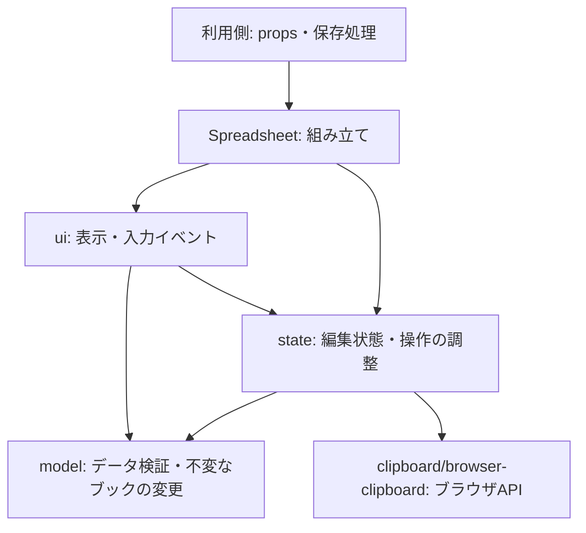

# 内部構成と拡張の方針

Spreadsheetは、ブックを変更する純粋な処理、React上の編集状態、画面とブラウザ操作を分けています。機能を追加するときも、UIからブックを直接書き換えず、この境界に沿って実装します。

公開入口は `index.ts`、利用側への契約は `props.ts` と `model/types.ts` です。パッケージからは公開入口をimportしてください。内部ファイルの配置は公開APIではなく、将来変更できます。コピー導入の場合も `src/` 全体をコピーする方式は変わりません。

## 依存の方向



矢印は利用・依存の方向です。`model/` はReact・DOM・`state/`・`ui/` に依存しません。`state/` から `ui/` も参照しません。表示上の寸法の既定値を含め、モデルと画面で共通の値は `model/sheet-dimensions.ts` に置きます。

## ファイルの役割

以下は `src/` 内の主な構成です。

| 場所 | 責務 |
| --- | --- |
| `model/types.ts` | 保存できるJSONの型と上限 |
| `model/workbook.ts` | ブック操作の公開用export。実装は下記に分離 |
| `model/workbook/normalize.ts`・`validation.ts`・`snapshot.ts` | 外部データの正規化、入力検証、不変なスナップショットの生成 |
| `model/workbook/cells.ts`・`merges.ts` | セル値・書式、セルの結合・解除 |
| `model/workbook/structure.ts`・`sheets.ts`・`move-cells.ts` | 行列・シート構造、セル移動と参照の整合性 |
| `model/workbook/annotations.ts` | 描画オブジェクト・画像・コメントのブックへの反映 |
| `model/formula.ts`・`function-definitions.ts` | 数式の評価と参照の変換、対応関数の定義 |
| `model/serialization.ts` | JSONの読み書き |
| `state/use-spreadsheet.ts` | 下記の状態を組み合わせ、UI用のコントローラーを提供 |
| `state/use-workbook-draft.ts` | 下書き、変更履歴、読み取り専用、保存と非同期応答 |
| `state/use-spreadsheet-selection.ts`・`selection.ts` | 選択状態と、範囲の計算・検証 |
| `state/use-cell-edit.ts` | 入力中の文字列、確定・キャンセル |
| `state/use-pending-object-edits.ts` | コメントや図形など、未確定の入力があるかの管理 |
| `state/features.ts`・`types.ts`・`notifications.ts` | 機能設定の解決、内部の連携型、親への通知 |
| `state/clipboard/cell-transfer.ts` | コピーするデータの抽出、貼り付けの検証とブック変更。React・ブラウザAPIは使わない |
| `state/clipboard/browser-clipboard.ts` | ブラウザのクリップボードの読み書き |
| `state/use-spreadsheet-clipboard.ts` | 上記の連携、切り取り状態、古くなった非同期操作の取り消し |
| `ui/spreadsheet-grid.tsx` | グリッドの描画と操作hookの組み立て |
| `ui/grid/` | 表示範囲と座標、セルの表示書式、キーボードとフォーカス、ポインター選択、列幅変更 |
| `ui/spreadsheet-drawings.tsx`・`ui/drawings/` | 描画レイヤー、移動・サイズ変更、描画内容、プロパティ編集 |
| その他の `ui/` | ツールバー、数式バー、コメントパネルなどの画面部品 |

`model/workbook/annotations.ts` は「ブックを変更する操作」、`model/annotations.ts` は「描画・コメントのデータ検証」を担当します。内部モジュールは必要な下位モジュールを直接importし、自身を再exportする入口へ戻る依存を作りません。

## 変更を反映する経路

セルや図形を変更する操作は、コントローラーの `apply(operation)` を通します。

1. 読み取り専用・保存中などのガードを確認する。
2. モデルの操作から、変更後のブックを得る。元のブックは変更しない。
3. 変更後の構造に合わせた選択範囲を検証する。
4. 成功した場合だけ履歴・ブック・選択を更新し、`onChange` で親へ通知する。

途中で失敗した場合、ブックと履歴を部分的に更新しません。複数セルへの貼り付けや結合も、1つの操作として渡します。Undo/Redoはこの単位になります。

保存時はセル入力を先に確定し、コメントや図形に未確定の入力がないことを確認してから `onSave` を呼びます。通信・認証・競合解決は引き続き利用側が実装します。選択、入力途中の文字列、スクロール位置、コピー状態は保存するブックJSONに追加しません。

## 機能を追加する場所

| 追加する内容 | 実装の入口と確認点 |
| --- | --- |
| 新しいセル操作 | `model/workbook/` に純粋な操作を追加し、UIから `apply` を呼ぶ。無変更時と失敗時に元のブックを維持できるか検証 |
| 数式・関数 | `model/` の数式エンジンへ追加。UIとは別に値・参照・エラー・計算上限をテスト |
| 選択やショートカット | 範囲の意味は `state/selection.ts`、入力ジェスチャーは `ui/grid/` に置く。セル編集中・IME中・結合セルも確認 |
| 描画オブジェクト | JSON型と検証、ブック操作、描画・編集UIをそれぞれ追加。履歴とJSON往復も確認 |
| コピー形式や貼り付け規則 | データ変換は `cell-transfer.ts`、ブラウザとの通信は `browser-clipboard.ts`、非同期の有効性判定はhookへ追加 |
| 利用側への設定やコールバック | `props.ts` に公開型を定義し、state側で処理。既定値、読み取り専用時の動作、利用ガイドを揃える |

共通化は、複数の処理が同じルールを共有するときに行います。関係のない処理をまとめた `utils` や、用途のない汎用プラグイン基盤は設けません。

## 確認方法

リポジトリのルートから実行します。

```bash
npm run test --workspace @likex/spreadsheet
npm run typecheck --workspace @likex/spreadsheet
npm run check:release -- --online
```

テストはモデルの不変性、編集と保存、選択と結合、クリップボード、UI操作に加え、依存方向と実行時importの循環も検査します。リリースチェックでは他パッケージへの影響、tarball導入、コピー導入、Next.jsへの組み込みまで確認します。`--online` は導入検証用の依存取得にネットワーク接続を使います。
