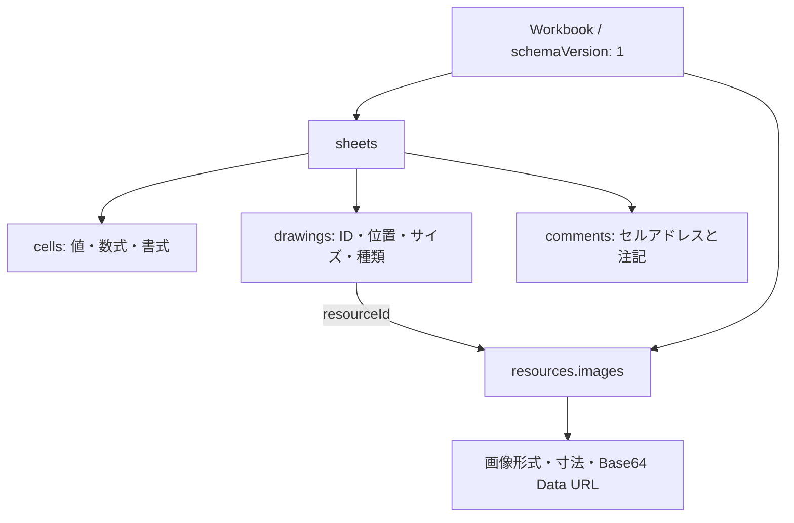

# 挿入オブジェクトとJSON保存

[利用ガイドへ戻る](./README.md)

ヘッダーの「ホーム」でセルを編集し、「挿入」で画像・図形・テキストボックス・コメントを追加します。保存・Undo／Redoはセルと挿入オブジェクトに共通です。

## 画面の操作

| 対象 | 操作 |
| --- | --- |
| 画像 | PNG・JPEG・WebP・GIFをローカルから選択し、選択セルの位置に挿入。ドラッグで移動し、現在の表示枠の縦横比を保ってサイズ変更。 |
| 図形 | 長方形・楕円・直線・矢印を挿入。位置・サイズ・塗り・線を編集。 |
| テキストボックス | セルと独立した複数行テキストを挿入。文字色・背景・文字サイズ・太字を編集。 |
| コメント | 選択セルに追加。セルの印から開き、内容の編集・削除が可能。1セルにつき1件。 |

選択したオブジェクトはDelete / Backspaceで削除できます。ドラッグ中のEscapeで移動・サイズ変更を取り消します。コメントは返信スレッドやユーザー認証を持たないセルの注記です。`author` は必要に応じて親側で指定できます。

画像は角のハンドルのドラッグ、サイズ変更ハンドルの矢印キー、設定パネルの幅・高さの入力で、もう一辺も連動して変更します。維持するのは現在の表示枠の比率です。画像本体は比率を崩さず枠内に収めるため、明示した枠と画像の比率が違う場合は余白ができます。図形・テキストボックスは幅と高さを独立して変更できます。

挿入オブジェクトを選択中は、背後のセルにコピー／切り取り／貼り付けや書式変更を適用しません。オブジェクト自体のクリップボード複製は未対応です。セルの内部コピーではコメントに新しいIDを付け、切り取りでは元のIDのまま移動します。外部アプリへのTSVコピーにコメントは含みません。

## 保存データの構成

挿入後も `onSave` の引数は `SpreadsheetWorkbook` です。内容はすべてJSONで表現し、`File`、`Blob`、DOM要素、一時的な `blob:` URLは保存しません。



画像バイナリはブックの `resources.images` に保存し、シート上の画像オブジェクトは `resourceId` で参照します。同じ画像リソースを複数の描画で参照できます。最後の参照を削除すると、未使用の画像リソースも除去します。Undoすると画像データも復元します。

`drawings` の配列順が重なり順です。`anchor.row` / `column` は0始まりのセル位置、`offsetX` / `offsetY` はセル左上からのピクセル数、`width` / `height` は表示サイズです。行列の挿入・削除ではアンカーが追従し、表示サイズは保ちます。アンカーの行列が削除された場合もオブジェクトを残し、有効な位置へ寄せます。コメントはセルの移動に追従し、対象の行列を削除すると一緒に削除します。

画像リソースの `width` / `height` は符号化された画像ヘッダーの寸法です。JPEGのEXIFに表示方向がある場合は画像データから解釈し、初期の表示サイズにも反映します。保存フィールドは増やさず、元画像リソースの寸法も書き換えません。描画側の `width` / `height` とは別の情報です。

画像の表示サイズには正の小数ピクセルも使えます。非常に横長・縦長の画像でも、短い辺を整数へ丸めて比率を変えることはありません。既存JSON、外部の `images.update`、低レベルの `insertImage` / `updateDrawing` で指定した表示枠を自動的に元画像比率へ補正しません。

```ts
import type { SpreadsheetWorkbook } from "@likex/spreadsheet";

const snapshot: SpreadsheetWorkbook = {
  schemaVersion: 1,
  resources: {
    images: {
      logo: {
        name: "pixel.png", mimeType: "image/png", width: 1, height: 1,
        dataUrl: "data:image/png;base64,iVBORw0KGgoAAAANSUhEUgAAAAEAAAABCAQAAAC1HAwCAAAAC0lEQVR42mNk+A8AAQUBAScY42YAAAAASUVORK5CYII=",
      },
    },
  },
  sheets: [{
    id: "sheet-1", name: "資料", rowCount: 100, columnCount: 26,
    cells: { A1: { value: "売上" } },
    comments: { A1: { id: "comment-1", text: "金額を確認してください", author: "担当者" } },
    drawings: [
      { id: "image-1", type: "image", resourceId: "logo", alt: "サンプル画像",
        anchor: { row: 1, column: 1, offsetX: 0, offsetY: 0 }, width: 40, height: 40 },
      { id: "shape-1", type: "shape", shape: "rectangle", fill: "#e8f3ec", stroke: "#217346", strokeWidth: 2,
        anchor: { row: 4, column: 1, offsetX: 0, offsetY: 0 }, width: 160, height: 100 },
      { id: "text-1", type: "text", text: "確認用のメモ\n2行目", fontSize: 16, color: "currentColor", background: "transparent",
        anchor: { row: 1, column: 4, offsetX: 8, offsetY: 0 }, width: 220, height: 100 },
    ],
  }],
};
```

この画像は構造を示すための1ピクセルのサンプルです。実際の画像は「挿入 → 画像」で読み込めます。テキストの `currentColor` はテーマの文字色を使い、明示した色・背景色はそのまま保持します。

## 保存と復元

`serializeWorkbook` は検証したJSON文字列を返し、`parseWorkbook` はJSONの構文・形式・サイズを検証してブックを復元します。通常の `JSON.stringify(workbook)` でもJSON化できますが、読み込み時は `parseWorkbook` または `normalizeWorkbook` を使ってください。

```tsx
"use client";

import Spreadsheet, { parseWorkbook, serializeWorkbook } from "@likex/spreadsheet";
import "@likex/spreadsheet/styles.css";

export function WorkbookView({ savedJson, revision }: { savedJson: string; revision: string }) {
  return <Spreadsheet
    key={revision}
    initialWorkbook={parseWorkbook(savedJson)}
    onSave={async workbook => {
      const response = await fetch("/api/workbooks/current", {
        method: "PUT",
        headers: { "Content-Type": "application/json" },
        body: serializeWorkbook(workbook),
      });
      if (!response.ok) throw new Error("保存に失敗しました");
    }}
    style={{ height: 600 }}
  />;
}
```

認証、権限、JSONを保存するDBやファイル、競合の検知は親アプリが担当します。`initialWorkbook` はマウント時だけ読み込むため、別の保存データを開く場合は `key` を変更します。変更前に未保存データの扱いを親で確認してください。

`schemaVersion: 1` を保存します。以前の `{ sheets: [...] }` 形式も読み込めます。未対応のバージョン番号はエラーとし、無理に読み替えません。

## APIと機能のOFF指定

`SpreadsheetDrawing` は `type` による判別可能なunionで、画像・図形・テキストの必要なフィールドを型で区別します。`SpreadsheetImageResource`、`SpreadsheetDrawingAnchor`、`SpreadsheetDrawingPatch`、`SpreadsheetComment` も公開しています。

`addDrawing`、`insertImage`、`updateDrawing`、`deleteDrawing`、`setCellComment`、`setCellComments` は入力ブックを変更せず、新しいスナップショットを返します。`updateDrawing` でIDや種類は変更できません。セルコメントの削除には `null` を指定します。

```tsx
<Spreadsheet
  initialWorkbook={snapshot}
  onSave={saveWorkbook}
  features={{ images: false, shapes: false, textBoxes: false, comments: false }}
  style={{ height: 600 }}
/>
```

各機能は既定でONです。OFFにすると挿入メニューと該当オブジェクトの表示・編集を隠します。保存済みデータを削除する設定ではないため、隠されたデータもJSONに残ります。`onSave` 未指定または `readOnly` のときは閲覧のみです。

## サイズと画像の制約

- 画像は1枚5 MiB、ブック全体20 MiBまで。各辺10,000ピクセル、合計1,600万画素以下です。
- モデルはBase64・画像ヘッダー・宣言した形式と寸法を検証します。ローカル画像を選択するときは、さらにブラウザで実際にデコードできることを確認します。SVG・外部URL・HTMLの埋め込みは受け付けません。ブラウザのCSPで画像を制限する場合は、`img-src` に `data:`（保存した画像の表示）と `blob:`（ローカル画像の読み込み中の検証）を許可してください。
- 描画は1ブック全体で1,000件、コメントは1ブック全体で10,000件まで。コメント本文は10,000文字です。
- JSON文字列は64 Mi文字までです。Base64化で画像の保存サイズは元のバイナリより増えます。上限は快適な描画速度や保存先APIの受信可能サイズを保証する値ではありません。

## Univerを参考にした点

Univerは、ブックのスナップショットにシートを持ち、追加機能のデータを `resources` に格納できます。[公式データモデル](https://docs.univer.ai/guides/sheets/model/workbook-data)・[Custom Model](https://docs.univer.ai/blog/custom-model)

LikeXも「編集時の状態と保存スナップショットを分ける」「画像実体とシート上の配置を分ける」という考え方を採用しています。上記JSONはLikeX独自形式で、Univerの `IWorkbookData` と直接互換ではありません。Univer本体への依存や形式変換機能は追加していません。
