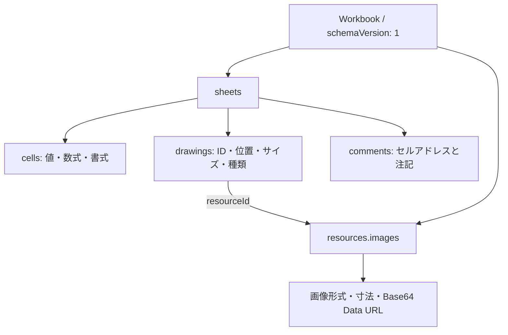

# 挿入オブジェクトとJSON保存

[利用ガイドへ戻る](./README.md)

ヘッダーの「ホーム」でセルを編集し、「挿入」で画像・図形・テキストボックス・コメントを追加します。保存・Undo／Redoはセルと挿入オブジェクトに共通です。

## 画面の操作

| 対象 | 操作 |
| --- | --- |
| 画像 | PNG・JPEG・WebP・GIFをローカルから選択し、選択セルの位置に挿入。ドラッグで移動し、現在の表示枠の縦横比を保ってサイズ変更。 |
| 図形 | 基本図形・直線・矢印をカテゴリ別のアイコン一覧から挿入。位置・サイズ・塗り・線と、図形内の文字を編集。 |
| テキストボックス | セルと独立した複数行テキストを挿入。文字色・背景・文字サイズ・太字を編集。 |
| コメント | 選択セルに追加。セルの印から開き、内容の編集・削除が可能。1セルにつき1件。 |

選択したオブジェクトはDelete / Backspaceで削除できます。ドラッグ中のEscapeで移動・サイズ変更・回転を取り消します。コメントは返信スレッドやユーザー認証を持たないセルの注記です。`author` は必要に応じて親側で指定できます。

図形・テキストボックスはダブルクリック、または選択後のEnterで文章を編集します。改行も入力でき、外側をクリックすると確定、Escapeで取り消します。図形の文字は形状内の領域に合わせて中央に配置し、設定パネルで文字サイズ・文字色・太字を変更できます。図形と文字は1つのオブジェクトとして移動・保存・Undo／Redo・Excel出力されます。図形の文字は `features.shapes` に従い、`features.textBoxes` とは独立しています。

設定パネルの色見本をクリックするとカラーピッカーが開き、図形の塗り・線・文字色、テキストボックスの文字色・背景色を選べます。色コードの入力は不要です。「なし」で塗り・線・背景を透明に、「自動」で文字色を既定値に戻せます。図形は濃いグレー、テキストボックスはテーマの文字色が既定です。選んだ色はすぐ反映され、Undo／Redoも使えます。ピッカーを開いただけでは保存済みの色は変わりません。

画像は角のハンドルのドラッグ、サイズ変更ハンドルの矢印キー、設定パネルの幅・高さの入力で、もう一辺も連動して変更します。維持するのは現在の表示枠の比率です。画像本体は比率を崩さず枠内に収めるため、明示した枠と画像の比率が違う場合は余白ができます。図形・テキストボックスは幅と高さを独立して変更できます。

四隅のハンドルでサイズを変更できます。ドラッグした角が反対側の角を越えると、左右・上下の反転状態が切り替わります。画像と図形の向きに反映し、図形内の文字とテキストボックスの文字は読める向きを保ちます。

オブジェクト上部の丸いハンドルをドラッグすると、中心を軸に回転します。Shiftを押しながらドラッグすると15°刻みになります。設定パネルの「角度（°）」からも角度を指定できます。回転ハンドルにフォーカスがあるときは矢印キーで1°、Shift＋矢印キーで15°ずつ変更し、Homeで0°に戻せます。文字も図形と一緒に回転し、反転によって鏡文字にはしません。

選択した画像・図形・テキストボックスはCtrl+C／Cmd+Cでコピーし、Ctrl+V／Cmd+Vで複製できます。オブジェクトを選択したまま貼り付けると、その位置から右・下へ16pxずらして配置します。セルを選び直してから貼り付けると、そのセルの左上へ配置します。サイズ・書式・文字・画像データを保ち、新しいオブジェクトIDを付けます。同じSpreadsheet内の通常の貼り付けが対象で、オブジェクトの切り取りと形式選択貼り付けは対応していません。

挿入オブジェクトを選択中は、背後のセルにコピー／切り取り／貼り付けや書式変更を適用しません。図形・テキストボックスの文字を編集中は通常のテキスト操作を使います。セルの内部コピーではコメントに新しいIDを付け、切り取りでは元のIDのまま移動します。外部アプリへのTSVコピーにコメントは含みません。図形のコピー用データを外部APIから扱う場合は、[図形・画像・テキストボックスの複製](./external-operations.md#図形画像テキストボックスの複製)を参照してください。

## 図形の種類

「挿入 → 図形」でアイコン一覧を開き、形を選択します。選択したセルの位置へ挿入されます。デモの「図形一覧」シートで、全種類の表示・文字編集・サイズ変更を試せます。

| 分類 | 表示名 | `shape` |
| --- | --- | --- |
| 基本図形 | 長方形 | `rectangle` |
| 基本図形 | 角丸長方形 | `roundedRectangle` |
| 基本図形 | 楕円 | `ellipse` |
| 基本図形 | 三角形 | `triangle` |
| 基本図形 | 直角三角形 | `rightTriangle` |
| 基本図形 | ひし形 | `diamond` |
| 基本図形 | 平行四辺形 | `parallelogram` |
| 基本図形 | 台形 | `trapezoid` |
| 線 | 直線 | `line` |
| 線 | 線の矢印 | `arrow` |
| ブロック矢印 | 右向き | `rightArrow` |
| ブロック矢印 | 左向き | `leftArrow` |
| ブロック矢印 | 上向き | `upArrow` |
| ブロック矢印 | 下向き | `downArrow` |
| ブロック矢印 | 左右 | `leftRightArrow` |
| ブロック矢印 | 上下 | `upDownArrow` |
| ブロック矢印 | カギ矢印・上向きカギ矢印・Uターン矢印 | `bentArrow`, `bentUpArrow`, `uturnArrow` |
| ブロック矢印 | 左上・左右上・上下左右矢印 | `leftUpArrow`, `leftRightUpArrow`, `quadArrow` |
| ブロック矢印 | 山形・ホームベース | `chevron`, `homePlate` |
| 基本図形 | 五角形・六角形・八角形・星・十字 | `pentagon`, `hexagon`, `octagon`, `star5`, `plus` |
| フローチャート | 処理・判断・端子・データ | `flowChartProcess`, `flowChartDecision`, `flowChartTerminator`, `flowChartInputOutput` |
| フローチャート | 定義済み処理・書類・複数書類 | `flowChartPredefinedProcess`, `flowChartDocument`, `flowChartMultidocument` |
| フローチャート | 準備・手動入力・手作業・合流・待機 | `flowChartPreparation`, `flowChartManualInput`, `flowChartManualOperation`, `flowChartMerge`, `flowChartDelay` |

`SpreadsheetShapeKind` は上記の文字列のunion型です。`SPREADSHEET_SHAPES` は `kind`・`label`・`category` を持つ一覧で、利用側の選択UIにも使えます。どちらも通常の入口と `@likex/spreadsheet/model` から公開しています。

```ts
import { applySpreadsheetCommands, type SpreadsheetShapeKind } from "@likex/spreadsheet/model";

const shape: SpreadsheetShapeKind = "bentArrow";
const result = applySpreadsheetCommands(workbook, [{
  type: "shapes.insert", sheetId, shape,
  anchor: { row: 2, column: 1 }, width: 220, height: 100,
  text: "承認へ", fill: "#e8f3ec", stroke: "#217346", rotation: 30,
}]);
```

図形の文字・反転・回転・コピー・保存は全種類で共通です。Excel出力でも画像に変換せず、編集できる図形として出力します。カギ矢印は塗りを持つブロック図形です。2点で編集する接続線とは別で、回転・反転・幅・高さで調整します。既存の `arrow` は斜めの線の矢印を維持し、塗りのある矢印には `rightArrow` などを使います。

Excelの標準 `a:prstGeom` から追加図形も編集可能な形で取り込み、標準プリセットで書き出します。追加プリセットの表示枠は線幅を含み、Officeの線の中心を基準にした枠と相互変換するため、繰り返し入出力してもサイズが縮みません。接続先の図形は8つの接続点を持つDrawingMLのカスタム形状で外形と接続を維持します。Officeの黄色い調整ハンドルによる個別の変形は保存対象外で、新規プリセットに調整値がある場合は警告を返して標準形状へ戻します。未対応の自由曲線・独自形状・グループは警告して省略します。図形追加は保存バージョン1の任意識別子の拡張で、既存の識別子は変更しません。旧版では追加図形を読めないため、該当ブックを扱う利用側は本対応版へ更新してください。

## 保存データの構成

挿入後も `onSave` の引数は `SpreadsheetWorkbook` です。内容はすべてJSONで表現し、`File`、`Blob`、DOM要素、一時的な `blob:` URLは保存しません。


```mermaid
flowchart TD
  W[Workbook / schemaVersion: 1] --> S[sheets]
  W --> R[resources.images]
  S --> C[cells: 値・数式・書式]
  S --> D[drawings: ID・位置・サイズ・種類]
  S --> N[comments: セルアドレスと注記]
  D -->|resourceId| R
  R --> B[画像形式・寸法・Base64 Data URL]
```

画像バイナリはブックの `resources.images` に保存し、シート上の画像オブジェクトは `resourceId` で参照します。同じ画像リソースを複数の描画で参照できます。最後の参照を削除すると、未使用の画像リソースも除去します。Undoすると画像データも復元します。

`drawings` の配列順が重なり順です。`anchor.row` / `column` は0始まりのセル位置、`offsetX` / `offsetY` はセル左上からのピクセル数、`width` / `height` は表示サイズです。行列の挿入・削除ではアンカーが追従し、表示サイズは保ちます。アンカーの行列が削除された場合もオブジェクトを残し、有効な位置へ寄せます。コメントはセルの移動に追従し、対象の行列を削除すると一緒に削除します。

画像・図形・テキストボックスの共通フィールド `flipX?: boolean` は左右反転、`flipY?: boolean` は上下反転を表します。未指定は `false` で、正規化時は `true` の項目だけを保存します。反転後も `width` / `height` は正のサイズ、`anchor` は表示枠の左上です。既存JSONにフィールドを追加する必要はありません。コピー・貼り付け、保存・復元、Undo／Redoでも反転状態を保持します。

`rotation?: number` は表示枠の中心を軸とする時計回りの角度です。有限の数値を受け付け、`-90` は `270`、`450` は `90` に正規化します。未指定・`0`・`360` は回転なしとしてフィールドを省略します。保存する `anchor` と `width` / `height` は回転前の枠のままです。回転後の外接矩形や次の行を調べる場合は [getDrawingBounds / getDrawingPlacement](./drawing-placement.md) を使います。回転角度はJSON・コピー・Undo／Redo・Excel出力にも保持されます。

画像リソースの `width` / `height` は符号化された画像ヘッダーの寸法です。JPEGのEXIFに表示方向がある場合は画像データから解釈し、初期の表示サイズにも反映します。保存フィールドは増やさず、元画像リソースの寸法も書き換えません。描画側の `width` / `height` とは別の情報です。

画像の表示サイズには正の小数ピクセルも使えます。非常に横長・縦長の画像でも、短い辺を整数へ丸めて比率を変えることはありません。既存JSON、外部の `images.update`、低レベルの `insertImage` / `updateDrawing` で指定した表示枠を自動的に元画像比率へ補正しません。

```ts
import type { SpreadsheetWorkbook } from "@likex/spreadsheet";

const snapshot: SpreadsheetWorkbook = {
  schemaVersion: 1,
  resources: {
    images: {
      logo: {
        name: "pixel.png", mimeType: "image/png", width: 1, height: 1,
        dataUrl: "data:image/png;base64,iVBORw0KGgoAAAANSUhEUgAAAAEAAAABCAQAAAC1HAwCAAAAC0lEQVR42mNk+A8AAQUBAScY42YAAAAASUVORK5CYII=",
      },
    },
  },
  sheets: [{
    id: "sheet-1", name: "資料", rowCount: 300, columnCount: 26,
    cells: { A1: { value: "売上" } },
    comments: { A1: { id: "comment-1", text: "金額を確認してください", author: "担当者" } },
    drawings: [
      { id: "image-1", type: "image", resourceId: "logo", alt: "サンプル画像",
        anchor: { row: 1, column: 1, offsetX: 0, offsetY: 0 }, width: 40, height: 40 },
      { id: "shape-1", type: "shape", shape: "rectangle", fill: "#e8f3ec", stroke: "#217346", strokeWidth: 2,
        text: "確認中\n担当者レビュー", fontSize: 16, color: "#24563a", bold: true,
        anchor: { row: 4, column: 1, offsetX: 0, offsetY: 0 }, width: 160, height: 100 },
      { id: "text-1", type: "text", text: "確認用のメモ\n2行目", fontSize: 16, color: "currentColor", background: "transparent",
        anchor: { row: 1, column: 4, offsetX: 8, offsetY: 0 }, width: 220, height: 100 },
    ],
  }],
};
```

この画像は構造を示すための1ピクセルのサンプルです。実際の画像は「挿入 → 画像」で読み込めます。テキストの `currentColor` はテーマの文字色を使い、明示した色・背景色はそのまま保持します。

図形の `text`・`fontSize`・`color`・`bold` は任意です。未指定なら文字なし・16px・濃いグレー（`#1f2937`）・通常の太さになります。図形の既定の塗りは淡色のため、ダークモードでも文字が読める既定色にしています。外部APIの `shapes.insert` に同じ項目を渡すか、`shapes.update` の `patch` で変更できます。

## 保存と復元

`serializeWorkbook` は検証したモデルを行ごとの保存形式へ変換し、固定書式のJSON文字列を返します。`parseWorkbook` はJSONの構文・形式・サイズを検証し、編集用モデルへ復元します。ファイルへの保存・読み込みはこの2つを使ってください。`normalizeWorkbook` は編集用モデルの検証用で、保存形式の変換は行いません。

```tsx
"use client";

import Spreadsheet, { parseWorkbook, serializeWorkbook } from "@likex/spreadsheet";
import "@likex/spreadsheet/styles.css";

export function WorkbookView({ savedJson, revision }: { savedJson: string; revision: string }) {
  return <Spreadsheet
    key={revision}
    initialWorkbook={parseWorkbook(savedJson)}
    onSave={async workbook => {
      const response = await fetch("/api/workbooks/current", {
        method: "PUT",
        headers: { "Content-Type": "application/json" },
        body: serializeWorkbook(workbook),
      });
      if (!response.ok) throw new Error("保存に失敗しました");
    }}
    style={{ height: 600 }}
  />;
}
```

認証、権限、JSONを保存するDBやファイル、競合の検知は親アプリが担当します。`initialWorkbook` はマウント時だけ読み込むため、別の保存データを開く場合は `key` を変更します。変更前に未保存データの扱いを親で確認してください。

このページの `SpreadsheetWorkbook` は編集用モデルです。`serializeWorkbook` はこれを、行オブジェクトの配列を持つ保存用 `SpreadsheetFile`（`format: "likex.spreadsheet"`、`schemaVersion: 1`）へ変換して、一定の順序・書式で出力します。`parseWorkbook` で編集用モデルへ戻せます。保存構造と固定ルールは [`.spon` 形式](./native-files.md)を参照してください。

## APIと機能のOFF指定

`SpreadsheetDrawing` は `type` による判別可能なunionで、画像・図形・テキストの必要なフィールドを型で区別します。`SpreadsheetImageResource`、`SpreadsheetDrawingAnchor`、`SpreadsheetDrawingPatch`、`SpreadsheetComment` も公開しています。

`addDrawing`、`insertImage`、`updateDrawing`、`deleteDrawing`、`setCellComment`、`setCellComments` は入力ブックを変更せず、新しいスナップショットを返します。`updateDrawing` でIDや種類は変更できません。セルコメントの削除には `null` を指定します。

`images.insert` / `shapes.insert` / `textBoxes.insert` には `flipX` / `flipY` / `rotation` を指定できます。既存オブジェクトは対応する `update` コマンドの `patch: { flipX: true }` などで変更し、`false` で解除します。回転は `patch: { rotation: 45 }` で変更し、`0` で解除します。`features.resize: false` は既存オブジェクトの反転・回転変更も拒否し、ハンドルと角度欄を隠します。同じ状態の再指定、新規挿入時の指定、反転済みオブジェクトの貼り付けは、初期サイズと同様に許可します。

```tsx
<Spreadsheet
  initialWorkbook={snapshot}
  onSave={saveWorkbook}
  features={{ images: false, shapes: false, textBoxes: false, comments: false }}
  style={{ height: 600 }}
/>
```

各機能は既定でONです。OFFにすると挿入メニューと該当オブジェクトの表示・編集を隠します。保存済みデータを削除する設定ではないため、隠されたデータもJSONに残ります。`onSave` 未指定または `readOnly` のときは閲覧のみです。

## サイズと画像の制約

- 画像は1枚5 MiB、ブック全体20 MiBまで。各辺10,000ピクセル、合計1,600万画素以下です。
- モデルはBase64・画像ヘッダー・宣言した形式と寸法を検証します。ローカル画像を選択するときは、さらにブラウザで実際にデコードできることを確認します。SVG・外部URL・HTMLの埋め込みは受け付けません。ブラウザのCSPで画像を制限する場合は、`img-src` に `data:`（保存した画像の表示）と `blob:`（ローカル画像の読み込み中の検証）を許可してください。
- 描画は1ブック全体で1,000件、コメントは1ブック全体で10,000件まで。コメント本文は10,000文字です。
- JSON文字列は64 Mi文字までです。Base64化で画像の保存サイズは元のバイナリより増えます。上限は快適な描画速度や保存先APIの受信可能サイズを保証する値ではありません。

## Univerを参考にした点

Univerは、ブックのスナップショットにシートを持ち、追加機能のデータを `resources` に格納できます。[公式データモデル](https://docs.univer.ai/guides/sheets/model/workbook-data)・[Custom Model](https://docs.univer.ai/blog/custom-model)

LikeXも「編集時の状態と保存スナップショットを分ける」「画像実体とシート上の配置を分ける」という考え方を採用しています。上記JSONはLikeX独自形式で、Univerの `IWorkbookData` と直接互換ではありません。Univer本体への依存や形式変換機能は追加していません。

## 直線・接続線

挿入の図形メニューは「線」に直線・右向き矢印線・左向き矢印線・双方向矢印線・折れ線・矢印付き折れ線を用意します。右・左のブロック矢印は別の「ブロック矢印」グループです。線の選択はストローク付近だけで反応し、外接矩形の空白ではセルを操作できます。

線には始点・終点の2つのハンドルを表示します。端点を図形に近づけると、最寄りの図形だけに8つの接続点が現れ、12画面px以内で接続します。32画面px以上離れると点の表示が消えます。接続点は上下左右・四隅方向の実際の輪郭上にあり、楕円・三角形・ひし形・ブロック矢印では矩形の角とは異なります。図形の移動・サイズ・回転・反転に接続端点が追従します。端点を外へ動かすと解除し、線全体を動かすと両端を解除します。右の設定では座標・直線／自動の折れ線・始点／終点それぞれの矢印を変更できます。折れ線も操作する端点は2つで、接続先の現在位置に合わせて直角の経路を再計算します。

公開コマンドは `lines.insert` / `lines.update`、公開モデルAPIは `updateLineEndpoints`、`getSpreadsheetLinePoints(sheet, drawingId)`、`getSpreadsheetLineRoute(sheet, drawingId)` です。端点の取得は `{ start, end }`、経路の取得は全頂点の `points` と外接矩形の `bounds` を返します。座標はA1左上を原点とするズーム前pxで、行列見出しを含みません。

```ts
const result = applySpreadsheetCommands(workbook, [{
  type: "lines.insert", sheetId: "design",
  start: { x: 120, y: 90 },
  end: { x: 480, y: 240, binding: { targetId: "process-box", port: "left" } },
  routing: "elbow", startArrow: "none", endArrow: "triangle", stroke: "#334155", strokeWidth: 2,
}]);
```

`port` は `top`, `topRight`, `right`, `bottomRight`, `bottom`, `bottomLeft`, `left`, `topLeft`。同じシートの線以外の描画だけを指定でき、自己接続・線同士の接続は拒否します。`lines.update` は `drawingId` と変更する `start?`, `end?`, `routing?`, `startArrow?`, `endArrow?` を渡します。`routing` は `"straight" | "elbow"` で、省略した新規の線は直線です。端点を省略すれば維持し、`binding` なしの端点を渡せばその端だけを解除します。矢印は `none`, `triangle`, `openArrow`, `diamond`, `oval`, `stealth` です。

保存形式の `line.start/end` は `{ anchor: { row, column, offsetX, offsetY }, binding? }`。自由端点は行列の挿入・削除・サイズ変更に追従するセルアンカー、接続端点は対象IDと接続点から位置を解決します。接続先削除時は削除直前の座標に固定します。線だけのコピーは接続を外して形を維持し、シート全体の複製は接続先IDも複製先へ更新します。旧 `shape: "line" / "arrow"` の矩形形式は読み込みを維持し、端点操作時に新しい保存構造へ変換します。新しい線の位置・向きは `lines.update` を使い、矩形の幅・高さ・回転では編集しません。


折れ線は `routing: "elbow"` と2つの端点を保存し、途中の曲がり角は保存せず再計算します。接続された2つの図形の外側へ回る経路を優先しますが、無関係な図形の回避は行わず、接続先が重なる場合は交差することがあります。`getDrawingBounds` は曲がり角を含む経路全体を返します。

XLSXには編集可能な標準の接続線（`cxnSp`）とカスタム経路を出力し、端点・接続先・矢印を保持します。外部Excelの `bentConnector2`〜`bentConnector5` も取り込めますが、手動の経由点・調整値は保持せず、自動経路へ変換した警告を返します。Excel側で接続先を編集した際の再配線はOfficeの実装に依存し、LikeXと同じ経路になる保証はありません。
