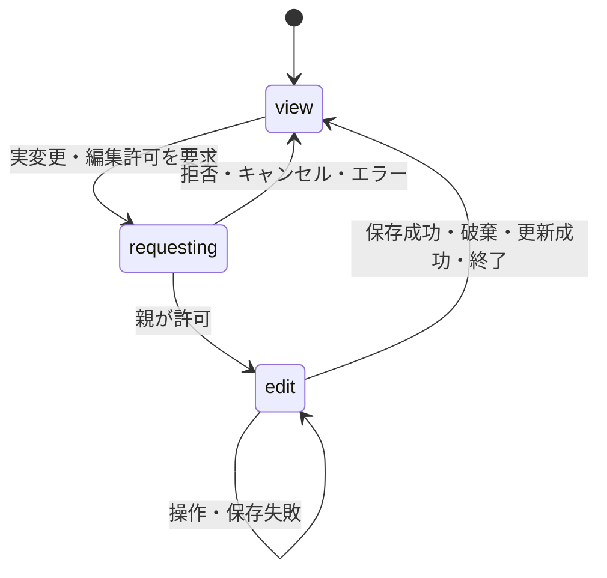

# 保存・編集許可・イベントを外から注入する

[利用ガイドへ戻る](./README.md)

Spreadsheetはクライアント側の下書きと操作を担当し、認証・DB・ストレージ・ロックの実装を持ちません。Explorerと同じ考え方で、処理を行うコールバックと、結果を観測するコールバックを分けています。

| プロパティ | 責務 |
| --- | --- |
| `onSave(workbook, context)` | ブック全体を保存する。失敗時は例外またはPromiseのreject |
| `onBeforeSave(workbook, context)` | 保存前の検証。`false`で中止、`true`または`undefined`で続行 |
| `onRefresh(context)` | 正式な最新ブックを取得する。未指定なら更新ボタンを非表示 |
| `onEditRequest(request, context)` | 最初の実変更の前に編集許可を得る。未指定なら即時許可 |
| `onEvent(event)` | 変更・保存・編集モード・選択などを型付きイベントで観測する |
| `onChange(workbook)` | 確定した下書きの変更を観測する。保存処理には使わない |
| `onDirtyChange(dirty)` | 最後の保存・読み込み結果との差があるかを観測する |
| `onUnsavedChangesChange(hasUnsavedChanges)` | 上記に加え、セル・コメント等の未確定入力を含めた変更を観測する |

`context` はLikeX共通の `OperationContext`（`requestId`・`signal`）です。既存の引数が1個だけの `onSave` もそのまま使用できます。未指定の `onSave` は従来どおり読み取り専用です。

通知用の `onEvent` や `onChange` の例外で、成功した変更や保存が失敗に戻ることはありません。処理を止めたい検証は `onBeforeSave`、`onSave`、`onEditRequest` に記述します。

## 保存と再読み込みの例

以下のURL・データ形式は**親アプリケーションの実装例**です。これらのサーバーAPIはライブラリに含まれません。

```tsx
"use client";

import { useRef, useState } from "react";
import Spreadsheet, { type SpreadsheetHandle, type SpreadsheetWorkbook } from "@likex/spreadsheet";
import "@likex/spreadsheet/styles.css";

export function Report({ initial, initialVersion }: {
  initial: SpreadsheetWorkbook; initialVersion: string;
}) {
  const api = useRef<SpreadsheetHandle>(null);
  const version = useRef(initialVersion);
  const [message, setMessage] = useState("");

  return <Spreadsheet ref={api} initialWorkbook={initial}
    onBeforeSave={workbook => {
      // 任意の業務上の検証。falseを返すと保存は呼ばれません。
      if (!workbook.sheets[0].cells.A1?.value.trim()) {
        setMessage("A1にタイトルを入力してください");
        return false;
      }
      return true;
    }}
    onSave={async (workbook, { signal }) => {
      const response = await fetch("/api/report", {
        method: "PUT", signal,
        headers: { "Content-Type": "application/json", "If-Match": version.current },
        body: JSON.stringify(workbook),
      });
      if (response.status === 412) throw new Error("ほかの利用者が更新しました。内容を確認してください");
      if (!response.ok) throw new Error("保存に失敗しました");
      const saved = await response.json();
      version.current = saved.version;
      return saved.workbook; // 正規化後のブックを返せます。返さなければ保存時のブックを採用。
    }}
    onRefresh={async ({ signal }) => {
      const response = await fetch("/api/report", { signal });
      if (!response.ok) throw new Error("再読み込みに失敗しました");
      const latest = await response.json();
      version.current = latest.version;
      return latest.workbook;
    }}
    onEvent={event => {
      if (event.type === "save" && event.status === "success") setMessage("保存しました");
    }}
    aria-label={message || "レポート"}
    style={{ height: 560 }} />;
}
```

`onBeforeSave` → `onSave` → 保存済みの基準を更新 → 成功通知の順で処理します。保存中はほかの変更・保存・更新を受け付けません。保存失敗や事前検証による中止では、下書きと編集セッションを保持します。保存は自動では実行されません。

更新ボタンは `onRefresh` があり、`features.refresh` が有効な場合だけ表示します。未保存の変更がある場合は、表示領域の中央で破棄を確認します。Escape・背景クリックでキャンセルできます。取得失敗では現在の下書きを保持し、取得が成功した時点で置き換えます。

## 編集許可とロック



セルの選択、コピー、エディタを開くだけの操作、同じ値の設定、不正なコマンドではロックを取得しません。変更が成立することを確認してから、最初の1回だけ `onEditRequest` を呼びます。許可を待つ間に変更を確定せず、拒否された場合は下書きを変更しません。入力中の文字列も保持します。

```tsx
onEditRequest={async (request, { requestId, signal }) => {
  // acquireLease/releaseLeaseは利用側が実装する関数です。
  const lease = await acquireLease({ reportId, requestId, signal });
  if (!lease) return false;
  if (signal.aborted) {
    await releaseLease(lease.id);
    return false;
  }
  signal.addEventListener("abort", () => {
    void releaseLease(lease.id).catch(reportReleaseError);
  }, { once: true });
  return true;
}}
```

`request` には変更元 `source`、操作 `action`、対象が1シートに定まる場合の `sheetId`、コマンドの種類、現在のブックが入ります。`false`では「他のユーザーが編集中のため変更できません」と表示します。詳細な理由がある場合はErrorをthrowできます。

編集許可の `signal` は許可後も有効です。保存成功・破棄・更新成功・明示的終了・読み取り専用への変更・アンマウントでabortされます。親がこれを解錠の契機にできます。ロック本体の所有者・期限・更新・権限の検証はサーバー側で管理します。

`{ allowed: true, workbook: latestWorkbook }` を返すと、未保存の確定変更がない場合だけ最新ブックを基準にできます。行列には安定したIDがないため、GUIは異なるブックへの置き換え後に古い座標の操作を自動反映せず、再操作を求めます。外部APIの明示的な座標は、許可後のブックに対して解釈します。

楽観ロックなら `onEditRequest` を省略し、保存時に上の例のバージョン条件をサーバーで検証します。悲観ロックなら `onEditRequest` でリースを取得します。どちらもコンポーネント内にDBの処理を持ち込む必要はありません。

## 外部APIからの操作

```ts
const result = await api.current!.batchAsync([
  { type: "cells.set", sheetId, values: { A1: "レポート" } },
  { type: "shapes.insert", sheetId, shape: "rectangle", anchor: { row: 4, column: 2 } },
]);
if (!result.ok) showMessage(result.message);
```

`executeAsync` / `batchAsync` は、検証・実変更判定・必要な編集許可・反映をまとめて扱います。許可待ちの操作を無制限にキューへ積む仕組みではありません。

既存の `execute` / `batch` は同期のままです。外部の編集許可が必要なのにまだ取得していない場合は `EDIT_REQUIRED` を返し、自動再実行しません。事前に `await api.requestEdit()` するか、上の非同期APIを使ってください。未確定入力や保存中などの保護は、どちらのAPIにも適用されます。

| Handle API | 動作 |
| --- | --- |
| `getEditState()` | `view` / `requesting` / `edit` と要求ID、エラーを取得 |
| `requestEdit(intent?)` | 親が明示的に編集開始を要求する。`boolean`またはPromiseを返す |
| `cancelEditRequest()` | 待機中の編集許可要求を取り消す |
| `endEdit()` | 未保存の変更がなければセッションを終了する |
| `save()` | 保存前検証と保存を実行し、成功したかをPromiseで返す |
| `exportExcel(options?)` | 確定済みの下書きからXLSXのBlobを生成。保存やダウンロードは行いません。[Excel出力](./excel-export.md) |
| `refresh(options?)` | 最新ブックを読み込み、成功したかをPromiseで返す |
| `discard(options?)` | 最後の保存済み状態へ戻し、編集セッションを終了する |

`refresh` / `discard` は未保存の変更がある場合、既定で拒否します。親側で利用者の確認を済ませた場合だけ `{ discardChanges: true }` を指定してください。Handleは確認ダイアログを自動表示しません。`features.save: false` / `refresh: false` はHandleでの実行も無効にします。

## イベントと離脱防止

`SpreadsheetEvent` は `type` に応じて内容が絞り込めるunion型です。

| `type` | 通知内容 |
| --- | --- |
| `change` | 確定ブック、変更元 `ui` / `api` / `undo` / `redo`、コマンドの種類 |
| `save` | `start` / `success` / `error` / `cancelled` |
| `export` | Excel生成の `start` / `success` / `error` / `cancelled`。[詳細](./excel-export.md) |
| `refresh` | `start` / `success` / `error` / `cancelled` |
| `edit-mode` | モード、開始・許可・拒否・終了理由、要求IDと要求内容 |
| `discard` | 破棄後のブック |
| `selection` | セル・範囲の選択 |
| `drawing-selection` | 選択した描画のID、解除時は`null` |
| `clipboard` | `copy` / `cut` / `paste`、対象シートと操作開始時の選択範囲 |
| `context-menu` | カスタムメニュー処理の開始・確認待ち・成功・キャンセル・失敗。[右クリックメニュー](./context-menu.md) |
| `unsaved-changes` | 確定変更 `dirty`、未確定入力 `pending`、両者を含む `hasUnsavedChanges` |

ブラウザの再読み込み・タブやウィンドウを閉じる操作は、未保存時に標準の確認を表示します。`warnOnUnsavedChanges: false` でOFFにできます。文言や確認が表示される条件はブラウザが管理します。SPA内の画面遷移や親によるアンマウントは、`onUnsavedChangesChange` を使って親が確認してください。

この共通契約の型・通知の例外隔離・離脱ガード・機能解決は `@likex/core` が担当します。パッケージでは通常の依存関係として利用します。ソースコピーでは `core` とコンポーネントを並べて配置し、コンポーネントの `core.ts` 一か所を相対参照へ変更します。生成・同期するコードはありません。
